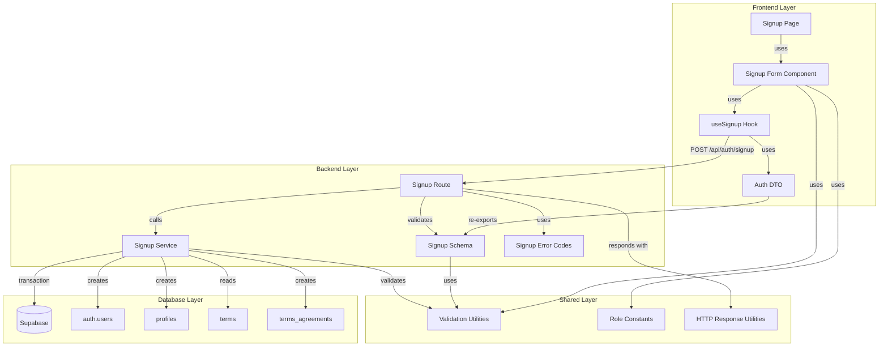

# 구현 계획: 역할 선택 & 온보딩

## 개요

### Backend Modules

| 모듈 | 위치 | 설명 |
|------|------|------|
| **Signup Schema** | `src/features/auth/backend/schema.ts` | 회원가입 요청/응답 zod 스키마 정의 |
| **Signup Service** | `src/features/auth/backend/service.ts` | 회원가입 비즈니스 로직 (트랜잭션 관리) |
| **Signup Route** | `src/features/auth/backend/route.ts` | Hono 라우터 정의 (POST /api/auth/signup) |
| **Signup Error Codes** | `src/features/auth/backend/error.ts` | 회원가입 관련 에러 코드 정의 |
| **Validation Utilities** | `src/lib/validation.ts` | 공통 검증 유틸 (이메일, 비밀번호, 휴대폰) |

### Frontend Modules

| 모듈 | 위치 | 설명 |
|------|------|------|
| **Signup Page** | `src/app/signup/page.tsx` | 회원가입 페이지 컴포넌트 (기존 수정) |
| **Signup Form Component** | `src/features/auth/components/signup-form.tsx` | 회원가입 폼 컴포넌트 (재사용 가능) |
| **Signup Hook** | `src/features/auth/hooks/useSignup.ts` | 회원가입 mutation 훅 |
| **Auth DTO** | `src/features/auth/lib/dto.ts` | Frontend에서 사용할 DTO 재노출 |
| **Role Constants** | `src/constants/auth.ts` | 역할 관련 상수 (기존 확장) |

### Database Migration

| 모듈 | 위치 | 설명 |
|------|------|------|
| **Terms Seed Data** | `supabase/migrations/0002_seed_terms.sql` | 최신 약관 버전 시드 데이터 |

---

## Diagram



---

## Implementation Plan

### 1. Shared Layer: Validation Utilities

**파일**: `src/lib/validation.ts`

**목적**: 이메일, 비밀번호, 휴대폰번호 검증 로직 공통화

**구현 내용**:
```typescript
// 이메일 검증 정규식 및 함수
export const EMAIL_REGEX = /^[^\s@]+@[^\s@]+\.[^\s@]+$/;
export const isValidEmail = (email: string): boolean => EMAIL_REGEX.test(email);

// 비밀번호 정책 (최소 8자)
export const PASSWORD_MIN_LENGTH = 8;
export const isValidPassword = (password: string): boolean =>
  password.length >= PASSWORD_MIN_LENGTH;

// 한국 휴대폰번호 정규식 (010-XXXX-XXXX 또는 01012345678)
export const PHONE_REGEX = /^01[0-9]-?[0-9]{3,4}-?[0-9]{4}$/;
export const isValidPhone = (phone: string): boolean => PHONE_REGEX.test(phone);

// 휴대폰번호 정규화 (하이픈 제거)
export const normalizePhone = (phone: string): string => phone.replace(/-/g, '');
```

**테스트**:
- ✅ 유효한 이메일 형식 검증
- ✅ 무효한 이메일 형식 거부
- ✅ 비밀번호 최소 길이 검증
- ✅ 유효한 휴대폰번호 형식 검증 (하이픈 있음/없음)
- ✅ 무효한 휴대폰번호 형식 거부
- ✅ 휴대폰번호 정규화 동작 확인

---

### 2. Backend: Signup Schema

**파일**: `src/features/auth/backend/schema.ts`

**목적**: 회원가입 요청/응답 스키마 정의

**구현 내용**:
```typescript
import { z } from 'zod';
import { EMAIL_REGEX, PASSWORD_MIN_LENGTH, PHONE_REGEX } from '@/lib/validation';

// 역할 enum
export const UserRoleSchema = z.enum(['learner', 'instructor']);
export type UserRole = z.infer<typeof UserRoleSchema>;

// 회원가입 요청 바디
export const SignupRequestSchema = z.object({
  email: z.string()
    .email('올바른 이메일 형식을 입력하세요')
    .regex(EMAIL_REGEX, '올바른 이메일 형식을 입력하세요'),
  password: z.string()
    .min(PASSWORD_MIN_LENGTH, `비밀번호는 최소 ${PASSWORD_MIN_LENGTH}자 이상이어야 합니다`),
  role: UserRoleSchema,
  name: z.string().min(1, '이름을 입력하세요'),
  phone: z.string()
    .regex(PHONE_REGEX, '올바른 휴대폰번호 형식을 입력하세요'),
  termsAgreed: z.boolean().refine(val => val === true, {
    message: '필수 약관에 동의해야 합니다',
  }),
});

export type SignupRequest = z.infer<typeof SignupRequestSchema>;

// 회원가입 응답
export const SignupResponseSchema = z.object({
  userId: z.string().uuid(),
  email: z.string().email(),
  role: UserRoleSchema,
  accessToken: z.string(),
  refreshToken: z.string(),
});

export type SignupResponse = z.infer<typeof SignupResponseSchema>;

// Database Row Schemas
export const ProfileRowSchema = z.object({
  id: z.string().uuid(),
  role: z.string(),
  name: z.string(),
  phone: z.string(),
  created_at: z.string(),
  updated_at: z.string(),
});

export const TermRowSchema = z.object({
  id: z.string().uuid(),
  version: z.string(),
  content: z.string(),
  is_required: z.boolean(),
  created_at: z.string(),
});
```

**Unit Tests**:
- ✅ SignupRequestSchema: 유효한 요청 파싱 성공
- ✅ SignupRequestSchema: 이메일 형식 오류 감지
- ✅ SignupRequestSchema: 비밀번호 길이 오류 감지
- ✅ SignupRequestSchema: 휴대폰번호 형식 오류 감지
- ✅ SignupRequestSchema: 약관 미동의 감지
- ✅ SignupRequestSchema: 역할 잘못된 값 감지
- ✅ SignupResponseSchema: 유효한 응답 파싱 성공

---

### 3. Backend: Signup Error Codes

**파일**: `src/features/auth/backend/error.ts`

**목적**: 회원가입 관련 에러 코드 정의

**구현 내용**:
```typescript
export const signupErrorCodes = {
  invalidRequest: 'SIGNUP_INVALID_REQUEST',
  emailAlreadyExists: 'SIGNUP_EMAIL_ALREADY_EXISTS',
  authCreationFailed: 'SIGNUP_AUTH_CREATION_FAILED',
  profileCreationFailed: 'SIGNUP_PROFILE_CREATION_FAILED',
  termsNotFound: 'SIGNUP_TERMS_NOT_FOUND',
  termsAgreementFailed: 'SIGNUP_TERMS_AGREEMENT_FAILED',
  transactionFailed: 'SIGNUP_TRANSACTION_FAILED',
} as const;

type SignupErrorValue = (typeof signupErrorCodes)[keyof typeof signupErrorCodes];

export type SignupServiceError = SignupErrorValue;
```

---

### 4. Backend: Signup Service

**파일**: `src/features/auth/backend/service.ts`

**목적**: 회원가입 비즈니스 로직 및 트랜잭션 관리

**구현 내용**:
```typescript
import type { SupabaseClient } from '@supabase/supabase-js';
import { failure, success, type HandlerResult } from '@/backend/http/response';
import { normalizePhone } from '@/lib/validation';
import type { SignupRequest, SignupResponse } from './schema';
import { signupErrorCodes, type SignupServiceError } from './error';

export const signup = async (
  client: SupabaseClient,
  request: SignupRequest,
): Promise<HandlerResult<SignupResponse, SignupServiceError, unknown>> => {
  const normalizedPhone = normalizePhone(request.phone);

  // 1. 이메일 중복 확인 (Supabase Auth에서 자동 처리되지만 명시적 체크)
  const { data: existingUser } = await client.auth.admin.listUsers();
  const emailExists = existingUser?.users.some(u => u.email === request.email);

  if (emailExists) {
    return failure(409, signupErrorCodes.emailAlreadyExists, '이미 사용 중인 이메일입니다');
  }

  // 2. 필수 약관 조회
  const { data: requiredTerms, error: termsError } = await client
    .from('terms')
    .select('id')
    .eq('is_required', true);

  if (termsError || !requiredTerms || requiredTerms.length === 0) {
    return failure(500, signupErrorCodes.termsNotFound, '필수 약관을 찾을 수 없습니다');
  }

  // 3. Auth 계정 생성 (트랜잭션 시작점)
  const { data: authData, error: authError } = await client.auth.admin.createUser({
    email: request.email,
    password: request.password,
    email_confirm: true, // 이메일 인증 스킵 (자동 확인)
  });

  if (authError || !authData.user) {
    return failure(500, signupErrorCodes.authCreationFailed, '회원가입에 실패했습니다');
  }

  const userId = authData.user.id;

  // 4. 프로필 생성
  const { error: profileError } = await client
    .from('profiles')
    .insert({
      id: userId,
      role: request.role,
      name: request.name,
      phone: normalizedPhone,
    });

  if (profileError) {
    // 롤백: Auth 계정 삭제
    await client.auth.admin.deleteUser(userId);
    return failure(500, signupErrorCodes.profileCreationFailed, '프로필 생성에 실패했습니다');
  }

  // 5. 약관 동의 이력 저장
  const termsAgreements = requiredTerms.map(term => ({
    user_id: userId,
    term_id: term.id,
  }));

  const { error: agreementError } = await client
    .from('terms_agreements')
    .insert(termsAgreements);

  if (agreementError) {
    // 롤백: 프로필 및 Auth 계정 삭제
    await client.from('profiles').delete().eq('id', userId);
    await client.auth.admin.deleteUser(userId);
    return failure(500, signupErrorCodes.termsAgreementFailed, '약관 동의 이력 저장에 실패했습니다');
  }

  // 6. 세션 토큰 생성
  const { data: sessionData, error: sessionError } = await client.auth.signInWithPassword({
    email: request.email,
    password: request.password,
  });

  if (sessionError || !sessionData.session) {
    // 롤백: 모든 데이터 삭제
    await client.from('terms_agreements').delete().eq('user_id', userId);
    await client.from('profiles').delete().eq('id', userId);
    await client.auth.admin.deleteUser(userId);
    return failure(500, signupErrorCodes.transactionFailed, '토큰 생성에 실패했습니다');
  }

  return success({
    userId,
    email: request.email,
    role: request.role,
    accessToken: sessionData.session.access_token,
    refreshToken: sessionData.session.refresh_token,
  }, 201);
};
```

**Unit Tests**:
- ✅ 정상 회원가입 플로우 (모든 단계 성공)
- ✅ 이메일 중복 시 409 에러 반환
- ✅ 필수 약관 없을 시 500 에러 반환
- ✅ Auth 계정 생성 실패 시 500 에러 반환
- ✅ 프로필 생성 실패 시 롤백 (Auth 계정 삭제) 및 500 에러 반환
- ✅ 약관 동의 이력 저장 실패 시 롤백 (프로필, Auth 계정 삭제) 및 500 에러 반환
- ✅ 토큰 생성 실패 시 전체 롤백 및 500 에러 반환
- ✅ 휴대폰번호 정규화 동작 확인

---

### 5. Backend: Signup Route

**파일**: `src/features/auth/backend/route.ts`

**목적**: Hono 라우터 정의

**구현 내용**:
```typescript
import type { Hono } from 'hono';
import { failure, respond, type ErrorResult } from '@/backend/http/response';
import { getLogger, getSupabase, type AppEnv } from '@/backend/hono/context';
import { SignupRequestSchema } from './schema';
import { signup } from './service';
import { signupErrorCodes, type SignupServiceError } from './error';

export const registerAuthRoutes = (app: Hono<AppEnv>) => {
  app.post('/auth/signup', async (c) => {
    const body = await c.req.json();
    const parsedBody = SignupRequestSchema.safeParse(body);

    if (!parsedBody.success) {
      return respond(
        c,
        failure(
          400,
          signupErrorCodes.invalidRequest,
          '입력값이 유효하지 않습니다',
          parsedBody.error.format(),
        ),
      );
    }

    const supabase = getSupabase(c);
    const logger = getLogger(c);

    const result = await signup(supabase, parsedBody.data);

    if (!result.ok) {
      const errorResult = result as ErrorResult<SignupServiceError, unknown>;

      // 에러 로깅
      if (errorResult.error.code === signupErrorCodes.authCreationFailed) {
        logger.error('Auth account creation failed', errorResult.error.message);
      } else if (errorResult.error.code === signupErrorCodes.profileCreationFailed) {
        logger.error('Profile creation failed', errorResult.error.message);
      } else if (errorResult.error.code === signupErrorCodes.termsAgreementFailed) {
        logger.error('Terms agreement failed', errorResult.error.message);
      } else if (errorResult.error.code === signupErrorCodes.transactionFailed) {
        logger.error('Transaction failed', errorResult.error.message);
      }

      return respond(c, result);
    }

    return respond(c, result);
  });
};
```

**Integration Tests**:
- ✅ POST /auth/signup: 유효한 요청으로 201 응답 및 토큰 반환
- ✅ POST /auth/signup: 잘못된 이메일 형식으로 400 에러 반환
- ✅ POST /auth/signup: 비밀번호 길이 부족으로 400 에러 반환
- ✅ POST /auth/signup: 휴대폰번호 형식 오류로 400 에러 반환
- ✅ POST /auth/signup: 약관 미동의로 400 에러 반환
- ✅ POST /auth/signup: 이메일 중복으로 409 에러 반환

---

### 6. Backend: Hono App Integration

**파일**: `src/backend/hono/app.ts` (기존 수정)

**수정 내용**:
```typescript
import { registerAuthRoutes } from '@/features/auth/backend/route';

// ...existing code...

export const createHonoApp = () => {
  // ...existing middleware...

  registerExampleRoutes(app);
  registerAuthRoutes(app); // 추가

  // ...existing code...
};
```

---

### 7. Frontend: Auth DTO

**파일**: `src/features/auth/lib/dto.ts`

**목적**: Backend 스키마 재노출

**구현 내용**:
```typescript
export {
  SignupRequestSchema,
  SignupResponseSchema,
  UserRoleSchema,
  type SignupRequest,
  type SignupResponse,
  type UserRole,
} from '@/features/auth/backend/schema';
```

---

### 8. Frontend: useSignup Hook

**파일**: `src/features/auth/hooks/useSignup.ts`

**목적**: 회원가입 mutation 훅

**구현 내용**:
```typescript
import { useMutation } from '@tanstack/react-query';
import { apiClient, extractApiErrorMessage } from '@/lib/remote/api-client';
import type { SignupRequest, SignupResponse } from '@/features/auth/lib/dto';

export const useSignup = () => {
  return useMutation({
    mutationFn: async (request: SignupRequest): Promise<SignupResponse> => {
      const response = await apiClient.post<SignupResponse>('/auth/signup', request);
      return response.data;
    },
    onError: (error) => {
      const message = extractApiErrorMessage(error, '회원가입에 실패했습니다');
      console.error('Signup error:', message);
    },
  });
};
```

---

### 9. Frontend: Role Constants

**파일**: `src/constants/auth.ts` (기존 확장)

**구현 내용**:
```typescript
export const USER_ROLES = {
  LEARNER: 'learner',
  INSTRUCTOR: 'instructor',
  OPERATOR: 'operator',
} as const;

export type UserRole = (typeof USER_ROLES)[keyof typeof USER_ROLES];

export const ROLE_LABELS: Record<UserRole, string> = {
  [USER_ROLES.LEARNER]: '학습자',
  [USER_ROLES.INSTRUCTOR]: '강사',
  [USER_ROLES.OPERATOR]: '운영자',
};

export const ROLE_REDIRECT_PATHS: Record<UserRole, string> = {
  [USER_ROLES.LEARNER]: '/courses',
  [USER_ROLES.INSTRUCTOR]: '/instructor/dashboard',
  [USER_ROLES.OPERATOR]: '/operator/dashboard',
};
```

---

### 10. Frontend: Signup Form Component

**파일**: `src/features/auth/components/signup-form.tsx`

**목적**: 재사용 가능한 회원가입 폼 컴포넌트

**구현 내용**:
```typescript
"use client";

import { useState } from "react";
import { useRouter } from "next/navigation";
import { useForm } from "react-hook-form";
import { zodResolver } from "@hookform/resolvers/zod";
import { Button } from "@/components/ui/button";
import { Input } from "@/components/ui/input";
import { Label } from "@/components/ui/label";
import { Checkbox } from "@/components/ui/checkbox";
import { Select, SelectContent, SelectItem, SelectTrigger, SelectValue } from "@/components/ui/select";
import { useToast } from "@/hooks/use-toast";
import { useSignup } from "@/features/auth/hooks/useSignup";
import { SignupRequestSchema, type SignupRequest } from "@/features/auth/lib/dto";
import { USER_ROLES, ROLE_LABELS, ROLE_REDIRECT_PATHS } from "@/constants/auth";

export const SignupForm = () => {
  const router = useRouter();
  const { toast } = useToast();
  const { mutate: signup, isPending } = useSignup();

  const {
    register,
    handleSubmit,
    formState: { errors },
    watch,
    setValue,
  } = useForm<SignupRequest>({
    resolver: zodResolver(SignupRequestSchema),
    defaultValues: {
      email: "",
      password: "",
      role: USER_ROLES.LEARNER,
      name: "",
      phone: "",
      termsAgreed: false,
    },
  });

  const selectedRole = watch("role");

  const onSubmit = (data: SignupRequest) => {
    signup(data, {
      onSuccess: (response) => {
        // 토큰 저장
        localStorage.setItem("accessToken", response.accessToken);
        localStorage.setItem("refreshToken", response.refreshToken);

        toast({
          title: "회원가입 성공",
          description: `${ROLE_LABELS[response.role]}으로 가입되었습니다`,
        });

        // 역할에 따라 리다이렉트
        const redirectPath = ROLE_REDIRECT_PATHS[response.role];
        router.push(redirectPath);
      },
      onError: (error) => {
        toast({
          title: "회원가입 실패",
          description: error.message ?? "회원가입에 실패했습니다",
          variant: "destructive",
        });
      },
    });
  };

  return (
    <form onSubmit={handleSubmit(onSubmit)} className="space-y-4">
      {/* 이메일 */}
      <div className="space-y-2">
        <Label htmlFor="email">이메일</Label>
        <Input
          id="email"
          type="email"
          autoComplete="email"
          {...register("email")}
        />
        {errors.email && (
          <p className="text-sm text-red-500">{errors.email.message}</p>
        )}
      </div>

      {/* 비밀번호 */}
      <div className="space-y-2">
        <Label htmlFor="password">비밀번호</Label>
        <Input
          id="password"
          type="password"
          autoComplete="new-password"
          {...register("password")}
        />
        {errors.password && (
          <p className="text-sm text-red-500">{errors.password.message}</p>
        )}
      </div>

      {/* 역할 선택 */}
      <div className="space-y-2">
        <Label htmlFor="role">역할</Label>
        <Select
          value={selectedRole}
          onValueChange={(value) => setValue("role", value as "learner" | "instructor")}
        >
          <SelectTrigger>
            <SelectValue />
          </SelectTrigger>
          <SelectContent>
            <SelectItem value={USER_ROLES.LEARNER}>
              {ROLE_LABELS[USER_ROLES.LEARNER]}
            </SelectItem>
            <SelectItem value={USER_ROLES.INSTRUCTOR}>
              {ROLE_LABELS[USER_ROLES.INSTRUCTOR]}
            </SelectItem>
          </SelectContent>
        </Select>
        {errors.role && (
          <p className="text-sm text-red-500">{errors.role.message}</p>
        )}
      </div>

      {/* 이름 */}
      <div className="space-y-2">
        <Label htmlFor="name">이름</Label>
        <Input
          id="name"
          type="text"
          autoComplete="name"
          {...register("name")}
        />
        {errors.name && (
          <p className="text-sm text-red-500">{errors.name.message}</p>
        )}
      </div>

      {/* 휴대폰번호 */}
      <div className="space-y-2">
        <Label htmlFor="phone">휴대폰번호</Label>
        <Input
          id="phone"
          type="tel"
          autoComplete="tel"
          placeholder="010-1234-5678"
          {...register("phone")}
        />
        {errors.phone && (
          <p className="text-sm text-red-500">{errors.phone.message}</p>
        )}
      </div>

      {/* 약관 동의 */}
      <div className="flex items-center space-x-2">
        <Checkbox
          id="termsAgreed"
          onCheckedChange={(checked) => setValue("termsAgreed", !!checked)}
        />
        <Label htmlFor="termsAgreed" className="text-sm font-normal">
          서비스 이용약관 및 개인정보 처리방침에 동의합니다 (필수)
        </Label>
      </div>
      {errors.termsAgreed && (
        <p className="text-sm text-red-500">{errors.termsAgreed.message}</p>
      )}

      {/* 제출 버튼 */}
      <Button type="submit" className="w-full" disabled={isPending}>
        {isPending ? "등록 중..." : "회원가입"}
      </Button>
    </form>
  );
};
```

**QA Sheet**:

| 테스트 케이스 | 입력 | 예상 결과 | 실제 결과 | 상태 |
|--------------|------|----------|----------|------|
| 정상 회원가입 (Learner) | 유효한 모든 필드 + role=learner | 201 응답, /courses로 리다이렉트, 토큰 저장 | | ⬜ |
| 정상 회원가입 (Instructor) | 유효한 모든 필드 + role=instructor | 201 응답, /instructor/dashboard로 리다이렉트, 토큰 저장 | | ⬜ |
| 이메일 형식 오류 | email="invalid-email" | 클라이언트 측 에러 표시 | | ⬜ |
| 비밀번호 길이 부족 | password="1234" | 클라이언트 측 에러 표시 | | ⬜ |
| 휴대폰번호 형식 오류 | phone="123-456" | 클라이언트 측 에러 표시 | | ⬜ |
| 약관 미동의 | termsAgreed=false | 클라이언트 측 에러 표시 | | ⬜ |
| 이메일 중복 | 기존 이메일 사용 | 409 에러, 에러 메시지 표시 | | ⬜ |
| 네트워크 오류 | 서버 다운 상태 | 타임아웃 에러, 에러 메시지 표시 | | ⬜ |
| 토큰 저장 확인 | 정상 회원가입 후 | localStorage에 accessToken, refreshToken 저장 | | ⬜ |
| 역할별 리다이렉트 확인 | Learner/Instructor 각각 | 올바른 경로로 리다이렉트 | | ⬜ |

---

### 11. Frontend: Signup Page (수정)

**파일**: `src/app/signup/page.tsx` (기존 대체)

**구현 내용**:
```typescript
"use client";

import Image from "next/image";
import Link from "next/link";
import { useEffect } from "react";
import { useRouter, useSearchParams } from "next/navigation";
import { useCurrentUser } from "@/features/auth/hooks/useCurrentUser";
import { SignupForm } from "@/features/auth/components/signup-form";

type SignupPageProps = {
  params: Promise<Record<string, never>>;
};

export default function SignupPage({ params }: SignupPageProps) {
  void params;
  const router = useRouter();
  const searchParams = useSearchParams();
  const { isAuthenticated } = useCurrentUser();

  useEffect(() => {
    if (isAuthenticated) {
      const redirectedFrom = searchParams.get("redirectedFrom") ?? "/";
      router.replace(redirectedFrom);
    }
  }, [isAuthenticated, router, searchParams]);

  if (isAuthenticated) {
    return null;
  }

  return (
    <div className="mx-auto flex min-h-screen w-full max-w-4xl flex-col items-center justify-center gap-10 px-6 py-16">
      <header className="flex flex-col items-center gap-3 text-center">
        <h1 className="text-3xl font-semibold">회원가입</h1>
        <p className="text-slate-500">
          역할을 선택하고 학습 여정을 시작하세요
        </p>
      </header>
      <div className="grid w-full gap-8 md:grid-cols-2">
        <div className="rounded-xl border border-slate-200 p-6 shadow-sm">
          <SignupForm />
          <p className="mt-4 text-xs text-slate-500">
            이미 계정이 있으신가요?{" "}
            <Link
              href="/login"
              className="font-medium text-slate-700 underline hover:text-slate-900"
            >
              로그인으로 이동
            </Link>
          </p>
        </div>
        <figure className="overflow-hidden rounded-xl border border-slate-200">
          <Image
            src="https://picsum.photos/seed/signup/640/640"
            alt="회원가입"
            width={640}
            height={640}
            className="h-full w-full object-cover"
            priority
          />
        </figure>
      </div>
    </div>
  );
}
```

**QA Sheet**:

| 테스트 케이스 | 입력 | 예상 결과 | 실제 결과 | 상태 |
|--------------|------|----------|----------|------|
| 페이지 렌더링 | /signup 접근 | 회원가입 폼 표시 | | ⬜ |
| 인증된 사용자 리다이렉트 | 로그인 상태에서 /signup 접근 | / 로 리다이렉트 | | ⬜ |
| redirectedFrom 파라미터 처리 | /signup?redirectedFrom=/dashboard | 로그인 후 /dashboard로 이동 | | ⬜ |
| 로그인 링크 동작 | "로그인으로 이동" 클릭 | /login 페이지로 이동 | | ⬜ |

---

### 12. Database Migration: Terms Seed Data

**파일**: `supabase/migrations/0002_seed_terms.sql`

**목적**: 최신 약관 버전 시드 데이터 추가

**구현 내용**:
```sql
-- Migration: Seed latest terms and conditions
-- Adds current version of terms for signup process

-- Delete existing terms (for idempotency)
DELETE FROM public.terms WHERE version = 'v1.0';

-- Insert latest terms
INSERT INTO public.terms (version, content, is_required) VALUES
  ('v1.0', '
# 서비스 이용약관

## 제1조 (목적)
본 약관은 LMS 플랫폼 서비스의 이용과 관련하여 회사와 회원 간의 권리, 의무 및 책임사항을 규정함을 목적으로 합니다.

## 제2조 (정의)
1. "회원"이란 본 약관에 동의하고 회사가 제공하는 서비스를 이용하는 자를 말합니다.
2. "학습자"란 강좌를 수강하는 회원을 말합니다.
3. "강사"란 강좌를 개설하고 운영하는 회원을 말합니다.

## 제3조 (약관의 효력 및 변경)
본 약관은 회원가입 시 동의함으로써 효력이 발생합니다.
', true),
  ('v1.0', '
# 개인정보 처리방침

## 제1조 (수집하는 개인정보의 항목)
회사는 회원가입, 서비스 제공을 위해 다음과 같은 개인정보를 수집합니다:
- 필수항목: 이메일, 비밀번호, 이름, 휴대폰번호
- 선택항목: 프로필 사진, 자기소개

## 제2조 (개인정보의 수집 및 이용목적)
1. 회원 관리: 본인 확인, 개인 식별, 부정 이용 방지
2. 서비스 제공: 강좌 수강, 과제 제출, 성적 관리

## 제3조 (개인정보의 보유 및 이용기간)
회원 탈퇴 시까지 보유하며, 관계 법령에 따라 일정 기간 보관할 수 있습니다.
', true)
ON CONFLICT (version) DO NOTHING;
```

---

## 구현 순서

1. **Shared Layer** (1시간)
   - `src/lib/validation.ts` 작성 및 테스트

2. **Backend Layer** (3시간)
   - `src/features/auth/backend/schema.ts` 작성
   - `src/features/auth/backend/error.ts` 작성
   - `src/features/auth/backend/service.ts` 작성 및 Unit Test
   - `src/features/auth/backend/route.ts` 작성 및 Integration Test
   - `src/backend/hono/app.ts` 수정

3. **Database Migration** (30분)
   - `supabase/migrations/0002_seed_terms.sql` 작성 및 적용

4. **Frontend Layer** (2.5시간)
   - `src/constants/auth.ts` 확장
   - `src/features/auth/lib/dto.ts` 작성
   - `src/features/auth/hooks/useSignup.ts` 작성
   - `src/features/auth/components/signup-form.tsx` 작성 및 QA Sheet 검증
   - `src/app/signup/page.tsx` 수정 및 QA Sheet 검증

5. **Integration Testing** (1시간)
   - 전체 플로우 E2E 테스트
   - 에러 케이스 검증
   - 롤백 시나리오 검증

**예상 총 소요 시간**: 8시간
