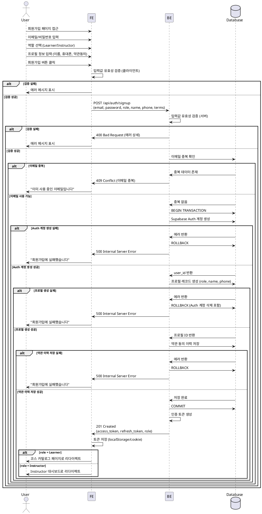

# 유스케이스 001: 역할 선택 & 온보딩

## Primary Actor
- 신규 사용자 (미등록 또는 미인증 상태)

## Precondition
- 사용자가 회원가입 페이지에 접근 가능
- 유효한 이메일 주소를 보유

## Trigger
- 사용자가 회원가입 버튼 클릭

## Main Scenario

1. 사용자가 이메일/비밀번호를 입력
2. 사용자가 역할(Learner/Instructor)을 선택
3. 사용자가 필수 프로필 정보 입력:
   - 이름
   - 휴대폰번호
   - 약관 동의 (필수)
4. 시스템이 입력값 유효성 검증
5. 시스템이 Supabase Auth 계정 생성
6. 시스템이 사용자 프로필 레코드 생성 (role 포함)
7. 시스템이 약관 동의 이력 저장
8. 시스템이 인증 토큰 발급
9. 시스템이 역할에 따라 리다이렉트:
   - Learner → 코스 카탈로그 페이지
   - Instructor → Instructor 대시보드 페이지

## Edge Cases

### 입력 검증 실패
- 이메일 형식 오류: "올바른 이메일 형식을 입력하세요"
- 비밀번호 조건 미충족: "비밀번호는 최소 8자 이상이어야 합니다"
- 휴대폰번호 형식 오류: "올바른 휴대폰번호 형식을 입력하세요"
- 필수 약관 미동의: "필수 약관에 동의해야 합니다"

### 계정 생성 실패
- 이메일 중복: "이미 사용 중인 이메일입니다"
- Supabase Auth 오류: "회원가입에 실패했습니다. 잠시 후 다시 시도하세요"

### 데이터베이스 저장 실패
- 프로필 생성 실패: 트랜잭션 롤백, Auth 계정 삭제
- 약관 이력 저장 실패: 에러 로깅, 사용자에게 재시도 안내

### 네트워크 오류
- 타임아웃: "네트워크 오류가 발생했습니다. 다시 시도하세요"

## Business Rules

### BR-001: 역할 선택
- 사용자는 최초 가입 시 반드시 하나의 역할(Learner 또는 Instructor)을 선택해야 함
- 역할은 가입 후 변경 불가

### BR-002: 필수 입력 정보
- 이메일, 비밀번호, 이름, 휴대폰번호, 필수 약관 동의는 모두 필수 입력
- 이메일은 중복 불가

### BR-003: 비밀번호 정책
- 최소 8자 이상
- 영문, 숫자, 특수문자 조합 권장 (선택적 강제)

### BR-004: 휴대폰번호 형식
- 한국 휴대폰번호 형식 (010-XXXX-XXXX 또는 01012345678)
- 중복 가능 (동일 번호로 여러 계정 생성 허용)

### BR-005: 약관 동의
- 필수 약관 미동의 시 가입 불가
- 약관 동의 이력은 감사 목적으로 영구 보존

### BR-006: 계정 생성 원자성
- Auth 계정 생성 → 프로필 생성 → 약관 이력 저장은 단일 트랜잭션으로 처리
- 중간 단계 실패 시 이전 단계 롤백

### BR-007: 초기 권한
- 모든 신규 사용자는 기본 권한만 보유
- 역할에 따라 접근 가능한 리소스가 달라짐

---

## Sequence Diagram

