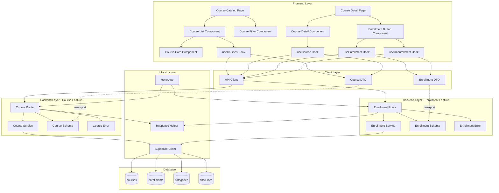

# 코스 탐색 & 수강신청/취소 구현 설계

## 개요

### Backend Modules
| 모듈 | 위치 | 설명 |
|------|------|------|
| Course Route | `src/features/course/backend/route.ts` | 코스 목록 조회, 상세 조회 API 엔드포인트 |
| Course Service | `src/features/course/backend/service.ts` | 코스 조회 비즈니스 로직 (필터링, 정렬, 권한 검증) |
| Course Schema | `src/features/course/backend/schema.ts` | 코스 요청/응답 Zod 스키마 |
| Course Error | `src/features/course/backend/error.ts` | 코스 관련 에러 코드 정의 |
| Enrollment Route | `src/features/enrollment/backend/route.ts` | 수강신청/취소 API 엔드포인트 |
| Enrollment Service | `src/features/enrollment/backend/service.ts` | 수강신청/취소 비즈니스 로직 (중복 검증, 상태 관리) |
| Enrollment Schema | `src/features/enrollment/backend/schema.ts` | 수강신청/취소 요청/응답 Zod 스키마 |
| Enrollment Error | `src/features/enrollment/backend/error.ts` | 수강신청/취소 관련 에러 코드 정의 |

### Frontend Modules
| 모듈 | 위치 | 설명 |
|------|------|------|
| Course Catalog Page | `src/app/(protected)/courses/page.tsx` | 코스 목록 페이지 |
| Course Detail Page | `src/app/(protected)/courses/[id]/page.tsx` | 코스 상세 페이지 |
| Course List Component | `src/features/course/components/course-list.tsx` | 코스 목록 UI 컴포넌트 |
| Course Card Component | `src/features/course/components/course-card.tsx` | 코스 카드 UI 컴포넌트 |
| Course Filter Component | `src/features/course/components/course-filter.tsx` | 필터/정렬 UI 컴포넌트 |
| Course Detail Component | `src/features/course/components/course-detail.tsx` | 코스 상세 정보 UI 컴포넌트 |
| Enrollment Button Component | `src/features/enrollment/components/enrollment-button.tsx` | 수강신청/취소 버튼 UI 컴포넌트 |
| useCourses Hook | `src/features/course/hooks/useCourses.ts` | 코스 목록 조회 React Query 훅 |
| useCourse Hook | `src/features/course/hooks/useCourse.ts` | 코스 상세 조회 React Query 훅 |
| useEnrollment Hook | `src/features/enrollment/hooks/useEnrollment.ts` | 수강신청 Mutation 훅 |
| useUnenrollment Hook | `src/features/enrollment/hooks/useUnenrollment.ts` | 수강취소 Mutation 훅 |

### Shared/Common Modules
| 모듈 | 위치 | 설명 |
|------|------|------|
| Course DTO | `src/features/course/lib/dto.ts` | Backend schema 재노출 (Frontend 공유) |
| Enrollment DTO | `src/features/enrollment/lib/dto.ts` | Backend schema 재노출 (Frontend 공유) |
| Course Constants | `src/features/course/constants/index.ts` | 코스 관련 상수 (status, 정렬 옵션 등) |
| Enrollment Constants | `src/features/enrollment/constants/index.ts` | 수강신청 관련 상수 |
| Pagination Utility | `src/lib/pagination.ts` | 페이지네이션 유틸리티 함수 (공통) |

---

## Diagram



---

## Implementation Plan

### 1. Database Layer

#### 1.1 Migration (이미 완료)
- `supabase/migrations/0001_create_lms_schema.sql`에 courses, enrollments, categories, difficulties 테이블 정의됨
- 추가 작업 필요 없음

---

### 2. Backend - Course Feature

#### 2.1 Course Schema (`src/features/course/backend/schema.ts`)
**구현 내용:**
```typescript
// Query params for course list
- CourseListQuerySchema: { search?, categoryId?, difficultyId?, status?, sortBy?, sortOrder?, page?, limit? }
- CourseListResponseSchema: { courses: Course[], total: number, page: number, limit: number }

// Course detail
- CourseDetailParamsSchema: { id: UUID }
- CourseDetailResponseSchema: Course (with category, difficulty, instructor info, enrollment count)

// Course row from DB
- CourseRowSchema: DB 테이블 컬럼 매핑
- CategoryRowSchema: DB 테이블 컬럼 매핑
- DifficultyRowSchema: DB 테이블 컬럼 매핑
```

**Unit Tests:**
- ✅ CourseListQuerySchema는 선택적 파라미터를 올바르게 파싱한다
- ✅ CourseListQuerySchema는 잘못된 sortBy 값을 거부한다
- ✅ CourseListQuerySchema는 잘못된 UUID를 거부한다
- ✅ CourseDetailParamsSchema는 유효한 UUID만 허용한다

---

#### 2.2 Course Error (`src/features/course/backend/error.ts`)
**구현 내용:**
```typescript
export const courseErrorCodes = {
  invalidRequest: 'COURSE_INVALID_REQUEST',
  courseNotFound: 'COURSE_NOT_FOUND',
  courseNotPublished: 'COURSE_NOT_PUBLISHED',
  fetchFailed: 'COURSE_FETCH_FAILED',
  unauthorized: 'COURSE_UNAUTHORIZED',
} as const;

export type CourseServiceError = typeof courseErrorCodes[keyof typeof courseErrorCodes];
```

---

#### 2.3 Course Service (`src/features/course/backend/service.ts`)
**구현 내용:**
```typescript
// 1. getCourses(client, query): 코스 목록 조회
//    - published 상태 필터링
//    - 검색어로 title/description ILIKE
//    - categoryId, difficultyId 필터링
//    - sortBy (latest, popular), sortOrder (asc, desc)
//    - 페이지네이션 (LIMIT, OFFSET)
//    - JOIN categories, difficulties
//    - 총 개수 카운트

// 2. getCourseById(client, courseId, userId?): 코스 상세 조회
//    - courseId로 조회
//    - published 상태 검증 (draft는 instructor만 조회 가능)
//    - JOIN categories, difficulties, profiles (instructor)
//    - 수강생 수 COUNT
//    - userId가 있으면 현재 사용자의 enrollment 여부 포함
```

**Unit Tests:**
- ✅ getCourses는 published 상태의 코스만 반환한다
- ✅ getCourses는 검색어로 필터링한다
- ✅ getCourses는 카테고리로 필터링한다
- ✅ getCourses는 난이도로 필터링한다
- ✅ getCourses는 정렬 순서를 올바르게 적용한다
- ✅ getCourses는 페이지네이션을 올바르게 적용한다
- ✅ getCourseById는 존재하지 않는 코스에 대해 실패한다
- ✅ getCourseById는 published가 아닌 코스에 대해 실패한다 (instructor가 아닌 경우)
- ✅ getCourseById는 instructor 정보를 포함한다
- ✅ getCourseById는 enrollment 여부를 포함한다

---

#### 2.4 Course Route (`src/features/course/backend/route.ts`)
**구현 내용:**
```typescript
// GET /courses: 코스 목록 조회
//   - query params 파싱 (CourseListQuerySchema)
//   - getCourses(client, query) 호출
//   - success/failure respond

// GET /courses/:id: 코스 상세 조회
//   - params 파싱 (CourseDetailParamsSchema)
//   - 현재 사용자 ID 추출 (optional, 로그인 여부에 따라)
//   - getCourseById(client, id, userId) 호출
//   - success/failure respond
```

**Integration Tests (수동 테스트 - Hono 테스트 환경 구성 복잡도 고려):**
- ✅ GET /courses는 200과 코스 목록을 반환한다
- ✅ GET /courses는 필터링 파라미터를 올바르게 처리한다
- ✅ GET /courses/:id는 존재하는 코스에 대해 200과 상세 정보를 반환한다
- ✅ GET /courses/:id는 존재하지 않는 코스에 대해 404를 반환한다

---

### 3. Backend - Enrollment Feature

#### 3.1 Enrollment Schema (`src/features/enrollment/backend/schema.ts`)
**구현 내용:**
```typescript
// Enroll request
- EnrollRequestSchema: { courseId: UUID }
- EnrollResponseSchema: { enrollmentId: UUID, courseId: UUID, enrolledAt: string }

// Unenroll request
- UnenrollRequestSchema: { courseId: UUID }
- UnenrollResponseSchema: { success: boolean }

// Enrollment row from DB
- EnrollmentRowSchema: DB 테이블 컬럼 매핑
```

**Unit Tests:**
- ✅ EnrollRequestSchema는 유효한 UUID를 허용한다
- ✅ EnrollRequestSchema는 잘못된 UUID를 거부한다
- ✅ UnenrollRequestSchema는 유효한 UUID를 허용한다

---

#### 3.2 Enrollment Error (`src/features/enrollment/backend/error.ts`)
**구현 내용:**
```typescript
export const enrollmentErrorCodes = {
  invalidRequest: 'ENROLLMENT_INVALID_REQUEST',
  courseNotFound: 'ENROLLMENT_COURSE_NOT_FOUND',
  courseNotPublished: 'ENROLLMENT_COURSE_NOT_PUBLISHED',
  alreadyEnrolled: 'ENROLLMENT_ALREADY_ENROLLED',
  notEnrolled: 'ENROLLMENT_NOT_ENROLLED',
  enrollmentFailed: 'ENROLLMENT_FAILED',
  unenrollmentFailed: 'UNENROLLMENT_FAILED',
  unauthorized: 'ENROLLMENT_UNAUTHORIZED',
} as const;

export type EnrollmentServiceError = typeof enrollmentErrorCodes[keyof typeof enrollmentErrorCodes];
```

---

#### 3.3 Enrollment Service (`src/features/enrollment/backend/service.ts`)
**구현 내용:**
```typescript
// 1. enrollCourse(client, userId, courseId): 수강신청
//    - courseId로 코스 조회
//    - 코스 상태가 published인지 검증
//    - 중복 신청 여부 확인 (enrollments 테이블 조회)
//    - enrollments 테이블에 INSERT
//    - 에러 시 적절한 failure 반환

// 2. unenrollCourse(client, userId, courseId): 수강취소
//    - enrollments 테이블에서 레코드 조회
//    - 존재하지 않으면 NOT_ENROLLED 에러
//    - enrollments 테이블에서 DELETE
//    - 에러 시 적절한 failure 반환
```

**Unit Tests:**
- ✅ enrollCourse는 published 코스에 대해 성공한다
- ✅ enrollCourse는 존재하지 않는 코스에 대해 실패한다
- ✅ enrollCourse는 published가 아닌 코스에 대해 실패한다
- ✅ enrollCourse는 이미 신청된 코스에 대해 실패한다
- ✅ unenrollCourse는 신청된 코스에 대해 성공한다
- ✅ unenrollCourse는 신청되지 않은 코스에 대해 실패한다
- ✅ unenrollCourse는 존재하지 않는 코스에 대해 실패한다

---

#### 3.4 Enrollment Route (`src/features/enrollment/backend/route.ts`)
**구현 내용:**
```typescript
// POST /enrollments: 수강신청
//   - body 파싱 (EnrollRequestSchema)
//   - 현재 사용자 ID 추출 (인증 필수)
//   - enrollCourse(client, userId, courseId) 호출
//   - success/failure respond

// DELETE /enrollments: 수강취소
//   - body 파싱 (UnenrollRequestSchema)
//   - 현재 사용자 ID 추출 (인증 필수)
//   - unenrollCourse(client, userId, courseId) 호출
//   - success/failure respond
```

**Integration Tests (수동 테스트):**
- ✅ POST /enrollments는 유효한 요청에 대해 201과 enrollment 정보를 반환한다
- ✅ POST /enrollments는 중복 신청에 대해 409를 반환한다
- ✅ DELETE /enrollments는 유효한 요청에 대해 200을 반환한다
- ✅ DELETE /enrollments는 신청되지 않은 코스에 대해 404를 반환한다

---

### 4. Backend - Integration

#### 4.1 Hono App Registration (`src/backend/hono/app.ts`)
**구현 내용:**
```typescript
import { registerCourseRoutes } from '@/features/course/backend/route';
import { registerEnrollmentRoutes } from '@/features/enrollment/backend/route';

// createHonoApp 내부에 추가
registerCourseRoutes(app);
registerEnrollmentRoutes(app);
```

---

### 5. Frontend - Course Feature

#### 5.1 Course DTO (`src/features/course/lib/dto.ts`)
**구현 내용:**
```typescript
// Backend schema를 재노출
export * from '../backend/schema';
```

---

#### 5.2 Course Constants (`src/features/course/constants/index.ts`)
**구현 내용:**
```typescript
export const COURSE_STATUS = {
  DRAFT: 'draft',
  PUBLISHED: 'published',
  ARCHIVED: 'archived',
} as const;

export const COURSE_SORT_BY = {
  LATEST: 'latest',
  POPULAR: 'popular',
} as const;

export const COURSE_SORT_ORDER = {
  ASC: 'asc',
  DESC: 'desc',
} as const;

export const DEFAULT_PAGE_SIZE = 12;
```

---

#### 5.3 useCourses Hook (`src/features/course/hooks/useCourses.ts`)
**구현 내용:**
```typescript
import { useQuery } from '@tanstack/react-query';
import { apiClient } from '@/lib/remote/api-client';
import type { CourseListQuery, CourseListResponse } from '../lib/dto';

export const useCourses = (query?: CourseListQuery) => {
  return useQuery({
    queryKey: ['courses', query],
    queryFn: async () => {
      const response = await apiClient.get<CourseListResponse>('/courses', {
        params: query,
      });
      return response.data;
    },
  });
};
```

---

#### 5.4 useCourse Hook (`src/features/course/hooks/useCourse.ts`)
**구현 내용:**
```typescript
import { useQuery } from '@tanstack/react-query';
import { apiClient } from '@/lib/remote/api-client';
import type { CourseDetailResponse } from '../lib/dto';

export const useCourse = (courseId: string) => {
  return useQuery({
    queryKey: ['courses', courseId],
    queryFn: async () => {
      const response = await apiClient.get<CourseDetailResponse>(`/courses/${courseId}`);
      return response.data;
    },
    enabled: !!courseId,
  });
};
```

---

#### 5.5 Course Filter Component (`src/features/course/components/course-filter.tsx`)
**구현 내용:**
- 검색 입력 필드 (debounced)
- 카테고리 선택 (Select)
- 난이도 선택 (Select)
- 정렬 옵션 (Select: 최신순/인기순)
- 필터 적용 시 URL query params 업데이트

**QA Sheet:**
| ID | Test Case | Expected Result | Status |
|----|-----------|----------------|--------|
| CF-1 | 검색어 입력 시 debounce 적용 | 500ms 후 필터링 적용 | ⬜ |
| CF-2 | 카테고리 선택 시 필터링 적용 | 선택한 카테고리의 코스만 표시 | ⬜ |
| CF-3 | 난이도 선택 시 필터링 적용 | 선택한 난이도의 코스만 표시 | ⬜ |
| CF-4 | 정렬 옵션 변경 시 코스 재정렬 | 선택한 정렬 순서로 코스 표시 | ⬜ |
| CF-5 | 필터 초기화 버튼 클릭 | 모든 필터 초기화 | ⬜ |

---

#### 5.6 Course Card Component (`src/features/course/components/course-card.tsx`)
**구현 내용:**
- 코스 썸네일 (placeholder 이미지)
- 코스 제목
- 카테고리 Badge
- 난이도 Badge
- 강사 이름
- 간략한 설명 (truncated)
- 클릭 시 코스 상세 페이지로 이동

**QA Sheet:**
| ID | Test Case | Expected Result | Status |
|----|-----------|----------------|--------|
| CC-1 | 코스 카드 렌더링 | 모든 정보가 올바르게 표시됨 | ⬜ |
| CC-2 | 카드 클릭 시 상세 페이지 이동 | /courses/[id] 페이지로 이동 | ⬜ |
| CC-3 | 긴 제목 truncation | 제목이 2줄을 넘지 않음 | ⬜ |
| CC-4 | 긴 설명 truncation | 설명이 3줄을 넘지 않음 | ⬜ |
| CC-5 | 반응형 레이아웃 | 모바일/태블릿/데스크톱에서 올바르게 표시 | ⬜ |

---

#### 5.7 Course List Component (`src/features/course/components/course-list.tsx`)
**구현 내용:**
- Grid 레이아웃 (responsive)
- CourseCard 렌더링
- Loading state
- Error state
- Empty state ("코스가 없습니다")
- 페이지네이션 (Page navigation)

**QA Sheet:**
| ID | Test Case | Expected Result | Status |
|----|-----------|----------------|--------|
| CL-1 | Loading state 표시 | 스켈레톤 또는 스피너 표시 | ⬜ |
| CL-2 | Error state 표시 | 에러 메시지 및 재시도 버튼 표시 | ⬜ |
| CL-3 | Empty state 표시 | "코스가 없습니다" 메시지 표시 | ⬜ |
| CL-4 | Grid 레이아웃 반응형 | 화면 크기에 따라 컬럼 수 변경 | ⬜ |
| CL-5 | 페이지네이션 동작 | 페이지 변경 시 코스 목록 갱신 | ⬜ |

---

#### 5.8 Course Detail Component (`src/features/course/components/course-detail.tsx`)
**구현 내용:**
- 코스 제목
- 강사 정보 (이름, 프로필)
- 카테고리, 난이도
- 상세 설명
- 커리큘럼 표시
- 수강생 수
- EnrollmentButton 포함

**QA Sheet:**
| ID | Test Case | Expected Result | Status |
|----|-----------|----------------|--------|
| CD-1 | 코스 정보 렌더링 | 모든 정보가 올바르게 표시됨 | ⬜ |
| CD-2 | 커리큘럼 표시 | 커리큘럼이 읽기 쉽게 표시됨 | ⬜ |
| CD-3 | Loading state 표시 | 스켈레톤 표시 | ⬜ |
| CD-4 | Error state 표시 | 에러 메시지 표시 | ⬜ |
| CD-5 | 반응형 레이아웃 | 모바일/데스크톱에서 올바르게 표시 | ⬜ |

---

### 6. Frontend - Enrollment Feature

#### 6.1 Enrollment DTO (`src/features/enrollment/lib/dto.ts`)
**구현 내용:**
```typescript
// Backend schema를 재노출
export * from '../backend/schema';
```

---

#### 6.2 Enrollment Constants (`src/features/enrollment/constants/index.ts`)
**구현 내용:**
```typescript
export const ENROLLMENT_MESSAGES = {
  ENROLL_SUCCESS: '수강신청이 완료되었습니다',
  ENROLL_CONFIRM: '이 코스를 수강신청하시겠습니까?',
  UNENROLL_SUCCESS: '수강취소가 완료되었습니다',
  UNENROLL_CONFIRM: '수강을 취소하시겠습니까? 제출한 과제와 성적이 삭제됩니다.',
} as const;
```

---

#### 6.3 useEnrollment Hook (`src/features/enrollment/hooks/useEnrollment.ts`)
**구현 내용:**
```typescript
import { useMutation, useQueryClient } from '@tanstack/react-query';
import { apiClient, extractApiErrorMessage } from '@/lib/remote/api-client';
import type { EnrollRequest, EnrollResponse } from '../lib/dto';

export const useEnrollment = () => {
  const queryClient = useQueryClient();

  return useMutation({
    mutationFn: async (request: EnrollRequest): Promise<EnrollResponse> => {
      const response = await apiClient.post<EnrollResponse>('/enrollments', request);
      return response.data;
    },
    onSuccess: () => {
      queryClient.invalidateQueries({ queryKey: ['courses'] });
      queryClient.invalidateQueries({ queryKey: ['enrollments'] });
    },
    onError: (error) => {
      const message = extractApiErrorMessage(error, '수강신청에 실패했습니다');
      console.error('Enrollment error:', message);
    },
  });
};
```

---

#### 6.4 useUnenrollment Hook (`src/features/enrollment/hooks/useUnenrollment.ts`)
**구현 내용:**
```typescript
import { useMutation, useQueryClient } from '@tanstack/react-query';
import { apiClient, extractApiErrorMessage } from '@/lib/remote/api-client';
import type { UnenrollRequest, UnenrollResponse } from '../lib/dto';

export const useUnenrollment = () => {
  const queryClient = useQueryClient();

  return useMutation({
    mutationFn: async (request: UnenrollRequest): Promise<UnenrollResponse> => {
      const response = await apiClient.delete<UnenrollResponse>('/enrollments', {
        data: request,
      });
      return response.data;
    },
    onSuccess: () => {
      queryClient.invalidateQueries({ queryKey: ['courses'] });
      queryClient.invalidateQueries({ queryKey: ['enrollments'] });
    },
    onError: (error) => {
      const message = extractApiErrorMessage(error, '수강취소에 실패했습니다');
      console.error('Unenrollment error:', message);
    },
  });
};
```

---

#### 6.5 Enrollment Button Component (`src/features/enrollment/components/enrollment-button.tsx`)
**구현 내용:**
- 수강신청 상태에 따라 버튼 텍스트 변경 ("수강신청" / "수강취소")
- 수강신청 시 확인 다이얼로그 표시
- 수강취소 시 확인 다이얼로그 표시 (경고 메시지 포함)
- useEnrollment, useUnenrollment 훅 사용
- Loading state (isPending)
- Success/Error toast

**QA Sheet:**
| ID | Test Case | Expected Result | Status |
|----|-----------|----------------|--------|
| EB-1 | 미신청 상태에서 버튼 클릭 | "수강신청" 버튼 표시 및 확인 다이얼로그 표시 | ⬜ |
| EB-2 | 신청 상태에서 버튼 클릭 | "수강취소" 버튼 표시 및 확인 다이얼로그 표시 | ⬜ |
| EB-3 | 수강신청 성공 | 성공 toast 표시 및 버튼 상태 변경 | ⬜ |
| EB-4 | 수강신청 실패 | 에러 toast 표시 | ⬜ |
| EB-5 | 수강취소 성공 | 성공 toast 표시 및 버튼 상태 변경 | ⬜ |
| EB-6 | 수강취소 실패 | 에러 toast 표시 | ⬜ |
| EB-7 | Loading state | 버튼 비활성화 및 스피너 표시 | ⬜ |
| EB-8 | 확인 다이얼로그 취소 | 아무 동작 없음 | ⬜ |

---

### 7. Frontend - Pages

#### 7.1 Course Catalog Page (`src/app/(protected)/courses/page.tsx`)
**구현 내용:**
```tsx
"use client";

import { CourseFilter } from '@/features/course/components/course-filter';
import { CourseList } from '@/features/course/components/course-list';

export default function CoursesPage() {
  return (
    <div>
      <h1>코스 카탈로그</h1>
      <CourseFilter />
      <CourseList />
    </div>
  );
}
```

**QA Sheet:**
| ID | Test Case | Expected Result | Status |
|----|-----------|----------------|--------|
| CP-1 | 페이지 접근 (로그인 상태) | 코스 목록 페이지 표시 | ⬜ |
| CP-2 | 페이지 접근 (비로그인 상태) | 로그인 페이지로 리다이렉트 | ⬜ |
| CP-3 | 필터 적용 | 필터링된 코스 목록 표시 | ⬜ |
| CP-4 | URL에 query params 반영 | 필터 상태가 URL에 반영됨 | ⬜ |
| CP-5 | 뒤로가기 시 필터 상태 유지 | 이전 필터 상태로 복원 | ⬜ |

---

#### 7.2 Course Detail Page (`src/app/(protected)/courses/[id]/page.tsx`)
**구현 내용:**
```tsx
"use client";

import { use } from 'react';
import { useCourse } from '@/features/course/hooks/useCourse';
import { CourseDetail } from '@/features/course/components/course-detail';

interface CourseDetailPageProps {
  params: Promise<{ id: string }>;
}

export default function CourseDetailPage({ params }: CourseDetailPageProps) {
  const { id } = use(params);
  const { data, isLoading, error } = useCourse(id);

  if (isLoading) return <div>Loading...</div>;
  if (error) return <div>Error: {error.message}</div>;
  if (!data) return <div>Course not found</div>;

  return <CourseDetail course={data} />;
}
```

**QA Sheet:**
| ID | Test Case | Expected Result | Status |
|----|-----------|----------------|--------|
| CD-1 | 유효한 코스 ID로 접근 | 코스 상세 정보 표시 | ⬜ |
| CD-2 | 존재하지 않는 코스 ID로 접근 | "Course not found" 메시지 표시 | ⬜ |
| CD-3 | Loading state | 로딩 표시 | ⬜ |
| CD-4 | Error state | 에러 메시지 표시 | ⬜ |
| CD-5 | 수강신청/취소 버튼 동작 | 버튼 클릭 시 올바르게 동작 | ⬜ |

---

### 8. Shared/Common Utilities

#### 8.1 Pagination Utility (`src/lib/pagination.ts`)
**구현 내용:**
```typescript
export const calculateOffset = (page: number, limit: number): number => {
  return (page - 1) * limit;
};

export const calculateTotalPages = (total: number, limit: number): number => {
  return Math.ceil(total / limit);
};

export interface PaginationInfo {
  page: number;
  limit: number;
  total: number;
  totalPages: number;
  hasNext: boolean;
  hasPrev: boolean;
}

export const getPaginationInfo = (
  page: number,
  limit: number,
  total: number
): PaginationInfo => {
  const totalPages = calculateTotalPages(total, limit);
  return {
    page,
    limit,
    total,
    totalPages,
    hasNext: page < totalPages,
    hasPrev: page > 1,
  };
};
```

**Unit Tests:**
- ✅ calculateOffset는 올바른 offset을 반환한다
- ✅ calculateTotalPages는 올바른 총 페이지 수를 반환한다
- ✅ getPaginationInfo는 올바른 pagination 정보를 반환한다
- ✅ getPaginationInfo는 hasNext/hasPrev를 올바르게 계산한다

---

## Implementation Order

### Phase 1: Backend Foundation
1. Course Schema, Error, Service
2. Course Route
3. Enrollment Schema, Error, Service
4. Enrollment Route
5. Hono App 등록
6. Backend Unit Tests 작성 및 실행

### Phase 2: Frontend Foundation
7. Course DTO, Constants
8. Enrollment DTO, Constants
9. Pagination Utility
10. useCourses, useCourse Hooks
11. useEnrollment, useUnenrollment Hooks

### Phase 3: UI Components
12. Course Card Component
13. Course Filter Component
14. Course List Component
15. Course Detail Component
16. Enrollment Button Component

### Phase 4: Pages & Integration
17. Course Catalog Page
18. Course Detail Page
19. End-to-End QA Testing
20. Bug Fixes & Refinements

---

## Testing Strategy

### Backend Tests
- **Unit Tests**: Service 레이어 로직 (Mock Supabase Client 사용)
- **Integration Tests**: Route 레이어 (수동 또는 Hono Test Helper 사용)

### Frontend Tests
- **Unit Tests**: Utility 함수 (pagination)
- **Component Tests**: QA Sheet 기반 수동 테스트
- **E2E Tests**: 사용자 시나리오 기반 수동 테스트

### QA Checklist
- [ ] 코스 목록 조회 (필터링, 정렬, 페이지네이션)
- [ ] 코스 상세 조회
- [ ] 수강신청 (성공, 실패 케이스)
- [ ] 수강취소 (성공, 실패 케이스)
- [ ] 중복 신청 방지
- [ ] 권한 검증 (로그인 필요)
- [ ] 반응형 UI
- [ ] 에러 핸들링
- [ ] Loading state
- [ ] Toast 알림

---

## Risks & Mitigation

### Risk 1: 인증/권한 미들웨어 미구현
- **Mitigation**: 현재 Supabase Auth를 사용하므로, 요청에서 사용자 ID를 추출하는 미들웨어 필요. `withAuth()` 미들웨어 추가 고려.

### Risk 2: 페이지네이션 성능
- **Mitigation**: DB 인덱스 활용, LIMIT/OFFSET 최적화. 향후 cursor-based pagination 고려.

### Risk 3: 동시성 문제 (중복 신청)
- **Mitigation**: DB의 UNIQUE 제약조건 활용. 에러 발생 시 적절한 에러 메시지 반환.

### Risk 4: Frontend State 동기화
- **Mitigation**: React Query의 `invalidateQueries`로 캐시 무효화. 낙관적 업데이트 고려.

---

## Future Enhancements

1. **코스 검색 개선**: Elasticsearch 또는 PostgreSQL Full-Text Search 활용
2. **코스 추천**: 학습자의 관심사 기반 추천 알고리즘
3. **코스 리뷰**: 수강생의 평점 및 리뷰 기능
4. **코스 위시리스트**: 관심 코스 북마크 기능
5. **코스 미리보기**: 일부 콘텐츠를 로그인 없이 볼 수 있는 기능
