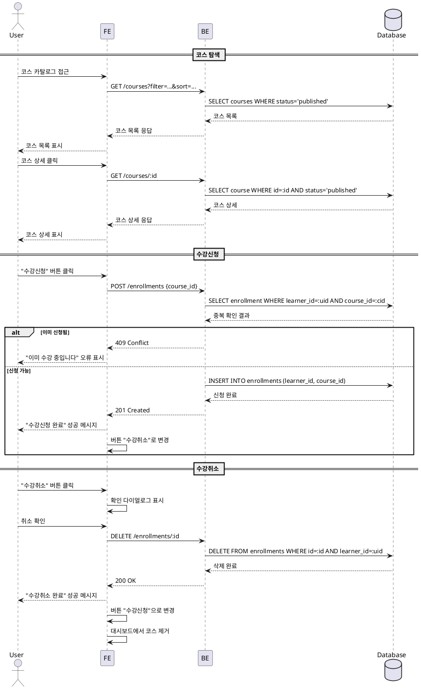

# 코스 탐색 & 수강신청/취소 (Learner)

## Primary Actor
- Learner (학습자)

## Precondition
- 사용자는 Learner 역할로 로그인되어 있어야 함
- 사용자는 이메일 인증 및 기본 프로필을 완료한 상태

## Trigger
- 학습자가 코스 카탈로그 페이지에 접근
- 학습자가 특정 코스 상세 페이지에서 "수강신청" 또는 "수강취소" 버튼 클릭

## Main Scenario

### 1. 코스 탐색
1. 학습자가 코스 카탈로그 페이지에 접근
2. 시스템은 `published` 상태인 코스 목록을 조회하여 표시
3. 학습자는 검색어, 카테고리, 난이도 필터를 적용
4. 시스템은 필터링된 결과를 최신순 또는 인기순으로 정렬하여 표시
5. 학습자가 관심 있는 코스를 선택하여 상세 페이지 진입

### 2. 수강신청
1. 학습자가 코스 상세 페이지에서 "수강신청" 버튼 클릭
2. 시스템은 코스 상태가 `published`인지 확인
3. 시스템은 학습자가 이미 해당 코스에 등록되어 있지 않은지 확인
4. 시스템은 `enrollments` 테이블에 새 레코드 생성
5. 시스템은 성공 메시지를 표시하고, 버튼을 "수강취소"로 변경
6. 학습자 대시보드의 "내 코스" 목록에 해당 코스가 추가됨

### 3. 수강취소
1. 학습자가 코스 상세 페이지 또는 대시보드에서 "수강취소" 버튼 클릭
2. 시스템은 확인 다이얼로그를 표시
3. 학습자가 확인하면 시스템은 `enrollments` 테이블에서 해당 레코드를 삭제 또는 상태 변경
4. 시스템은 성공 메시지를 표시하고, 버튼을 "수강신청"으로 변경
5. 학습자 대시보드의 "내 코스" 목록에서 해당 코스가 제거됨
6. 해당 코스의 모든 제출물 및 성적은 집계에서 제외됨

## Edge Cases

### 코스 탐색 시
- **코스 없음**: 필터 조건에 맞는 코스가 없을 경우 "검색 결과가 없습니다" 메시지 표시
- **네트워크 오류**: API 요청 실패 시 재시도 버튼과 함께 오류 메시지 표시

### 수강신청 시
- **이미 신청된 코스**: "이미 수강 중인 코스입니다" 메시지 표시 및 요청 차단
- **코스가 published 상태가 아님**: "현재 수강신청이 불가능한 코스입니다" 메시지 표시
- **코스가 archived 상태**: "종료된 코스입니다" 메시지 표시 및 신청 차단
- **동시성 문제**: 여러 탭에서 동시 신청 시 중복 방지 (DB 유니크 제약조건)

### 수강취소 시
- **제출한 과제 존재**: 확인 다이얼로그에 "제출한 과제가 있습니다. 취소 시 성적이 삭제됩니다" 경고 표시
- **이미 취소됨**: "수강 중이 아닌 코스입니다" 메시지 표시
- **네트워크 오류**: 취소 실패 시 재시도 버튼 제공

## Business Rules

### 코스 노출 규칙
- `published` 상태인 코스만 카탈로그에 노출
- `draft` 코스는 Instructor만 확인 가능
- `archived` 코스는 신규 수강신청 불가, 기존 수강생은 열람 가능

### 수강신청 규칙
- 한 학습자는 동일 코스에 중복 신청 불가
- 코스 상태가 `published`일 때만 신청 가능
- 신청 즉시 "내 코스"에 반영되며 모든 `published` 과제 열람 가능

### 수강취소 규칙
- 학습자는 언제든지 수강 취소 가능
- 취소 시 제출한 모든 과제 및 성적은 성적 집계에서 제외
- 취소 후 재신청 가능 (단, 이전 데이터는 복구되지 않음)

### 데이터 정합성
- `enrollments` 테이블의 `(learner_id, course_id)` 조합은 유니크 제약조건
- 수강취소 시 소프트 삭제(`status=cancelled`) 또는 하드 삭제 중 선택 (설계 시 결정)

---

## Sequence Diagram

