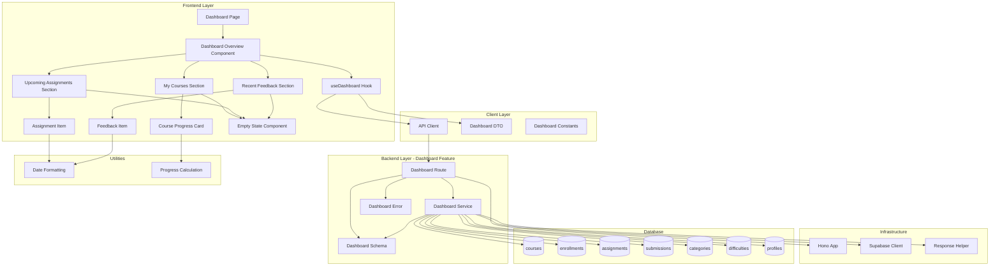

# Learner Dashboard 구현 설계

## 개요

### Backend Modules
| 모듈 | 위치 | 설명 |
|------|------|------|
| Dashboard Route | `src/features/dashboard/backend/route.ts` | 대시보드 데이터 조회 API 엔드포인트 (GET /dashboard) |
| Dashboard Service | `src/features/dashboard/backend/service.ts` | 대시보드 데이터 수집 비즈니스 로직 (코스, 진행률, 마감 임박 과제, 피드백) |
| Dashboard Schema | `src/features/dashboard/backend/schema.ts` | 대시보드 요청/응답 Zod 스키마 |
| Dashboard Error | `src/features/dashboard/backend/error.ts` | 대시보드 관련 에러 코드 정의 |

### Frontend Modules
| 모듈 | 위치 | 설명 |
|------|------|------|
| Dashboard Page | `src/app/(protected)/dashboard/page.tsx` | 대시보드 페이지 (수정) |
| Dashboard Overview Component | `src/features/dashboard/components/dashboard-overview.tsx` | 전체 대시보드 레이아웃 컴포넌트 |
| My Courses Section | `src/features/dashboard/components/my-courses-section.tsx` | 내 코스 목록 섹션 |
| Course Progress Card | `src/features/dashboard/components/course-progress-card.tsx` | 진행률 포함 코스 카드 |
| Upcoming Assignments Section | `src/features/dashboard/components/upcoming-assignments-section.tsx` | 마감 임박 과제 섹션 |
| Assignment Item | `src/features/dashboard/components/assignment-item.tsx` | 마감 임박 과제 아이템 |
| Recent Feedback Section | `src/features/dashboard/components/recent-feedback-section.tsx` | 최근 피드백 섹션 |
| Feedback Item | `src/features/dashboard/components/feedback-item.tsx` | 피드백 아이템 |
| Empty State Component | `src/features/dashboard/components/empty-state.tsx` | 빈 상태 UI (재사용) |
| useDashboard Hook | `src/features/dashboard/hooks/useDashboard.ts` | 대시보드 데이터 조회 React Query 훅 |

### Shared/Common Modules
| 모듈 | 위치 | 설명 |
|------|------|------|
| Dashboard DTO | `src/features/dashboard/lib/dto.ts` | Backend schema 재노출 (Frontend 공유) |
| Dashboard Constants | `src/features/dashboard/constants/index.ts` | 대시보드 관련 상수 (마감 임박 기준일, 피드백 최대 개수 등) |
| Date Formatting Utility | `src/lib/date.ts` | date-fns 기반 날짜 포맷팅 유틸 (신규 또는 확장) |
| Progress Calculation Utility | `src/lib/progress.ts` | 진행률 계산 유틸리티 함수 (신규) |

---

## Diagram



---

## Implementation Plan

### 1. Shared Layer: Dashboard Constants

**파일**: `src/features/dashboard/constants/index.ts`

**목적**: 대시보드 관련 상수 정의

**구현 내용**:
```typescript
export const DASHBOARD_CONSTANTS = {
  // 마감 임박 기준일 (7일)
  UPCOMING_DEADLINE_DAYS: 7,
  // 최근 피드백 최대 개수
  MAX_RECENT_FEEDBACK: 5,
  // 진행률 소수점 자리수
  PROGRESS_DECIMAL_PLACES: 2,
} as const;

export const CACHE_KEYS = {
  DASHBOARD: 'dashboard',
} as const;

export const CACHE_TIME = {
  // 5분 캐싱
  STALE_TIME: 5 * 60 * 1000,
  CACHE_TIME: 10 * 60 * 1000,
} as const;
```

---

### 2. Shared Layer: Date Utility

**파일**: `src/lib/date.ts`

**목적**: date-fns 기반 날짜 포맷팅 유틸

**구현 내용**:
```typescript
import { format, formatDistanceToNow, differenceInDays } from 'date-fns';
import { ko } from 'date-fns/locale';

export const formatDate = (date: string | Date, pattern = 'yyyy-MM-dd') => {
  return format(new Date(date), pattern, { locale: ko });
};

export const formatDateTime = (date: string | Date) => {
  return format(new Date(date), 'yyyy-MM-dd HH:mm', { locale: ko });
};

export const formatRelativeTime = (date: string | Date) => {
  return formatDistanceToNow(new Date(date), { addSuffix: true, locale: ko });
};

export const getDaysRemaining = (date: string | Date) => {
  return differenceInDays(new Date(date), new Date());
};
```

**Unit Tests**:
- ✅ formatDate는 올바른 형식으로 날짜를 포맷한다
- ✅ formatDateTime은 날짜와 시간을 포함한다
- ✅ formatRelativeTime은 상대 시간을 반환한다 (예: "5일 후")
- ✅ getDaysRemaining은 남은 일수를 계산한다

---

### 3. Shared Layer: Progress Utility

**파일**: `src/lib/progress.ts`

**목적**: 진행률 계산 유틸

**구현 내용**:
```typescript
export const calculateProgress = (completed: number, total: number): number => {
  if (total === 0) return 0;
  return Math.round((completed / total) * 100 * 100) / 100;
};

export const formatProgress = (progress: number): string => {
  return `${progress.toFixed(0)}%`;
};

export const getProgressColor = (progress: number): string => {
  if (progress === 0) return 'bg-slate-200';
  if (progress < 30) return 'bg-red-500';
  if (progress < 70) return 'bg-yellow-500';
  return 'bg-green-500';
};
```

**Unit Tests**:
- ✅ calculateProgress는 진행률을 올바르게 계산한다
- ✅ calculateProgress는 total이 0일 때 0을 반환한다
- ✅ formatProgress는 퍼센트 문자열을 반환한다
- ✅ getProgressColor는 진행률에 따른 색상을 반환한다

---

### 4. Backend: Dashboard Schema

**파일**: `src/features/dashboard/backend/schema.ts`

**목적**: 대시보드 요청/응답 Zod 스키마

**구현 내용**:
```typescript
import { z } from 'zod';

// Progress info
export const CourseProgressSchema = z.object({
  completed: z.number().int().min(0),
  total: z.number().int().min(0),
  percentage: z.number().min(0).max(100),
});

export type CourseProgress = z.infer<typeof CourseProgressSchema>;

// My course with progress
export const DashboardCourseSchema = z.object({
  id: z.string().uuid(),
  title: z.string(),
  description: z.string(),
  category: z.string(),
  difficulty: z.string(),
  enrolledAt: z.string(),
  progress: CourseProgressSchema,
});

export type DashboardCourse = z.infer<typeof DashboardCourseSchema>;

// Upcoming assignment
export const UpcomingAssignmentSchema = z.object({
  id: z.string().uuid(),
  title: z.string(),
  courseId: z.string().uuid(),
  courseTitle: z.string(),
  dueDate: z.string(),
  daysRemaining: z.number().int(),
});

export type UpcomingAssignment = z.infer<typeof UpcomingAssignmentSchema>;

// Recent feedback
export const RecentFeedbackSchema = z.object({
  id: z.string().uuid(),
  assignmentId: z.string().uuid(),
  assignmentTitle: z.string(),
  score: z.number().min(0).max(100),
  feedback: z.string(),
  gradedAt: z.string(),
});

export type RecentFeedback = z.infer<typeof RecentFeedbackSchema>;

// Dashboard response
export const DashboardResponseSchema = z.object({
  courses: z.array(DashboardCourseSchema),
  upcomingAssignments: z.array(UpcomingAssignmentSchema),
  recentFeedback: z.array(RecentFeedbackSchema),
});

export type DashboardResponse = z.infer<typeof DashboardResponseSchema>;

// Database row schemas
export const CourseRowSchema = z.object({
  id: z.string().uuid(),
  title: z.string(),
  description: z.string(),
  category_name: z.string(),
  difficulty_name: z.string(),
  enrolled_at: z.string(),
});

export const AssignmentRowSchema = z.object({
  id: z.string().uuid(),
  title: z.string(),
  course_id: z.string().uuid(),
  course_title: z.string(),
  due_date: z.string(),
});

export const SubmissionRowSchema = z.object({
  id: z.string().uuid(),
  assignment_id: z.string().uuid(),
  assignment_title: z.string(),
  score: z.number(),
  feedback: z.string(),
  graded_at: z.string(),
});

export const ProgressRowSchema = z.object({
  course_id: z.string().uuid(),
  completed: z.number().int(),
  total: z.number().int(),
});
```

**Unit Tests**:
- ✅ DashboardCourseSchema는 유효한 코스 데이터를 허용한다
- ✅ CourseProgressSchema는 0-100 범위의 percentage를 허용한다
- ✅ UpcomingAssignmentSchema는 유효한 과제 데이터를 허용한다
- ✅ RecentFeedbackSchema는 유효한 피드백 데이터를 허용한다
- ✅ DashboardResponseSchema는 배열 필드를 허용한다

---

### 5. Backend: Dashboard Error

**파일**: `src/features/dashboard/backend/error.ts`

**목적**: 대시보드 관련 에러 코드 정의

**구현 내용**:
```typescript
export const dashboardErrorCodes = {
  unauthorized: 'DASHBOARD_UNAUTHORIZED',
  forbidden: 'DASHBOARD_FORBIDDEN',
  fetchFailed: 'DASHBOARD_FETCH_FAILED',
  invalidRole: 'DASHBOARD_INVALID_ROLE',
  validationError: 'DASHBOARD_VALIDATION_ERROR',
} as const;

export type DashboardServiceError =
  typeof dashboardErrorCodes[keyof typeof dashboardErrorCodes];
```

---

### 6. Backend: Dashboard Service

**파일**: `src/features/dashboard/backend/service.ts`

**목적**: 대시보드 데이터 수집 비즈니스 로직

**구현 내용**:
```typescript
import type { SupabaseClient } from '@supabase/supabase-js';
import { failure, success, type HandlerResult } from '@/backend/http/response';
import { differenceInDays } from 'date-fns';
import {
  DashboardResponseSchema,
  CourseRowSchema,
  AssignmentRowSchema,
  SubmissionRowSchema,
  ProgressRowSchema,
  type DashboardResponse,
  type DashboardCourse,
  type UpcomingAssignment,
  type RecentFeedback,
} from './schema';
import { dashboardErrorCodes, type DashboardServiceError } from './error';

const UPCOMING_DEADLINE_DAYS = 7;
const MAX_RECENT_FEEDBACK = 5;

export const getDashboardData = async (
  client: SupabaseClient,
  userId: string,
): Promise<HandlerResult<DashboardResponse, DashboardServiceError, unknown>> => {
  try {
    // 1. Get my courses with category and difficulty
    const { data: coursesData, error: coursesError } = await client
      .from('enrollments')
      .select(
        `
        enrolled_at,
        courses (
          id,
          title,
          description,
          categories (name),
          difficulties (name)
        )
      `,
      )
      .eq('learner_id', userId)
      .eq('courses.status', 'published');

    if (coursesError) {
      return failure(
        500,
        dashboardErrorCodes.fetchFailed,
        '코스 목록 조회에 실패했습니다',
        coursesError,
      );
    }

    // 2. Get progress for each course
    const courseIds =
      coursesData?.map((e: any) => e.courses.id).filter(Boolean) ?? [];

    let progressMap = new Map<string, { completed: number; total: number }>();

    if (courseIds.length > 0) {
      // Get total assignments per course
      const { data: totalAssignments } = await client
        .from('assignments')
        .select('course_id, id')
        .in('course_id', courseIds)
        .eq('status', 'published');

      const totalMap = new Map<string, number>();
      totalAssignments?.forEach((a: any) => {
        totalMap.set(a.course_id, (totalMap.get(a.course_id) ?? 0) + 1);
      });

      // Get completed assignments per course
      const { data: completedSubmissions } = await client
        .from('submissions')
        .select('assignment_id, assignments!inner(course_id)')
        .eq('learner_id', userId)
        .eq('status', 'graded')
        .in('assignments.course_id', courseIds);

      const completedMap = new Map<string, number>();
      completedSubmissions?.forEach((s: any) => {
        const courseId = s.assignments.course_id;
        completedMap.set(courseId, (completedMap.get(courseId) ?? 0) + 1);
      });

      // Build progress map
      courseIds.forEach((courseId) => {
        const total = totalMap.get(courseId) ?? 0;
        const completed = completedMap.get(courseId) ?? 0;
        progressMap.set(courseId, { completed, total });
      });
    }

    // 3. Get upcoming assignments (due within 7 days, not submitted)
    const { data: upcomingData, error: upcomingError } = await client
      .from('assignments')
      .select(
        `
        id,
        title,
        due_date,
        course_id,
        courses!inner(title, enrollments!inner(learner_id))
      `,
      )
      .eq('status', 'published')
      .eq('courses.enrollments.learner_id', userId)
      .gte('due_date', new Date().toISOString())
      .lte('due_date', new Date(Date.now() + UPCOMING_DEADLINE_DAYS * 24 * 60 * 60 * 1000).toISOString())
      .order('due_date', { ascending: true });

    if (upcomingError) {
      return failure(
        500,
        dashboardErrorCodes.fetchFailed,
        '마감 임박 과제 조회에 실패했습니다',
        upcomingError,
      );
    }

    // Filter out already submitted assignments
    const upcomingAssignmentIds = upcomingData?.map((a: any) => a.id) ?? [];
    let submittedAssignmentIds: string[] = [];

    if (upcomingAssignmentIds.length > 0) {
      const { data: submittedData } = await client
        .from('submissions')
        .select('assignment_id')
        .eq('learner_id', userId)
        .in('assignment_id', upcomingAssignmentIds);

      submittedAssignmentIds = submittedData?.map((s) => s.assignment_id) ?? [];
    }

    const upcomingAssignments: UpcomingAssignment[] =
      upcomingData
        ?.filter((a: any) => !submittedAssignmentIds.includes(a.id))
        .map((a: any) => ({
          id: a.id,
          title: a.title,
          courseId: a.course_id,
          courseTitle: a.courses.title,
          dueDate: a.due_date,
          daysRemaining: differenceInDays(new Date(a.due_date), new Date()),
        })) ?? [];

    // 4. Get recent feedback (top 5, graded, with feedback)
    const { data: feedbackData, error: feedbackError } = await client
      .from('submissions')
      .select(
        `
        id,
        assignment_id,
        score,
        feedback,
        graded_at,
        assignments!inner(title)
      `,
      )
      .eq('learner_id', userId)
      .eq('status', 'graded')
      .not('feedback', 'is', null)
      .order('graded_at', { ascending: false })
      .limit(MAX_RECENT_FEEDBACK);

    if (feedbackError) {
      return failure(
        500,
        dashboardErrorCodes.fetchFailed,
        '최근 피드백 조회에 실패했습니다',
        feedbackError,
      );
    }

    const recentFeedback: RecentFeedback[] =
      feedbackData?.map((f: any) => ({
        id: f.id,
        assignmentId: f.assignment_id,
        assignmentTitle: f.assignments.title,
        score: f.score,
        feedback: f.feedback,
        gradedAt: f.graded_at,
      })) ?? [];

    // 5. Build courses with progress
    const courses: DashboardCourse[] =
      coursesData?.map((e: any) => {
        const courseId = e.courses.id;
        const progress = progressMap.get(courseId) ?? { completed: 0, total: 0 };
        const percentage =
          progress.total === 0
            ? 0
            : Math.round((progress.completed / progress.total) * 10000) / 100;

        return {
          id: courseId,
          title: e.courses.title,
          description: e.courses.description,
          category: e.courses.categories.name,
          difficulty: e.courses.difficulties.name,
          enrolledAt: e.enrolled_at,
          progress: {
            completed: progress.completed,
            total: progress.total,
            percentage,
          },
        };
      }) ?? [];

    // 6. Validate and return
    const response = {
      courses,
      upcomingAssignments,
      recentFeedback,
    };

    const parsed = DashboardResponseSchema.safeParse(response);

    if (!parsed.success) {
      return failure(
        500,
        dashboardErrorCodes.validationError,
        '대시보드 데이터 검증에 실패했습니다',
        parsed.error.format(),
      );
    }

    return success(parsed.data);
  } catch (error) {
    return failure(
      500,
      dashboardErrorCodes.fetchFailed,
      '대시보드 데이터 조회 중 오류가 발생했습니다',
      error,
    );
  }
};
```

**Unit Tests**:
- ✅ getDashboardData는 learner의 코스 목록을 반환한다
- ✅ getDashboardData는 각 코스의 진행률을 계산한다
- ✅ getDashboardData는 진행률이 0인 코스도 처리한다
- ✅ getDashboardData는 마감 임박 과제를 필터링한다
- ✅ getDashboardData는 이미 제출한 과제를 제외한다
- ✅ getDashboardData는 최근 피드백을 최대 5개 반환한다
- ✅ getDashboardData는 피드백이 없는 제출물을 제외한다
- ✅ getDashboardData는 데이터베이스 오류 시 실패를 반환한다
- ✅ getDashboardData는 스키마 검증 실패 시 오류를 반환한다

---

### 7. Backend: Dashboard Route

**파일**: `src/features/dashboard/backend/route.ts`

**목적**: 대시보드 API 엔드포인트

**구현 내용**:
```typescript
import type { Hono } from 'hono';
import { failure, respond } from '@/backend/http/response';
import { getLogger, getSupabase, type AppEnv } from '@/backend/hono/context';
import { getDashboardData } from './service';
import { dashboardErrorCodes } from './error';

export const registerDashboardRoutes = (app: Hono<AppEnv>) => {
  app.get('/dashboard', async (c) => {
    const supabase = getSupabase(c);
    const logger = getLogger(c);

    // Get current user from JWT
    const authHeader = c.req.header('authorization');
    if (!authHeader) {
      return respond(
        c,
        failure(401, dashboardErrorCodes.unauthorized, '인증이 필요합니다'),
      );
    }

    const token = authHeader.replace('Bearer ', '');
    const { data: userData, error: userError } = await supabase.auth.getUser(token);

    if (userError || !userData.user) {
      return respond(
        c,
        failure(401, dashboardErrorCodes.unauthorized, '유효하지 않은 토큰입니다'),
      );
    }

    const userId = userData.user.id;

    // Check if user is learner
    const { data: profile } = await supabase
      .from('profiles')
      .select('role')
      .eq('id', userId)
      .single();

    if (!profile || profile.role !== 'learner') {
      return respond(
        c,
        failure(403, dashboardErrorCodes.forbidden, '학습자 전용 페이지입니다'),
      );
    }

    const result = await getDashboardData(supabase, userId);

    if (!result.ok) {
      logger.error('Dashboard data fetch failed', result.error.message);
    }

    return respond(c, result);
  });
};
```

**Integration Tests (수동 테스트)**:
- ✅ GET /dashboard는 인증 없이 요청 시 401을 반환한다
- ✅ GET /dashboard는 learner가 아닌 사용자 요청 시 403을 반환한다
- ✅ GET /dashboard는 learner 요청 시 200과 대시보드 데이터를 반환한다
- ✅ GET /dashboard는 코스가 없는 learner에 대해 빈 배열을 반환한다

---

### 8. Backend: Hono App Integration

**파일**: `src/backend/hono/app.ts` (기존 수정)

**수정 내용**:
```typescript
import { registerDashboardRoutes } from '@/features/dashboard/backend/route';

// ...existing code...

export const createHonoApp = () => {
  // ...existing middleware...

  registerExampleRoutes(app);
  registerAuthRoutes(app);
  registerCourseRoutes(app);
  registerEnrollmentRoutes(app);
  registerDashboardRoutes(app); // 추가

  // ...existing code...
};
```

---

### 9. Frontend: Dashboard DTO

**파일**: `src/features/dashboard/lib/dto.ts`

**목적**: Backend 스키마 재노출

**구현 내용**:
```typescript
export {
  DashboardResponseSchema,
  DashboardCourseSchema,
  UpcomingAssignmentSchema,
  RecentFeedbackSchema,
  CourseProgressSchema,
  type DashboardResponse,
  type DashboardCourse,
  type UpcomingAssignment,
  type RecentFeedback,
  type CourseProgress,
} from '@/features/dashboard/backend/schema';
```

---

### 10. Frontend: useDashboard Hook

**파일**: `src/features/dashboard/hooks/useDashboard.ts`

**목적**: 대시보드 데이터 조회 React Query 훅

**구현 내용**:
```typescript
"use client";

import { useQuery } from '@tanstack/react-query';
import { apiClient } from '@/lib/remote/api-client';
import { CACHE_KEYS, CACHE_TIME } from '@/features/dashboard/constants';
import type { DashboardResponse } from '@/features/dashboard/lib/dto';

export const useDashboard = () => {
  return useQuery<DashboardResponse>({
    queryKey: [CACHE_KEYS.DASHBOARD],
    queryFn: async () => {
      const response = await apiClient.get<DashboardResponse>('/dashboard');
      return response.data;
    },
    staleTime: CACHE_TIME.STALE_TIME,
    gcTime: CACHE_TIME.CACHE_TIME,
  });
};
```

---

### 11. Frontend: Empty State Component

**파일**: `src/features/dashboard/components/empty-state.tsx`

**목적**: 빈 상태 UI 컴포넌트

**구현 내용**:
```typescript
"use client";

import { AlertCircle } from 'lucide-react';
import { Button } from '@/components/ui/button';
import Link from 'next/link';

type EmptyStateProps = {
  icon?: React.ReactNode;
  title: string;
  description: string;
  actionLabel?: string;
  actionHref?: string;
};

export const EmptyState = ({
  icon,
  title,
  description,
  actionLabel,
  actionHref,
}: EmptyStateProps) => {
  return (
    <div className="flex flex-col items-center justify-center py-12 text-center">
      <div className="mb-4 text-slate-400">
        {icon ?? <AlertCircle className="h-12 w-12" />}
      </div>
      <h3 className="mb-2 text-lg font-semibold text-slate-900">{title}</h3>
      <p className="mb-6 text-sm text-slate-500">{description}</p>
      {actionLabel && actionHref && (
        <Button asChild>
          <Link href={actionHref}>{actionLabel}</Link>
        </Button>
      )}
    </div>
  );
};
```

**QA Sheet**:
- ✅ 아이콘이 표시되는가?
- ✅ 제목과 설명이 올바르게 표시되는가?
- ✅ 액션 버튼이 있을 때만 표시되는가?
- ✅ 액션 버튼 클릭 시 올바른 링크로 이동하는가?

---

### 12. Frontend: Course Progress Card

**파일**: `src/features/dashboard/components/course-progress-card.tsx`

**목적**: 진행률 포함 코스 카드

**구현 내용**:
```typescript
"use client";

import Link from 'next/link';
import { Card, CardContent, CardDescription, CardHeader, CardTitle } from '@/components/ui/card';
import { Badge } from '@/components/ui/badge';
import { calculateProgress, formatProgress, getProgressColor } from '@/lib/progress';
import type { DashboardCourse } from '@/features/dashboard/lib/dto';

type CourseProgressCardProps = {
  course: DashboardCourse;
};

export const CourseProgressCard = ({ course }: CourseProgressCardProps) => {
  const progressColor = getProgressColor(course.progress.percentage);

  return (
    <Link href={`/courses/${course.id}`}>
      <Card className="transition-shadow hover:shadow-md">
        <CardHeader>
          <div className="flex items-start justify-between">
            <CardTitle className="text-lg">{course.title}</CardTitle>
            <div className="flex gap-2">
              <Badge variant="outline">{course.category}</Badge>
              <Badge variant="outline">{course.difficulty}</Badge>
            </div>
          </div>
          <CardDescription className="line-clamp-2">
            {course.description}
          </CardDescription>
        </CardHeader>
        <CardContent>
          <div className="space-y-2">
            <div className="flex items-center justify-between text-sm">
              <span className="text-slate-600">진행률</span>
              <span className="font-semibold">
                {formatProgress(course.progress.percentage)}
              </span>
            </div>
            <div className="h-2 w-full overflow-hidden rounded-full bg-slate-200">
              <div
                className={`h-full transition-all ${progressColor}`}
                style={{ width: `${course.progress.percentage}%` }}
              />
            </div>
            <p className="text-xs text-slate-500">
              {course.progress.completed}/{course.progress.total} 과제 완료
            </p>
          </div>
        </CardContent>
      </Card>
    </Link>
  );
};
```

**QA Sheet**:
- ✅ 코스 제목, 설명이 표시되는가?
- ✅ 카테고리와 난이도 배지가 표시되는가?
- ✅ 진행률 바가 올바른 색상과 너비로 표시되는가?
- ✅ 완료/전체 과제 수가 표시되는가?
- ✅ 카드 클릭 시 코스 상세 페이지로 이동하는가?
- ✅ 진행률 0%, 50%, 100%에 대해 올바른 색상이 적용되는가?

---

### 13. Frontend: My Courses Section

**파일**: `src/features/dashboard/components/my-courses-section.tsx`

**목적**: 내 코스 목록 섹션

**구현 내용**:
```typescript
"use client";

import { BookOpen } from 'lucide-react';
import { CourseProgressCard } from './course-progress-card';
import { EmptyState } from './empty-state';
import type { DashboardCourse } from '@/features/dashboard/lib/dto';

type MyCoursesSection Props = {
  courses: DashboardCourse[];
};

export const MyCoursesSection = ({ courses }: MyCoursesSection Props) => {
  if (courses.length === 0) {
    return (
      <section>
        <h2 className="mb-4 text-xl font-semibold">내 코스</h2>
        <EmptyState
          icon={<BookOpen className="h-12 w-12" />}
          title="수강 중인 코스가 없습니다"
          description="코스 카탈로그에서 관심 있는 코스를 둘러보세요."
          actionLabel="코스 탐색하기"
          actionHref="/courses"
        />
      </section>
    );
  }

  return (
    <section>
      <h2 className="mb-4 text-xl font-semibold">내 코스</h2>
      <div className="grid gap-4 md:grid-cols-2 lg:grid-cols-3">
        {courses.map((course) => (
          <CourseProgressCard key={course.id} course={course} />
        ))}
      </div>
    </section>
  );
};
```

**QA Sheet**:
- ✅ 코스 목록이 그리드로 표시되는가?
- ✅ 코스가 없을 때 빈 상태가 표시되는가?
- ✅ 반응형 레이아웃이 작동하는가? (1열 → 2열 → 3열)

---

### 14. Frontend: Assignment Item

**파일**: `src/features/dashboard/components/assignment-item.tsx`

**목적**: 마감 임박 과제 아이템

**구현 내용**:
```typescript
"use client";

import Link from 'next/link';
import { Clock, AlertTriangle } from 'lucide-react';
import { Badge } from '@/components/ui/badge';
import { formatDate, getDaysRemaining } from '@/lib/date';
import type { UpcomingAssignment } from '@/features/dashboard/lib/dto';

type AssignmentItemProps = {
  assignment: UpcomingAssignment;
};

export const AssignmentItem = ({ assignment }: AssignmentItemProps) => {
  const isUrgent = assignment.daysRemaining <= 3;

  return (
    <Link
      href={`/courses/${assignment.courseId}/assignments/${assignment.id}`}
      className="block"
    >
      <div className="flex items-start justify-between rounded-lg border border-slate-200 p-4 transition-colors hover:bg-slate-50">
        <div className="flex-1">
          <div className="mb-1 flex items-center gap-2">
            <h3 className="font-medium text-slate-900">{assignment.title}</h3>
            {isUrgent && (
              <AlertTriangle className="h-4 w-4 text-orange-500" />
            )}
          </div>
          <p className="text-sm text-slate-600">{assignment.courseTitle}</p>
          <div className="mt-2 flex items-center gap-2 text-sm text-slate-500">
            <Clock className="h-4 w-4" />
            <span>{formatDate(assignment.dueDate)}</span>
            <Badge variant={isUrgent ? 'destructive' : 'secondary'}>
              {assignment.daysRemaining === 0
                ? '오늘 마감'
                : `${assignment.daysRemaining}일 남음`}
            </Badge>
          </div>
        </div>
      </div>
    </Link>
  );
};
```

**QA Sheet**:
- ✅ 과제 제목과 코스명이 표시되는가?
- ✅ 마감일이 올바른 형식으로 표시되는가?
- ✅ 남은 일수가 올바르게 표시되는가?
- ✅ 3일 이하일 때 경고 아이콘과 빨간 배지가 표시되는가?
- ✅ 클릭 시 과제 상세 페이지로 이동하는가?

---

### 15. Frontend: Upcoming Assignments Section

**파일**: `src/features/dashboard/components/upcoming-assignments-section.tsx`

**목적**: 마감 임박 과제 섹션

**구현 내용**:
```typescript
"use client";

import { Calendar } from 'lucide-react';
import { AssignmentItem } from './assignment-item';
import { EmptyState } from './empty-state';
import type { UpcomingAssignment } from '@/features/dashboard/lib/dto';

type UpcomingAssignmentsSectionProps = {
  assignments: UpcomingAssignment[];
};

export const UpcomingAssignmentsSection = ({
  assignments,
}: UpcomingAssignmentsSectionProps) => {
  if (assignments.length === 0) {
    return (
      <section>
        <h2 className="mb-4 text-xl font-semibold">마감 임박 과제</h2>
        <EmptyState
          icon={<Calendar className="h-12 w-12" />}
          title="마감 임박 과제가 없습니다"
          description="모든 과제를 제출했거나 마감일이 충분히 남아있습니다."
        />
      </section>
    );
  }

  return (
    <section>
      <h2 className="mb-4 text-xl font-semibold">
        마감 임박 과제 <span className="text-slate-500">({assignments.length})</span>
      </h2>
      <div className="space-y-3">
        {assignments.map((assignment) => (
          <AssignmentItem key={assignment.id} assignment={assignment} />
        ))}
      </div>
    </section>
  );
};
```

**QA Sheet**:
- ✅ 과제 목록이 세로로 나열되는가?
- ✅ 과제 개수가 표시되는가?
- ✅ 과제가 없을 때 빈 상태가 표시되는가?

---

### 16. Frontend: Feedback Item

**파일**: `src/features/dashboard/components/feedback-item.tsx`

**목적**: 피드백 아이템

**구현 내용**:
```typescript
"use client";

import Link from 'next/link';
import { MessageSquare } from 'lucide-react';
import { Badge } from '@/components/ui/badge';
import { formatDateTime } from '@/lib/date';
import type { RecentFeedback } from '@/features/dashboard/lib/dto';

type FeedbackItemProps = {
  feedback: RecentFeedback;
};

export const FeedbackItem = ({ feedback }: FeedbackItemProps) => {
  const getScoreColor = (score: number) => {
    if (score >= 90) return 'bg-green-100 text-green-800';
    if (score >= 70) return 'bg-yellow-100 text-yellow-800';
    return 'bg-red-100 text-red-800';
  };

  return (
    <div className="rounded-lg border border-slate-200 p-4">
      <div className="mb-2 flex items-start justify-between">
        <div className="flex-1">
          <h3 className="font-medium text-slate-900">{feedback.assignmentTitle}</h3>
          <p className="text-xs text-slate-500">
            {formatDateTime(feedback.gradedAt)}
          </p>
        </div>
        <Badge className={getScoreColor(feedback.score)}>
          {feedback.score}점
        </Badge>
      </div>
      <div className="mt-3 flex items-start gap-2 rounded-md bg-slate-50 p-3">
        <MessageSquare className="mt-0.5 h-4 w-4 flex-shrink-0 text-slate-400" />
        <p className="text-sm text-slate-700">{feedback.feedback}</p>
      </div>
    </div>
  );
};
```

**QA Sheet**:
- ✅ 과제 제목이 표시되는가?
- ✅ 채점 시각이 올바른 형식으로 표시되는가?
- ✅ 점수가 배지로 표시되는가?
- ✅ 점수에 따라 배지 색상이 변경되는가? (90+: 녹색, 70+: 노랑, 70미만: 빨강)
- ✅ 피드백 내용이 표시되는가?

---

### 17. Frontend: Recent Feedback Section

**파일**: `src/features/dashboard/components/recent-feedback-section.tsx`

**목적**: 최근 피드백 섹션

**구현 내용**:
```typescript
"use client";

import { MessageCircle } from 'lucide-react';
import { FeedbackItem } from './feedback-item';
import { EmptyState } from './empty-state';
import type { RecentFeedback } from '@/features/dashboard/lib/dto';

type RecentFeedbackSectionProps = {
  feedback: RecentFeedback[];
};

export const RecentFeedbackSection = ({ feedback }: RecentFeedbackSectionProps) => {
  if (feedback.length === 0) {
    return (
      <section>
        <h2 className="mb-4 text-xl font-semibold">최근 피드백</h2>
        <EmptyState
          icon={<MessageCircle className="h-12 w-12" />}
          title="아직 받은 피드백이 없습니다"
          description="과제를 제출하고 강사의 피드백을 받아보세요."
        />
      </section>
    );
  }

  return (
    <section>
      <h2 className="mb-4 text-xl font-semibold">최근 피드백</h2>
      <div className="space-y-3">
        {feedback.map((item) => (
          <FeedbackItem key={item.id} feedback={item} />
        ))}
      </div>
    </section>
  );
};
```

**QA Sheet**:
- ✅ 피드백 목록이 세로로 나열되는가?
- ✅ 피드백이 없을 때 빈 상태가 표시되는가?

---

### 18. Frontend: Dashboard Overview Component

**파일**: `src/features/dashboard/components/dashboard-overview.tsx`

**목적**: 전체 대시보드 레이아웃 컴포넌트

**구현 내용**:
```typescript
"use client";

import { Loader2 } from 'lucide-react';
import { Alert, AlertDescription } from '@/components/ui/alert';
import { Button } from '@/components/ui/button';
import { MyCoursesSection } from './my-courses-section';
import { UpcomingAssignmentsSection } from './upcoming-assignments-section';
import { RecentFeedbackSection } from './recent-feedback-section';
import { useDashboard } from '@/features/dashboard/hooks/useDashboard';

export const DashboardOverview = () => {
  const { data, isLoading, isError, error, refetch } = useDashboard();

  if (isLoading) {
    return (
      <div className="flex min-h-[400px] items-center justify-center">
        <Loader2 className="h-8 w-8 animate-spin text-slate-400" />
      </div>
    );
  }

  if (isError) {
    return (
      <Alert variant="destructive">
        <AlertDescription className="flex items-center justify-between">
          <span>
            대시보드 데이터를 불러오는 데 실패했습니다.{' '}
            {error instanceof Error ? error.message : '다시 시도해주세요.'}
          </span>
          <Button variant="outline" size="sm" onClick={() => refetch()}>
            재시도
          </Button>
        </AlertDescription>
      </Alert>
    );
  }

  if (!data) {
    return null;
  }

  return (
    <div className="space-y-8">
      <MyCoursesSection courses={data.courses} />
      <UpcomingAssignmentsSection assignments={data.upcomingAssignments} />
      <RecentFeedbackSection feedback={data.recentFeedback} />
    </div>
  );
};
```

**QA Sheet**:
- ✅ 로딩 중일 때 스피너가 표시되는가?
- ✅ 에러 발생 시 에러 메시지와 재시도 버튼이 표시되는가?
- ✅ 재시도 버튼 클릭 시 데이터가 다시 로드되는가?
- ✅ 데이터 로드 성공 시 모든 섹션이 표시되는가?

---

### 19. Frontend: Dashboard Page (수정)

**파일**: `src/app/(protected)/dashboard/page.tsx`

**수정 내용**:
```typescript
"use client";

import { DashboardOverview } from '@/features/dashboard/components/dashboard-overview';
import { useCurrentUser } from '@/features/auth/hooks/useCurrentUser';

type DashboardPageProps = {
  params: Promise<Record<string, never>>;
};

export default function DashboardPage({ params }: DashboardPageProps) {
  void params;
  const { user } = useCurrentUser();

  return (
    <div className="mx-auto max-w-7xl px-6 py-12">
      <header className="mb-8 space-y-2">
        <h1 className="text-3xl font-semibold">대시보드</h1>
        <p className="text-slate-500">
          {user?.email ?? '알 수 없는 사용자'} 님, 환영합니다.
        </p>
      </header>
      <DashboardOverview />
    </div>
  );
}
```

**QA Sheet**:
- ✅ 페이지 헤더가 표시되는가?
- ✅ 사용자 이메일이 표시되는가?
- ✅ 대시보드 전체 레이아웃이 올바르게 표시되는가?
- ✅ 보호된 라우트로 인증되지 않은 사용자는 접근할 수 없는가?

---

## Testing Strategy

### Backend Tests
- **Unit Tests**: Service 레이어 로직 (Mock Supabase Client 사용)
  - `getDashboardData` 함수의 각 시나리오
  - 진행률 계산 로직
  - 마감 임박 과제 필터링 로직
  - 피드백 조회 로직
- **Integration Tests**: Route 레이어 (수동 또는 Hono Test Helper 사용)
  - 인증 검증
  - 권한 검증 (learner only)
  - 성공 케이스
  - 에러 케이스

### Utility Tests
- **Unit Tests**: 유틸리티 함수
  - Date formatting 함수
  - Progress calculation 함수

### Frontend Tests
- **Component Tests**: QA Sheet 기반 수동 테스트
  - 각 컴포넌트의 시각적 확인
  - 인터랙션 확인
- **Integration Tests**: 사용자 시나리오 기반 수동 테스트
  - 대시보드 접근 → 데이터 로드 → 각 섹션 확인
  - 빈 상태 시나리오
  - 에러 상태 시나리오

---

## Implementation Order

1. **Shared Layer** (병렬 작업 가능)
   - Dashboard Constants
   - Date Utility
   - Progress Utility

2. **Backend Layer** (순차 작업)
   - Dashboard Schema
   - Dashboard Error
   - Dashboard Service
   - Dashboard Route
   - Hono App Integration

3. **Frontend Layer - Shared** (병렬 작업 가능)
   - Dashboard DTO
   - useDashboard Hook

4. **Frontend Layer - Components** (하향식 개발)
   - Empty State Component
   - Feedback Item → Recent Feedback Section
   - Assignment Item → Upcoming Assignments Section
   - Course Progress Card → My Courses Section
   - Dashboard Overview Component
   - Dashboard Page (수정)

---

## Notes

### Performance Considerations
- 대시보드 데이터는 단일 API 호출로 모든 데이터를 가져옴 (N+1 쿼리 방지)
- React Query 캐싱으로 5분간 데이터 재사용
- Supabase `.select()` 체이닝으로 JOIN 최소화
- 필요한 컬럼만 SELECT

### Security Considerations
- JWT 토큰으로 사용자 인증
- 프로필 테이블에서 role 검증 (learner만 허용)
- 본인의 데이터만 조회 가능 (userId 필터링)

### UX Considerations
- 로딩 상태, 에러 상태, 빈 상태 모두 처리
- 빈 상태에서는 액션 버튼 제공 (코스 탐색 등)
- 마감 임박 과제는 날짜별로 정렬하고 3일 이하는 강조 표시
- 진행률은 시각적으로 프로그레스 바로 표현
- 점수는 색상 코딩으로 직관적 표시

### Future Enhancements
- 대시보드 위젯 커스터마이징 (드래그 앤 드롭)
- 코스별 성적 상세 차트
- 학습 시간 트래킹
- 목표 설정 및 달성 현황
- 추천 코스 섹션
