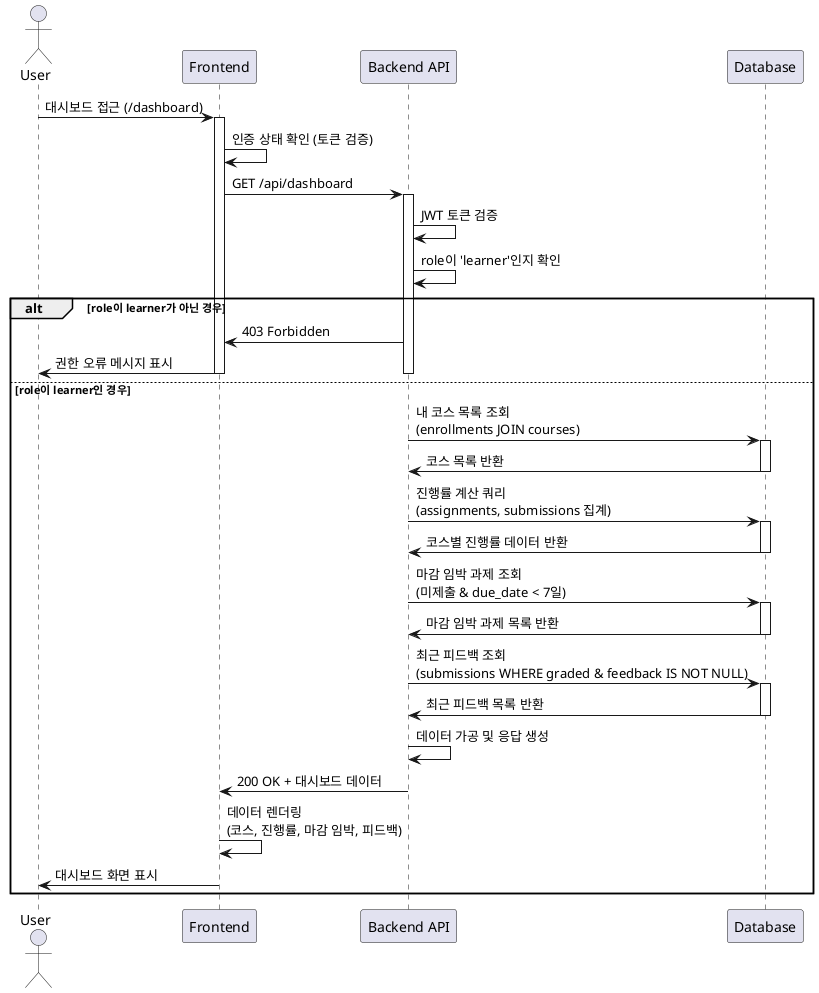

# Use Case Specification: Learner Dashboard (UC-003)

## Primary Actor
- **Learner** (학습자): 수강 중인 코스와 과제 현황을 확인하고자 하는 사용자

## Precondition
- 학습자가 시스템에 로그인되어 있어야 함
- 학습자의 role이 `learner`여야 함
- 최소 1개 이상의 코스에 수강신청(`enrollments` 레코드 존재)되어 있어야 함

## Trigger
- 학습자가 대시보드 페이지(`/dashboard`)에 접근

## Main Scenario

### 1. 대시보드 접근
- 학습자가 대시보드 URL로 이동하거나 네비게이션 메뉴에서 "대시보드" 클릭
- 시스템이 인증 상태 및 역할(role) 검증

### 2. 내 코스 목록 조회
- 시스템이 학습자의 `enrollments` 테이블 조회
- `published` 상태의 코스만 필터링하여 표시
- 각 코스의 기본 정보(제목, 설명, 카테고리, 난이도) 표시

### 3. 진행률 계산
- 각 코스별로 다음 계산 수행:
  - 전체 과제 수: 해당 코스의 `published` 상태 `assignments` 개수
  - 완료 과제 수: 해당 과제에 대해 `graded` 상태인 `submissions` 개수
  - 진행률 = (완료 과제 수 / 전체 과제 수) × 100
- 진행률을 퍼센트로 표시 (예: 60%)

### 4. 마감 임박 과제 조회
- 다음 조건을 만족하는 과제 조회:
  - 학습자가 수강 중인 코스의 과제
  - `published` 상태
  - 학습자가 아직 제출하지 않은 과제(해당 `submissions` 레코드 없음)
  - 마감일(`due_date`)이 현재 시각 이후이면서 7일 이내
- 마감일 오름차순으로 정렬하여 표시
- 과제명, 코스명, 남은 시간 표시

### 5. 최근 피드백 조회
- 다음 조건을 만족하는 제출물 조회:
  - 학습자가 제출한 `submissions`
  - `graded` 상태
  - `feedback` 필드가 NULL이 아님
- 채점 시각(`graded_at`) 내림차순으로 정렬
- 최대 5개까지 표시
- 과제명, 점수, 피드백 내용 표시

### 6. 대시보드 렌더링
- 수집한 모든 데이터를 통합하여 대시보드 UI 렌더링
- 각 섹션별로 카드 형태로 구성:
  - 내 코스 (진행률 바 포함)
  - 마감 임박 과제 (배지/태그로 강조)
  - 최근 피드백 (점수와 함께 표시)

## Edge Cases

### 1. 수강 중인 코스가 없는 경우
- **상황**: `enrollments` 테이블에 레코드가 없음
- **처리**: "수강 중인 코스가 없습니다. 코스 카탈로그에서 코스를 둘러보세요." 메시지 표시 및 코스 탐색 페이지 링크 제공

### 2. 과제가 없는 코스
- **상황**: 코스에 `published` 상태의 `assignments`가 없음
- **처리**: 진행률을 0% 또는 "N/A"로 표시, "아직 과제가 등록되지 않았습니다." 안내

### 3. 마감 임박 과제가 없는 경우
- **상황**: 모든 과제가 제출되었거나 마감일이 7일 이상 남음
- **처리**: "마감 임박 과제가 없습니다." 메시지 표시

### 4. 피드백이 없는 경우
- **상황**: 아직 채점된 제출물이 없거나 피드백이 작성되지 않음
- **처리**: "아직 받은 피드백이 없습니다." 메시지 표시

### 5. 코스 상태가 변경된 경우
- **상황**: 수강 중이던 코스가 `archived` 상태로 전환
- **처리**: 해당 코스를 대시보드에서 숨김 처리 (또는 "종료된 코스" 섹션으로 분리)

### 6. 데이터 로딩 실패
- **상황**: 네트워크 오류 또는 서버 오류
- **처리**: 에러 메시지 표시 및 재시도 버튼 제공

### 7. 권한 오류
- **상황**: 학습자가 아닌 사용자(instructor/operator)가 접근 시도
- **처리**: 403 Forbidden 응답, "학습자 전용 페이지입니다." 메시지 및 적절한 대시보드로 리다이렉트

## Business Rules

### BR-001: 진행률 계산 규칙
- 진행률은 `graded` 상태의 제출물만 카운트
- `submitted` 또는 `resubmission_required` 상태는 미완료로 간주
- 과제가 없는 코스는 진행률을 0%로 표시

### BR-002: 마감 임박 기준
- "마감 임박"은 현재 시각 기준 7일 이내로 정의
- 이미 마감된 과제(`due_date < NOW()`)는 포함하지 않음
- 미제출 과제만 표시

### BR-003: 피드백 표시 정책
- 최근 5개의 피드백만 표시
- `feedback` 필드가 비어있지 않은 것만 표시
- 채점 시각(`graded_at`) 기준 최신순 정렬

### BR-004: 코스 필터링
- `published` 상태의 코스만 대시보드에 표시
- `draft` 또는 `archived` 코스는 제외

### BR-005: 성능 최적화
- 대시보드 데이터는 클라이언트 캐싱 적용 (예: 5분간 유효)
- 페이지 접근 시 한 번에 모든 데이터를 조회 (N+1 쿼리 방지)

### BR-006: 접근 권한
- 학습자(`role=learner`)만 접근 가능
- 본인의 데이터만 조회 가능 (다른 학습자 데이터 조회 불가)

## Sequence Diagram



## API Endpoint

### GET /api/dashboard

**Request Headers**
```
Authorization: Bearer <JWT_TOKEN>
```

**Response 200 OK**
```json
{
  "courses": [
    {
      "id": "uuid",
      "title": "TypeScript 마스터하기",
      "description": "...",
      "category": "프로그래밍",
      "difficulty": "중급",
      "enrolledAt": "2025-09-01T00:00:00Z",
      "progress": {
        "completed": 5,
        "total": 10,
        "percentage": 50
      }
    }
  ],
  "upcomingAssignments": [
    {
      "id": "uuid",
      "title": "중간 프로젝트 제출",
      "courseTitle": "TypeScript 마스터하기",
      "dueDate": "2025-10-10T23:59:59Z",
      "daysRemaining": 5
    }
  ],
  "recentFeedback": [
    {
      "id": "uuid",
      "assignmentTitle": "변수와 타입 이해하기",
      "score": 85,
      "feedback": "잘 작성하셨습니다. 단, null 체크 부분을 보완하세요.",
      "gradedAt": "2025-10-03T14:30:00Z"
    }
  ]
}
```

**Response 403 Forbidden**
```json
{
  "error": "FORBIDDEN",
  "message": "학습자 전용 페이지입니다."
}
```

**Response 401 Unauthorized**
```json
{
  "error": "UNAUTHORIZED",
  "message": "인증이 필요합니다."
}
```

## Implementation Notes

### Frontend
- React Query를 사용하여 데이터 fetching 및 캐싱
- 로딩 상태, 에러 상태에 대한 UI 제공
- 빈 상태(empty state)에 대한 친절한 안내 메시지
- 진행률은 프로그레스 바로 시각화
- 마감 임박 과제는 경고 색상(예: 주황색) 배지 사용

### Backend
- 단일 엔드포인트에서 모든 대시보드 데이터 반환 (최적화)
- CTE(Common Table Expression)를 사용한 효율적인 쿼리
- 인덱스 활용: `idx_enrollments_learner`, `idx_submissions_learner`
- 응답 캐싱 고려 (Redis 등)

### Database
- 복잡한 집계 쿼리는 미리 테스트하여 성능 검증
- 필요시 materialized view 또는 집계 테이블 고려
- 인덱스가 적절히 사용되는지 EXPLAIN ANALYZE로 확인
