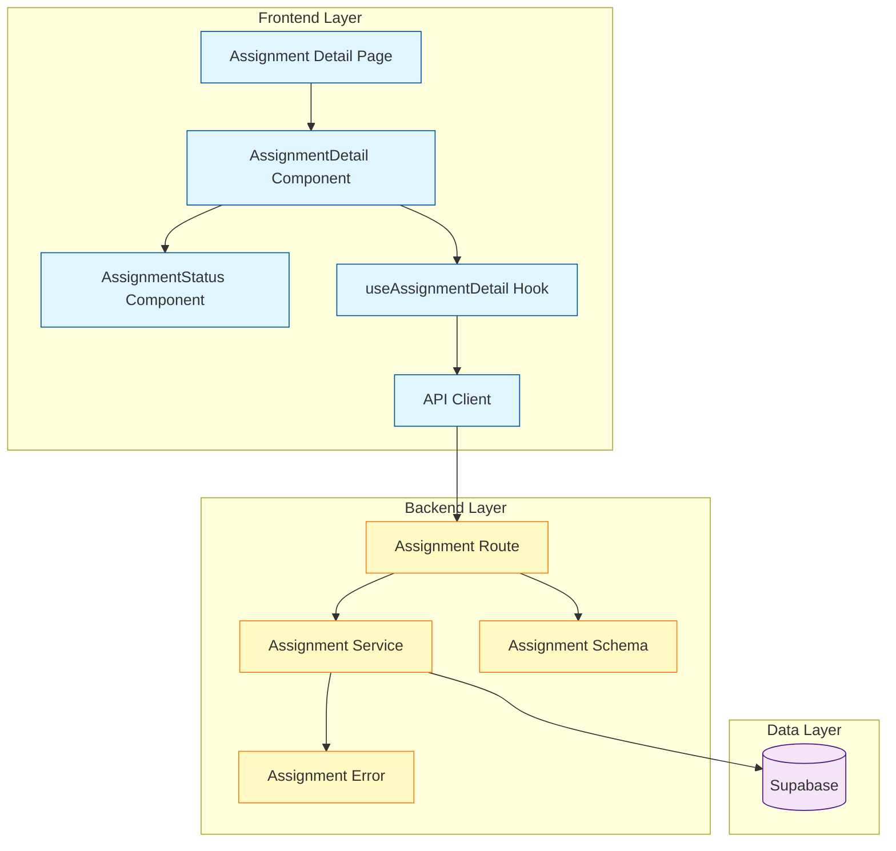

# Implementation Plan: UC-004 과제 상세 열람 (Learner)

## 개요

### 필요한 모듈

| 모듈 | 위치 | 설명 |
|------|------|------|
| Assignment Schema | `src/features/assignment/backend/schema.ts` | Assignment 관련 요청/응답 스키마 정의 |
| Assignment Service | `src/features/assignment/backend/service.ts` | Assignment 비즈니스 로직 및 데이터베이스 접근 |
| Assignment Route | `src/features/assignment/backend/route.ts` | Assignment API 엔드포인트 정의 (Hono) |
| Assignment Error | `src/features/assignment/backend/error.ts` | Assignment 도메인 에러 코드 정의 |
| Assignment DTO | `src/features/assignment/lib/dto.ts` | 프론트엔드용 스키마 재노출 |
| useAssignmentDetail Hook | `src/features/assignment/hooks/useAssignmentDetail.ts` | Assignment 상세 조회 React Query 훅 |
| AssignmentDetail Component | `src/features/assignment/components/assignment-detail.tsx` | Assignment 상세 화면 UI 컴포넌트 |
| AssignmentStatus Component | `src/features/assignment/components/assignment-status.tsx` | Assignment 상태 표시 컴포넌트 |
| SubmissionForm Component | `src/features/assignment/components/submission-form.tsx` | 제출/재제출 폼 컴포넌트 (UC-005에서 사용) |
| Assignment Page | `src/app/(protected)/courses/[id]/assignments/[assignmentId]/page.tsx` | Assignment 상세 페이지 라우트 |

### 기존 활용 가능 모듈

- `src/lib/remote/api-client.ts` - HTTP 클라이언트
- `src/backend/http/result.ts` - Result 타입 패턴
- `src/backend/http/response.ts` - 표준 응답 헬퍼
- `src/features/enrollment/backend/service.ts` - 수강 확인 로직 참조

## Diagram



## Implementation Plan

### 1. Backend Schema Definition

**파일**: `src/features/assignment/backend/schema.ts`

**구현 내용**:
- `AssignmentRowSchema`: DB 테이블 스키마
- `AssignmentDetailParamsSchema`: 과제 상세 조회 파라미터 (courseId, assignmentId)
- `SubmissionStatusSchema`: 제출 상태 정보 스키마
- `AssignmentDetailSchema`: 과제 상세 응답 스키마
  - 기본 과제 정보 (id, title, description, dueDate, weight, allowLate, allowResubmission, status)
  - 제출 가능 여부 (canSubmit, isLate, submitDisabledReason)
  - 제출 상태 (submission: { id, status, textContent, link, score, feedback, submittedAt, gradedAt, isLate })
- Type exports

**Unit Tests**:
```typescript
describe('AssignmentDetailSchema', () => {
  it('should validate valid assignment detail response', () => {
    const validData = {
      id: 'uuid',
      courseId: 'uuid',
      title: 'Assignment 1',
      description: 'Description',
      dueDate: '2025-10-10T00:00:00Z',
      weight: 20,
      allowLate: true,
      allowResubmission: false,
      status: 'published',
      canSubmit: true,
      isLate: false,
      submission: null,
      createdAt: '2025-10-01T00:00:00Z',
      updatedAt: '2025-10-01T00:00:00Z',
    };
    expect(AssignmentDetailSchema.parse(validData)).toEqual(validData);
  });

  it('should validate assignment with submission', () => {
    // ... with submission data
  });
});
```

---

### 2. Backend Error Codes

**파일**: `src/features/assignment/backend/error.ts`

**구현 내용**:
```typescript
export const assignmentErrorCodes = {
  invalidRequest: 'ASSIGNMENT_INVALID_REQUEST',
  unauthorized: 'ASSIGNMENT_UNAUTHORIZED',
  notEnrolled: 'ASSIGNMENT_NOT_ENROLLED',
  notFound: 'ASSIGNMENT_NOT_FOUND',
  notPublished: 'ASSIGNMENT_NOT_PUBLISHED',
  fetchFailed: 'ASSIGNMENT_FETCH_FAILED',
} as const;
```

---

### 3. Backend Service

**파일**: `src/features/assignment/backend/service.ts`

**구현 내용**:

#### `getAssignmentDetail(client, userId, courseId, assignmentId)`

**로직**:
1. 수강 확인: `enrollments` 테이블에서 userId + courseId 조회
   - 없으면 `failure(notEnrolled)`
2. Assignment 조회: `assignments` 테이블에서 assignmentId + courseId 조회
   - 없으면 `failure(notFound)`
   - status가 'published'가 아니면 `failure(notPublished)`
3. 제출물 조회: `submissions` 테이블에서 assignmentId + userId 조회
4. 제출 가능 여부 판단:
   - `canSubmit` 계산:
     - status === 'closed' → false
     - submission이 있고 status !== 'resubmission_required' → false
     - dueDate < now && !allowLate → false
     - 그 외 → true
   - `isLate` 계산: dueDate < now
   - `submitDisabledReason` 계산: canSubmit이 false일 때 이유
5. 응답 조립: `success(AssignmentDetail)`

**Unit Tests**:
```typescript
describe('getAssignmentDetail', () => {
  it('should return assignment detail for enrolled learner', async () => {
    // Mock enrollment exists, assignment published
  });

  it('should return failure when not enrolled', async () => {
    // Mock no enrollment
  });

  it('should return failure when assignment not found', async () => {
    // Mock assignment not found
  });

  it('should return failure when assignment not published', async () => {
    // Mock assignment status = 'draft'
  });

  it('should set canSubmit false when closed', async () => {
    // Mock assignment status = 'closed'
  });

  it('should set canSubmit false when past due date and not allow late', async () => {
    // Mock dueDate < now, allowLate = false
  });

  it('should set canSubmit true when past due date and allow late', async () => {
    // Mock dueDate < now, allowLate = true, isLate = true
  });

  it('should include submission data when exists', async () => {
    // Mock submission exists
  });

  it('should set canSubmit true when resubmission required', async () => {
    // Mock submission.status = 'resubmission_required'
  });
});
```

---

### 4. Backend Route

**파일**: `src/features/assignment/backend/route.ts`

**구현 내용**:

#### `GET /courses/:courseId/assignments/:assignmentId`

**핸들러 로직**:
1. 파라미터 파싱 및 검증 (courseId, assignmentId)
2. 세션에서 userId 추출 (없으면 401)
3. `getAssignmentDetail(supabase, userId, courseId, assignmentId)` 호출
4. Result 패턴에 따라 응답:
   - success → 200 OK
   - notEnrolled → 403 Forbidden
   - notFound / notPublished → 404 Not Found
   - 기타 → 400 Bad Request

**Integration Tests** (수동 테스트 시나리오):
```
1. 정상 조회: GET /api/courses/{courseId}/assignments/{assignmentId}
   - 인증된 learner, 수강 중, published 상태
   - 기대: 200 OK, assignment detail

2. 미인증: GET /api/courses/{courseId}/assignments/{assignmentId}
   - 세션 없음
   - 기대: 401 Unauthorized

3. 미수강: GET /api/courses/{courseId}/assignments/{assignmentId}
   - 수강하지 않은 코스
   - 기대: 403 Forbidden

4. 존재하지 않는 과제: GET /api/courses/{courseId}/assignments/{invalid-id}
   - 기대: 404 Not Found

5. Draft 상태 과제: GET /api/courses/{courseId}/assignments/{draftId}
   - 기대: 404 Not Found
```

---

### 5. Frontend DTO

**파일**: `src/features/assignment/lib/dto.ts`

**구현 내용**:
```typescript
export {
  AssignmentDetailSchema,
  type AssignmentDetail,
  type SubmissionStatus,
} from '../backend/schema';
```

---

### 6. Frontend Hook

**파일**: `src/features/assignment/hooks/useAssignmentDetail.ts`

**구현 내용**:
```typescript
import { useQuery } from '@tanstack/react-query';
import { apiClient } from '@/lib/remote/api-client';
import type { AssignmentDetail } from '../lib/dto';

export const useAssignmentDetail = (courseId: string, assignmentId: string) => {
  return useQuery({
    queryKey: ['assignments', courseId, assignmentId],
    queryFn: async () => {
      const response = await apiClient.get<AssignmentDetail>(
        `/courses/${courseId}/assignments/${assignmentId}`
      );
      return response.data;
    },
    enabled: !!courseId && !!assignmentId,
  });
};
```

---

### 7. Frontend Components

#### 7.1 AssignmentStatus Component

**파일**: `src/features/assignment/components/assignment-status.tsx`

**Props**:
```typescript
interface AssignmentStatusProps {
  status: 'draft' | 'published' | 'closed';
  dueDate: string;
  canSubmit: boolean;
  isLate: boolean;
  submitDisabledReason?: string;
}
```

**렌더링 로직**:
- status === 'closed' → Badge "마감됨" (destructive variant)
- isLate && canSubmit → Badge "지각 제출 가능" (warning variant)
- !canSubmit → Badge "제출 불가" (secondary variant) + 이유 표시
- canSubmit → Badge "제출 가능" (default variant)
- 마감일까지 남은 시간 표시 (date-fns 사용)

**QA Sheet**:
```
1. 정상 제출 가능 상태
   - Input: status='published', dueDate=미래, canSubmit=true, isLate=false
   - Expected: "제출 가능" 배지, 남은 시간 표시

2. 마감됨 상태
   - Input: status='closed', canSubmit=false
   - Expected: "마감됨" 배지 (red)

3. 지각 제출 가능 상태
   - Input: dueDate=과거, allowLate=true, canSubmit=true, isLate=true
   - Expected: "지각 제출 가능" 배지 (yellow), 경고 메시지

4. 지각 제출 불가 상태
   - Input: dueDate=과거, allowLate=false, canSubmit=false
   - Expected: "제출 불가" 배지, "마감일이 지나 제출할 수 없습니다" 메시지

5. 마감 24시간 이내
   - Input: dueDate=현재+12시간, canSubmit=true
   - Expected: "제출 가능" 배지, "12시간 남음" (강조 표시)
```

---

#### 7.2 AssignmentDetail Component

**파일**: `src/features/assignment/components/assignment-detail.tsx`

**Props**:
```typescript
interface AssignmentDetailProps {
  courseId: string;
  assignmentId: string;
}
```

**구현 로직**:
1. `useAssignmentDetail(courseId, assignmentId)` 훅 사용
2. Loading 상태: Skeleton UI
3. Error 상태: Alert 컴포넌트 + 재시도 버튼
4. Success 상태:
   - Card 레이아웃
   - 과제 제목, 설명
   - AssignmentStatus 컴포넌트
   - 점수 비중, 정책 (지각/재제출 허용) 표시
   - 제출 상태에 따른 UI:
     - submission === null && canSubmit → "제출하기" 버튼 (SubmissionForm으로 이동)
     - submission !== null → 제출 이력 표시 (textContent, link, submittedAt, isLate)
     - submission.status === 'graded' → 점수, 피드백 표시
     - submission.status === 'resubmission_required' → 피드백 + "재제출하기" 버튼

**QA Sheet**:
```
1. 로딩 상태
   - Input: isLoading=true
   - Expected: Skeleton UI 표시

2. 에러 상태
   - Input: error exists
   - Expected: Alert 컴포넌트, 재시도 버튼

3. 미제출 + 제출 가능
   - Input: submission=null, canSubmit=true
   - Expected: 과제 정보 표시, "제출하기" 버튼 활성화

4. 미제출 + 제출 불가 (마감)
   - Input: submission=null, canSubmit=false, status='closed'
   - Expected: 과제 정보 표시, "마감됨" 상태, 제출 버튼 없음

5. 제출 완료 (채점 전)
   - Input: submission.status='submitted'
   - Expected: 제출 정보 표시 (text, link, submittedAt), "채점 대기 중" 메시지

6. 채점 완료
   - Input: submission.status='graded', score, feedback
   - Expected: 제출 정보 + 점수 + 피드백 표시

7. 재제출 요청
   - Input: submission.status='resubmission_required', feedback
   - Expected: 이전 제출물 + 피드백 + "재제출하기" 버튼

8. 지각 제출
   - Input: submission.isLate=true
   - Expected: "지각 제출됨" 표시

9. 반응형 레이아웃
   - Expected: 모바일/태블릿/데스크톱에서 적절히 표시
```

---

### 8. Frontend Page

**파일**: `src/app/(protected)/courses/[id]/assignments/[assignmentId]/page.tsx`

**구현 내용**:
```typescript
'use client';

interface AssignmentDetailPageProps {
  params: Promise<{
    id: string;
    assignmentId: string;
  }>;
}

export default async function AssignmentDetailPage({ params }: AssignmentDetailPageProps) {
  const { id: courseId, assignmentId } = await params;

  return (
    <div className="container mx-auto py-8">
      <AssignmentDetail courseId={courseId} assignmentId={assignmentId} />
    </div>
  );
}
```

**QA Sheet**:
```
1. URL 파라미터 파싱
   - Input: /courses/{courseId}/assignments/{assignmentId}
   - Expected: courseId, assignmentId가 컴포넌트에 전달됨

2. Protected 라우트
   - Input: 미인증 사용자
   - Expected: 로그인 페이지로 리다이렉트 (middleware.ts에서 처리)

3. 페이지 메타데이터
   - Expected: 적절한 title, description
```

---

### 9. Backend App Integration

**파일**: `src/backend/hono/app.ts`

**수정 내용**:
```typescript
import { registerAssignmentRoutes } from '@/features/assignment/backend/route';

// ...
registerAssignmentRoutes(app);
```

---

## Implementation Order

1. **Backend Schema** (`schema.ts`) - 타입 정의가 최우선
2. **Backend Error** (`error.ts`) - 에러 코드 정의
3. **Backend Service** (`service.ts`) - 비즈니스 로직 구현
4. **Backend Route** (`route.ts`) - API 엔드포인트 구현
5. **Backend Integration** (`app.ts`) - 라우트 등록
6. **Frontend DTO** (`dto.ts`) - 타입 재노출
7. **Frontend Hook** (`useAssignmentDetail.ts`) - React Query 훅
8. **Frontend StatusComponent** (`assignment-status.tsx`) - 상태 표시 컴포넌트
9. **Frontend DetailComponent** (`assignment-detail.tsx`) - 메인 컴포넌트
10. **Frontend Page** (`page.tsx`) - 페이지 라우트

---

## Notes

### Shared Utilities 활용
- `src/lib/date.ts` - 마감일 포맷팅 (이미 존재한다면)
- `src/lib/utils.ts` - cn() 등 유틸리티

### 향후 확장 고려사항
- Assignment 목록 조회 API (`GET /courses/:courseId/assignments`)
- Assignment 검색 및 필터링
- Assignment 정렬 (마감일 순, 생성일 순)
- Assignment 알림 기능 (마감 임박)

### Performance Optimization
- React Query의 staleTime, cacheTime 설정
- 제출 상태 변경 시 캐시 무효화 전략

### Security Considerations
- 모든 API는 인증 필수 (401 Unauthorized)
- 수강하지 않은 코스의 과제 접근 차단 (403 Forbidden)
- Draft 상태 과제는 instructor만 조회 가능 (404 반환으로 존재 여부 숨김)
