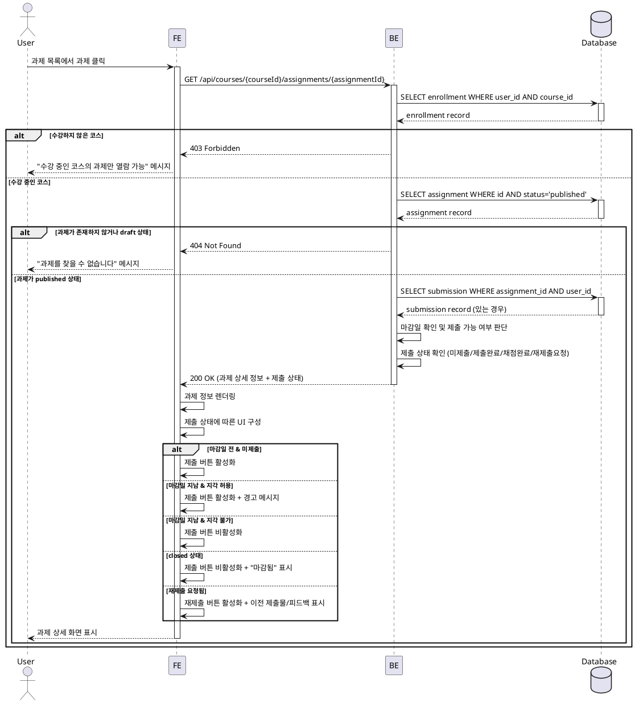

# UC-004: 과제 상세 열람 (Learner)

## Primary Actor
학습자 (Learner)

## Precondition
- 사용자가 Learner 역할로 로그인되어 있음
- 사용자가 하나 이상의 코스에 수강신청되어 있음

## Trigger
학습자가 자신이 수강 중인 코스의 과제 목록에서 특정 과제를 클릭함

## Main Scenario

1. 학습자가 내 코스 목록에서 특정 코스를 선택한다.
2. 학습자가 해당 코스의 과제(Assignment) 목록을 확인한다.
3. 학습자가 과제 목록에서 특정 과제를 클릭한다.
4. 시스템이 학습자의 해당 코스 수강 여부를 검증한다.
5. 시스템이 과제의 상태가 `published`인지 확인한다.
6. 시스템이 과제 상세 정보를 로드한다:
   - 과제 제목
   - 과제 설명 (상세 내용)
   - 마감일
   - 점수 비중 (배점)
   - 지각 제출 허용 여부
   - 재제출 허용 여부
7. 시스템이 학습자의 제출 상태를 조회한다:
   - 미제출
   - 제출 완료
   - 채점 완료
   - 재제출 요청됨
8. 시스템이 현재 시간과 마감일을 비교하여 제출 가능 여부를 판단한다.
9. 학습자에게 과제 상세 정보를 표시한다:
   - 과제 정보 섹션
   - 제출 상태 표시
   - 제출 UI (상황에 따라 활성화/비활성화)
   - 이전 제출물 (제출 이력이 있는 경우)
   - 채점 결과 및 피드백 (채점 완료된 경우)

## Edge Cases

### EC-1: 미수강 코스의 과제 접근 시도
- **상황**: 학습자가 수강하지 않은 코스의 과제 URL을 직접 입력하거나 링크를 통해 접근
- **처리**: 403 Forbidden 에러 반환, "수강 중인 코스의 과제만 열람할 수 있습니다" 메시지 표시

### EC-2: Draft 상태의 과제 접근 시도
- **상황**: 학습자가 아직 게시되지 않은 `draft` 상태 과제에 접근
- **처리**: 404 Not Found 또는 "아직 공개되지 않은 과제입니다" 메시지 표시

### EC-3: 마감된(Closed) 과제 열람
- **상황**: 과제가 `closed` 상태로 전환됨
- **처리**: 과제 내용은 정상 표시하되, 제출 버튼을 비활성화하고 "마감된 과제입니다" 안내 메시지 표시

### EC-4: 마감일 지난 후 접근 (지각 제출 허용)
- **상황**: 마감일이 지났으나 지각 제출이 허용된 과제
- **처리**: 과제 내용 표시, 제출 버튼 활성화, "마감일이 지났습니다. 지각 제출 시 점수에 영향이 있을 수 있습니다" 경고 메시지 표시

### EC-5: 마감일 지난 후 접근 (지각 제출 불가)
- **상황**: 마감일이 지났고 지각 제출이 허용되지 않은 과제
- **처리**: 과제 내용 표시, 제출 버튼 비활성화, "마감일이 지나 제출할 수 없습니다" 메시지 표시

### EC-6: 재제출 요청 상태
- **상황**: 강사가 재제출을 요청한 상태
- **처리**: 이전 제출물과 피드백 표시, 재제출 UI 활성화, "재제출이 요청되었습니다" 강조 메시지 표시

### EC-7: 네트워크 오류 또는 데이터 로드 실패
- **상황**: API 호출 실패 또는 서버 오류
- **처리**: 에러 메시지 표시, 재시도 버튼 제공

## Business Rules

### BR-1: 접근 권한
- 학습자는 자신이 수강신청한 코스의 과제만 열람할 수 있다.
- 수강신청이 취소된 경우, 해당 코스의 과제에 접근할 수 없다.

### BR-2: 과제 공개 상태
- `published` 상태의 과제만 학습자에게 표시된다.
- `draft` 상태의 과제는 강사만 볼 수 있다.
- `closed` 상태의 과제는 열람 가능하나 제출은 불가능하다.

### BR-3: 제출 가능 시점
- 과제가 `published` 상태이고, 마감일 전이면 정상 제출 가능
- 마감일 후에는 지각 제출 정책에 따라 제출 가능 여부가 결정됨
- 과제가 `closed` 상태이면 제출 불가

### BR-4: 제출 이력 표시
- 제출 이력이 있는 경우, 가장 최근 제출물을 표시
- 채점이 완료된 경우, 점수와 피드백을 함께 표시
- 재제출이 허용되고 요청된 경우, 재제출 UI를 활성화

### BR-5: 마감일 표시
- 마감일까지 남은 시간을 명확히 표시 (예: "3일 남음", "2시간 남음")
- 마감일이 24시간 이내인 경우 강조 표시
- 마감일이 지난 경우 "마감됨" 표시

## Sequence Diagram

