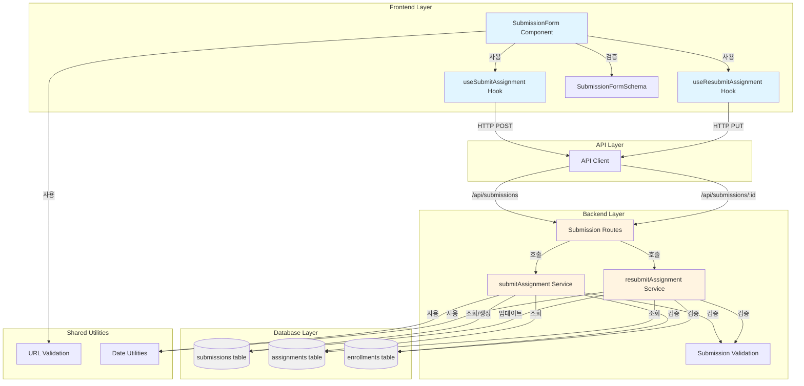

# 과제 제출/재제출 (Learner) - Implementation Plan

## 개요

### 모듈 목록

#### 1. Backend Layer

| 모듈 | 위치 | 설명 |
|------|------|------|
| **Submission Schema** | `src/features/assignment/backend/schema.ts` | 제출 관련 요청/응답 스키마 정의 (기존 파일 확장) |
| **Submission Service** | `src/features/assignment/backend/service.ts` | 제출/재제출 비즈니스 로직 (기존 파일 확장) |
| **Submission Routes** | `src/features/assignment/backend/route.ts` | 제출/재제출 API 엔드포인트 (기존 파일 확장) |
| **Submission Error Codes** | `src/features/assignment/backend/error.ts` | 제출 관련 에러 코드 정의 (기존 파일 확장) |

#### 2. Frontend Layer

| 모듈 | 위치 | 설명 |
|------|------|------|
| **Submission DTO** | `src/features/assignment/lib/dto.ts` | 프론트엔드용 DTO 재노출 (기존 파일 확장) |
| **Submission Form** | `src/features/assignment/components/submission-form.tsx` | 과제 제출/재제출 폼 컴포넌트 |
| **useSubmitAssignment Hook** | `src/features/assignment/hooks/useSubmitAssignment.ts` | 과제 제출 React Query 훅 |
| **useResubmitAssignment Hook** | `src/features/assignment/hooks/useResubmitAssignment.ts` | 과제 재제출 React Query 훅 |

#### 3. Shared Utilities

| 모듈 | 위치 | 설명 |
|------|------|------|
| **URL Validation** | `src/lib/validation.ts` | URL 형식 검증 유틸리티 (기존 파일 확장) |
| **Date Utilities** | `src/lib/date.ts` | 마감일 비교 유틸리티 (기존 파일 활용) |

---

## Diagram



---

## Implementation Plan

### Phase 1: Backend Schema & Error Codes

#### 1.1 Submission Request/Response Schema (`src/features/assignment/backend/schema.ts`)

**작업 내용:**
- 기존 파일에 제출 관련 스키마 추가

**추가할 스키마:**

```typescript
// 과제 제출 요청 스키마
export const SubmitAssignmentRequestSchema = z.object({
  assignmentId: z.string().uuid(),
  textContent: z.string().min(1, '과제 내용을 입력해주세요'),
  link: z.string().url('올바른 URL 형식을 입력해주세요').optional().nullable(),
});

// 과제 제출 응답 스키마
export const SubmitAssignmentResponseSchema = z.object({
  id: z.string().uuid(),
  assignmentId: z.string().uuid(),
  status: z.enum(['submitted']),
  textContent: z.string(),
  link: z.string().nullable(),
  isLate: z.boolean(),
  submittedAt: z.string().datetime(),
});

// 과제 재제출 요청 스키마
export const ResubmitAssignmentRequestSchema = z.object({
  submissionId: z.string().uuid(),
  textContent: z.string().min(1, '과제 내용을 입력해주세요'),
  link: z.string().url('올바른 URL 형식을 입력해주세요').optional().nullable(),
});

// 과제 재제출 응답 스키마
export const ResubmitAssignmentResponseSchema = z.object({
  id: z.string().uuid(),
  assignmentId: z.string().uuid(),
  status: z.enum(['submitted']),
  textContent: z.string(),
  link: z.string().nullable(),
  isLate: z.boolean(),
  submittedAt: z.string().datetime(),
  resubmissionCount: z.number().optional(),
});
```

**Unit Tests:**

```typescript
// Test cases for schema validation
describe('SubmitAssignmentRequestSchema', () => {
  it('should validate valid submission request', () => {
    const valid = {
      assignmentId: '123e4567-e89b-12d3-a456-426614174000',
      textContent: 'My assignment content',
      link: 'https://example.com',
    };
    expect(SubmitAssignmentRequestSchema.safeParse(valid).success).toBe(true);
  });

  it('should reject empty textContent', () => {
    const invalid = {
      assignmentId: '123e4567-e89b-12d3-a456-426614174000',
      textContent: '',
    };
    expect(SubmitAssignmentRequestSchema.safeParse(invalid).success).toBe(false);
  });

  it('should reject invalid URL format', () => {
    const invalid = {
      assignmentId: '123e4567-e89b-12d3-a456-426614174000',
      textContent: 'Content',
      link: 'not-a-url',
    };
    expect(SubmitAssignmentRequestSchema.safeParse(invalid).success).toBe(false);
  });

  it('should allow nullable link', () => {
    const valid = {
      assignmentId: '123e4567-e89b-12d3-a456-426614174000',
      textContent: 'Content',
      link: null,
    };
    expect(SubmitAssignmentRequestSchema.safeParse(valid).success).toBe(true);
  });
});
```

---

#### 1.2 Submission Error Codes (`src/features/assignment/backend/error.ts`)

**작업 내용:**
- 기존 파일에 제출 관련 에러 코드 추가

**추가할 에러 코드:**

```typescript
export const submissionErrorCodes = {
  // 인증/권한 관련
  unauthorized: 'SUBMISSION_UNAUTHORIZED',
  notEnrolled: 'SUBMISSION_NOT_ENROLLED',
  
  // 요청 관련
  invalidRequest: 'SUBMISSION_INVALID_REQUEST',
  
  // 과제 상태 관련
  assignmentNotFound: 'SUBMISSION_ASSIGNMENT_NOT_FOUND',
  assignmentNotPublished: 'SUBMISSION_ASSIGNMENT_NOT_PUBLISHED',
  assignmentClosed: 'SUBMISSION_ASSIGNMENT_CLOSED',
  
  // 제출 정책 관련
  deadlinePassed: 'SUBMISSION_DEADLINE_PASSED',
  alreadySubmitted: 'SUBMISSION_ALREADY_SUBMITTED',
  
  // 재제출 관련
  resubmissionNotAllowed: 'SUBMISSION_RESUBMISSION_NOT_ALLOWED',
  resubmissionNotRequired: 'SUBMISSION_RESUBMISSION_NOT_REQUIRED',
  submissionNotFound: 'SUBMISSION_NOT_FOUND',
  
  // 서버 에러
  databaseError: 'SUBMISSION_DATABASE_ERROR',
} as const;

export type SubmissionErrorCode = typeof submissionErrorCodes[keyof typeof submissionErrorCodes];
```

---

### Phase 2: Backend Service Logic

#### 2.1 Submit Assignment Service (`src/features/assignment/backend/service.ts`)

**작업 내용:**
- 기존 파일에 `submitAssignment` 함수 추가

**비즈니스 로직:**

```typescript
export async function submitAssignment(
  client: SupabaseClient,
  userId: string,
  request: SubmitAssignmentRequest,
): Promise<Result<SubmitAssignmentResponse, SubmissionErrorCode>>
```

**로직 단계:**
1. 과제 조회 및 존재 여부 확인
2. 수강 여부 확인 (enrollments 테이블)
3. 과제 상태 검증 (`published` 또는 `closed` with `allow_late`)
4. 중복 제출 여부 확인 (기존 submission 조회)
5. 마감일 검증 및 지각 여부 판단
6. 제출 가능 여부 최종 확인
7. submissions 테이블에 레코드 생성
8. 응답 데이터 반환

**Unit Tests:**

```typescript
describe('submitAssignment', () => {
  it('should successfully submit assignment before deadline', async () => {
    // Given: published assignment, enrolled user, before deadline
    // When: submitAssignment is called
    // Then: submission is created with is_late=false, status=submitted
  });

  it('should submit with late flag when after deadline but allow_late is true', async () => {
    // Given: published assignment with allow_late=true, after deadline
    // When: submitAssignment is called
    // Then: submission is created with is_late=true, status=submitted
  });

  it('should reject submission when deadline passed and allow_late is false', async () => {
    // Given: published assignment with allow_late=false, after deadline
    // When: submitAssignment is called
    // Then: returns SUBMISSION_DEADLINE_PASSED error
  });

  it('should reject duplicate submission', async () => {
    // Given: user already has a submission with status=submitted or graded
    // When: submitAssignment is called
    // Then: returns SUBMISSION_ALREADY_SUBMITTED error
  });

  it('should reject when user is not enrolled', async () => {
    // Given: user has no enrollment for the course
    // When: submitAssignment is called
    // Then: returns SUBMISSION_NOT_ENROLLED error
  });

  it('should reject when assignment is not published', async () => {
    // Given: assignment status is draft
    // When: submitAssignment is called
    // Then: returns SUBMISSION_ASSIGNMENT_NOT_PUBLISHED error
  });

  it('should reject when assignment is closed and allow_late is false', async () => {
    // Given: assignment status is closed, allow_late=false
    // When: submitAssignment is called
    // Then: returns SUBMISSION_ASSIGNMENT_CLOSED error
  });
});
```

---

#### 2.2 Resubmit Assignment Service (`src/features/assignment/backend/service.ts`)

**작업 내용:**
- 기존 파일에 `resubmitAssignment` 함수 추가

**비즈니스 로직:**

```typescript
export async function resubmitAssignment(
  client: SupabaseClient,
  userId: string,
  request: ResubmitAssignmentRequest,
): Promise<Result<ResubmitAssignmentResponse, SubmissionErrorCode>>
```

**로직 단계:**
1. 제출물 조회 및 존재 여부 확인
2. 제출물 소유권 확인 (learner_id === userId)
3. 과제 조회 및 재제출 허용 여부 확인 (`allow_resubmission`)
4. 제출물 상태 확인 (`resubmission_required`)
5. submissions 테이블 업데이트
   - `text_content`, `link` 업데이트
   - `status = submitted`
   - `submitted_at` 현재 시간으로 갱신
   - `resubmission_count` 증가 (선택적, 컬럼 추가 필요 시)
6. 응답 데이터 반환

**Unit Tests:**

```typescript
describe('resubmitAssignment', () => {
  it('should successfully resubmit when resubmission is required', async () => {
    // Given: submission with status=resubmission_required, assignment with allow_resubmission=true
    // When: resubmitAssignment is called
    // Then: submission is updated with new content, status=submitted
  });

  it('should reject when resubmission is not allowed', async () => {
    // Given: assignment with allow_resubmission=false
    // When: resubmitAssignment is called
    // Then: returns SUBMISSION_RESUBMISSION_NOT_ALLOWED error
  });

  it('should reject when submission status is not resubmission_required', async () => {
    // Given: submission with status=submitted or graded
    // When: resubmitAssignment is called
    // Then: returns SUBMISSION_RESUBMISSION_NOT_REQUIRED error
  });

  it('should reject when submission does not belong to user', async () => {
    // Given: submission with different learner_id
    // When: resubmitAssignment is called
    // Then: returns SUBMISSION_UNAUTHORIZED error
  });

  it('should reject when submission is not found', async () => {
    // Given: non-existent submission ID
    // When: resubmitAssignment is called
    // Then: returns SUBMISSION_NOT_FOUND error
  });
});
```

---

### Phase 3: Backend Routes

#### 3.1 Submission Routes (`src/features/assignment/backend/route.ts`)

**작업 내용:**
- 기존 파일에 제출/재제출 라우트 추가

**API 엔드포인트:**

1. **POST /api/submissions**
   - 과제 제출 엔드포인트
   - 요청: `SubmitAssignmentRequest`
   - 응답: `SubmitAssignmentResponse`
   - 인증 필수

2. **PUT /api/submissions/:id**
   - 과제 재제출 엔드포인트
   - 요청: `ResubmitAssignmentRequest`
   - 응답: `ResubmitAssignmentResponse`
   - 인증 필수

**구현 패턴:**
```typescript
app.post('/submissions', async (c) => {
  // 1. 인증 확인
  // 2. 요청 바디 파싱 및 검증
  // 3. 서비스 함수 호출
  // 4. 결과에 따라 응답 반환
});

app.put('/submissions/:id', async (c) => {
  // 1. 인증 확인
  // 2. 파라미터 및 바디 파싱
  // 3. 서비스 함수 호출
  // 4. 결과에 따라 응답 반환
});
```

---

### Phase 4: Frontend DTO

#### 4.1 Frontend DTO Re-export (`src/features/assignment/lib/dto.ts`)

**작업 내용:**
- 기존 파일에 제출 관련 스키마 재노출

```typescript
export {
  SubmitAssignmentRequestSchema,
  type SubmitAssignmentRequest,
  type SubmitAssignmentResponse,
  ResubmitAssignmentRequestSchema,
  type ResubmitAssignmentRequest,
  type ResubmitAssignmentResponse,
} from '../backend/schema';
```

---

### Phase 5: Frontend Hooks

#### 5.1 useSubmitAssignment Hook (`src/features/assignment/hooks/useSubmitAssignment.ts`)

**작업 내용:**
- React Query `useMutation` 훅 생성

**구현:**

```typescript
export const useSubmitAssignment = () => {
  const queryClient = useQueryClient();

  return useMutation({
    mutationFn: async (request: SubmitAssignmentRequest) => {
      const response = await apiClient.post<SubmitAssignmentResponse>(
        '/submissions',
        request
      );
      return response.data;
    },
    onSuccess: (_, variables) => {
      // Invalidate assignment detail to reflect submission status
      queryClient.invalidateQueries({ 
        queryKey: ['assignments', variables.assignmentId] 
      });
      // Invalidate dashboard queries
      queryClient.invalidateQueries({ 
        queryKey: ['dashboard'] 
      });
    },
  });
};
```

**QA Sheet:**

| 항목 | 검증 내용 | 예상 결과 |
|------|----------|----------|
| **정상 제출** | 마감일 전 제출 | `status=submitted`, `isLate=false`, 성공 메시지 표시 |
| **지각 제출** | 마감일 후, `allow_late=true` | `status=submitted`, `isLate=true`, 지각 제출 메시지 |
| **마감일 후 제출 차단** | 마감일 후, `allow_late=false` | 403 에러, "마감된 과제입니다" 메시지 |
| **중복 제출 차단** | 이미 제출한 과제 | 400 에러, "이미 제출한 과제입니다" 메시지 |
| **수강하지 않은 코스** | enrollment 없음 | 403 에러, "수강 중인 코스가 아닙니다" 메시지 |
| **네트워크 에러** | API 호출 실패 | 에러 토스트, "제출에 실패했습니다" 메시지 |
| **로딩 상태** | 제출 중 | `isPending=true`, 버튼 비활성화 |
| **성공 후 캐시 무효화** | 제출 성공 | 과제 상세 및 대시보드 쿼리 무효화 |

---

#### 5.2 useResubmitAssignment Hook (`src/features/assignment/hooks/useResubmitAssignment.ts`)

**작업 내용:**
- React Query `useMutation` 훅 생성

**구현:**

```typescript
export const useResubmitAssignment = () => {
  const queryClient = useQueryClient();

  return useMutation({
    mutationFn: async (request: ResubmitAssignmentRequest) => {
      const response = await apiClient.put<ResubmitAssignmentResponse>(
        `/submissions/${request.submissionId}`,
        {
          textContent: request.textContent,
          link: request.link,
        }
      );
      return response.data;
    },
    onSuccess: (data) => {
      // Invalidate assignment detail
      queryClient.invalidateQueries({ 
        queryKey: ['assignments', data.assignmentId] 
      });
      // Invalidate dashboard
      queryClient.invalidateQueries({ 
        queryKey: ['dashboard'] 
      });
    },
  });
};
```

**QA Sheet:**

| 항목 | 검증 내용 | 예상 결과 |
|------|----------|----------|
| **정상 재제출** | `status=resubmission_required` | 재제출 성공, `status=submitted`, 성공 메시지 |
| **재제출 불허** | `allow_resubmission=false` | 403 에러, "재제출이 허용되지 않습니다" 메시지 |
| **재제출 불필요** | `status=submitted` or `graded` | 400 에러, "재제출이 필요하지 않습니다" 메시지 |
| **권한 없음** | 다른 사용자의 제출물 | 403 에러, "권한이 없습니다" 메시지 |
| **네트워크 에러** | API 호출 실패 | 에러 토스트, "재제출에 실패했습니다" 메시지 |
| **로딩 상태** | 재제출 중 | `isPending=true`, 버튼 비활성화 |

---

### Phase 6: Frontend Component

#### 6.1 Submission Form Component (`src/features/assignment/components/submission-form.tsx`)

**작업 내용:**
- 과제 제출/재제출 통합 폼 컴포넌트 생성

**Props:**

```typescript
interface SubmissionFormProps {
  assignmentId: string;
  assignmentTitle: string;
  dueDate: string;
  allowLate: boolean;
  canSubmit: boolean;
  submitDisabledReason?: string;
  submission?: SubmissionStatus | null;
  onSuccess?: () => void;
}
```

**구현 요구사항:**
- `react-hook-form` + `zod` 사용
- Text 필드 (필수, Textarea)
- Link 필드 (선택, URL 검증)
- 제출/재제출 버튼
  - 최초 제출: "제출하기"
  - 재제출: "재제출하기"
  - 제출 불가: 버튼 비활성화 + 이유 표시
- 로딩 상태 표시 (`isPending`)
- 성공/실패 토스트 메시지
- 지각 여부 표시 (마감일 지났을 경우)
- 기존 제출 내용 표시 (재제출 시)

**QA Sheet:**

| 항목 | 검증 내용 | 예상 결과 |
|------|----------|----------|
| **폼 렌더링** | 컴포넌트 마운트 | Text/Link 필드, 제출 버튼 표시 |
| **Text 필드 필수 검증** | 빈 값으로 제출 | "과제 내용을 입력해주세요" 에러 메시지 |
| **URL 형식 검증** | 잘못된 URL 입력 | "올바른 URL 형식을 입력해주세요" 에러 메시지 |
| **제출 불가 상태** | `canSubmit=false` | 버튼 비활성화, 이유 표시 |
| **로딩 상태** | 제출 중 | 버튼 비활성화, "제출 중..." 텍스트 |
| **제출 성공** | API 성공 응답 | 성공 토스트, 폼 초기화 또는 제출 완료 표시 |
| **제출 실패** | API 에러 응답 | 에러 토스트, 에러 메시지 표시 |
| **재제출 모드** | `submission` 존재 | 기존 내용 표시, "재제출하기" 버튼 |
| **지각 경고** | 마감일 지남, `allowLate=true` | "지각 제출됩니다" 경고 메시지 |
| **마감일 표시** | - | 마감일 표시, 남은 시간 또는 지각 여부 |

---

### Phase 7: Shared Utilities

#### 7.1 URL Validation (`src/lib/validation.ts`)

**작업 내용:**
- 기존 파일에 URL 검증 함수 추가

```typescript
// URL validation regex
export const URL_REGEX = /^https?:\/\/.+/;
export const isValidUrl = (url: string): boolean => URL_REGEX.test(url);
```

**Unit Tests:**

```typescript
describe('isValidUrl', () => {
  it('should validate http and https URLs', () => {
    expect(isValidUrl('http://example.com')).toBe(true);
    expect(isValidUrl('https://example.com')).toBe(true);
  });

  it('should reject invalid URLs', () => {
    expect(isValidUrl('not-a-url')).toBe(false);
    expect(isValidUrl('ftp://example.com')).toBe(false);
  });

  it('should reject empty string', () => {
    expect(isValidUrl('')).toBe(false);
  });
});
```

---

## Implementation Order

### Step 1: Backend Foundation (Phase 1-2)
1. ✅ `schema.ts` - 제출 스키마 추가
2. ✅ `error.ts` - 에러 코드 추가
3. ✅ `service.ts` - `submitAssignment` 함수 구현 + 테스트
4. ✅ `service.ts` - `resubmitAssignment` 함수 구현 + 테스트

### Step 2: Backend Routes (Phase 3)
5. ✅ `route.ts` - POST `/submissions` 엔드포인트 추가
6. ✅ `route.ts` - PUT `/submissions/:id` 엔드포인트 추가
7. ✅ Hono 앱에 라우트 등록 확인

### Step 3: Frontend Data Layer (Phase 4-5)
8. ✅ `dto.ts` - 스키마 재노출
9. ✅ `useSubmitAssignment.ts` - 제출 훅 구현
10. ✅ `useResubmitAssignment.ts` - 재제출 훅 구현

### Step 4: Shared Utilities (Phase 7)
11. ✅ `validation.ts` - URL 검증 함수 추가 + 테스트

### Step 5: Frontend Component (Phase 6)
12. ✅ `submission-form.tsx` - 폼 컴포넌트 구현
13. ✅ QA 시트 기반 수동 테스트

### Step 6: Integration & Testing
14. ✅ 과제 상세 페이지에 SubmissionForm 통합
15. ✅ E2E 시나리오 테스트
    - 최초 제출 플로우
    - 재제출 플로우
    - 에러 케이스 (마감, 권한 등)
16. ✅ 빌드 에러, TypeScript 에러, ESLint 에러 해결

---

## Testing Strategy

### Backend Unit Tests
- 각 서비스 함수별 단위 테스트
- Supabase 클라이언트 모킹
- 모든 비즈니스 규칙 검증

### Frontend Unit Tests
- 훅 테스트 (React Query Test Utils)
- 컴포넌트 렌더링 테스트 (React Testing Library)
- 폼 검증 로직 테스트

### Integration Tests
- API 엔드포인트 테스트 (실제 Supabase 연동)
- E2E 시나리오 테스트 (Playwright/Cypress - 선택적)

### QA Checklist
- ✅ 모든 에러 케이스 핸들링
- ✅ 로딩 상태 표시
- ✅ 성공/실패 피드백
- ✅ 접근성 (키보드 네비게이션, 스크린 리더)
- ✅ 반응형 디자인
- ✅ 브라우저 호환성

---

## 추가 고려사항

### Database Migration (선택적)
현재 스키마에 `resubmission_count` 컬럼이 없는 경우, 추가 마이그레이션 필요:

```sql
ALTER TABLE submissions
ADD COLUMN resubmission_count INTEGER NOT NULL DEFAULT 0;
```

### 성능 최적화
- 제출물 조회 시 인덱스 활용 (이미 존재: `idx_submissions_assignment`, `idx_submissions_learner`)
- 대용량 텍스트 처리 고려 (text_content 컬럼)
- Link 필드 URL 검증 시 timeout 설정 (선택적)

### 보안
- CSRF 토큰 검증 (Hono 미들웨어)
- Rate limiting (과도한 제출 시도 방지)
- XSS 방지 (텍스트 컨텐츠 sanitization - 프론트엔드에서 표시 시)

### 향후 확장 가능성
- 파일 첨부 기능 (S3 연동)
- 제출 히스토리 관리 (버전 관리)
- 실시간 알림 (Supabase Realtime)
- 제출 전 임시 저장 (Draft)
