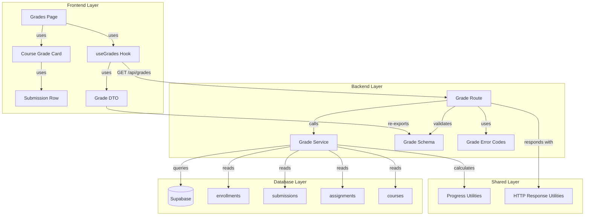

# 구현 계획: 성적 & 피드백 열람 (Learner)

## 개요

### Backend Modules

| 모듈 | 위치 | 설명 |
|------|------|------|
| **Grade Schema** | `src/features/grade/backend/schema.ts` | 성적 조회 응답 zod 스키마 정의 |
| **Grade Service** | `src/features/grade/backend/service.ts` | 성적 조회 비즈니스 로직 |
| **Grade Route** | `src/features/grade/backend/route.ts` | Hono 라우터 정의 (GET /api/grades) |
| **Grade Error Codes** | `src/features/grade/backend/error.ts` | 성적 조회 관련 에러 코드 정의 |

### Frontend Modules

| 모듈 | 위치 | 설명 |
|------|------|------|
| **Grades Page** | `src/app/(protected)/grades/page.tsx` | 성적 페이지 컴포넌트 |
| **Course Grade Card** | `src/features/grade/components/course-grade-card.tsx` | 코스별 성적 카드 컴포넌트 |
| **Submission Row** | `src/features/grade/components/submission-row.tsx` | 제출물 행 컴포넌트 |
| **Grade Hook** | `src/features/grade/hooks/useGrades.ts` | 성적 조회 query 훅 |
| **Grade DTO** | `src/features/grade/lib/dto.ts` | Frontend에서 사용할 DTO 재노출 |

### Shared Utilities

| 모듈 | 위치 | 설명 |
|------|------|------|
| **Progress Utilities** | `src/lib/progress.ts` (기존 활용) | 진행률 계산 유틸리티 |

---

## Diagram



---

## Implementation Plan

### 1. Backend: Grade Schema

**파일**: `src/features/grade/backend/schema.ts`

**목적**: 성적 조회 응답 스키마 정의

**구현 내용**:
```typescript
import { z } from 'zod';

/**
 * Submission Grade Schema
 */
export const SubmissionGradeSchema = z.object({
  submissionId: z.string().uuid(),
  assignmentId: z.string().uuid(),
  assignmentTitle: z.string(),
  assignmentWeight: z.number(),
  assignmentDueDate: z.string().datetime(),
  status: z.enum(['submitted', 'graded', 'resubmission_required']),
  score: z.number().nullable(),
  feedback: z.string().nullable(),
  isLate: z.boolean(),
  submittedAt: z.string().datetime(),
  gradedAt: z.string().datetime().nullable(),
});

export type SubmissionGrade = z.infer<typeof SubmissionGradeSchema>;

/**
 * Course Grade Schema
 */
export const CourseGradeSchema = z.object({
  courseId: z.string().uuid(),
  courseTitle: z.string(),
  totalScore: z.number(),
  submissions: z.array(SubmissionGradeSchema),
});

export type CourseGrade = z.infer<typeof CourseGradeSchema>;

/**
 * Grades Response Schema
 */
export const GradesResponseSchema = z.object({
  courses: z.array(CourseGradeSchema),
});

export type GradesResponse = z.infer<typeof GradesResponseSchema>;
```

**Unit Tests**:
- ✅ GradesResponseSchema: 유효한 응답 파싱 성공
- ✅ GradesResponseSchema: 빈 배열 파싱 성공
- ✅ CourseGradeSchema: 유효한 코스 성적 파싱 성공
- ✅ SubmissionGradeSchema: 유효한 제출물 성적 파싱 성공
- ✅ SubmissionGradeSchema: 채점 대기 중 상태 파싱 성공 (score=null, feedback=null)

---

### 2. Backend: Grade Error Codes

**파일**: `src/features/grade/backend/error.ts`

**목적**: 성적 조회 관련 에러 코드 정의

**구현 내용**:
```typescript
export const gradeErrorCodes = {
  unauthorized: 'GRADE_UNAUTHORIZED',
  databaseError: 'GRADE_DATABASE_ERROR',
} as const;

type GradeErrorValue = (typeof gradeErrorCodes)[keyof typeof gradeErrorCodes];

export type GradeServiceError = GradeErrorValue;
```

---

### 3. Backend: Grade Service

**파일**: `src/features/grade/backend/service.ts`

**목적**: 성적 조회 비즈니스 로직

**구현 내용**:
```typescript
import type { SupabaseClient } from '@supabase/supabase-js';
import type { Result } from '@/backend/http/result';
import { failure, success } from '@/backend/http/result';
import { gradeErrorCodes } from './error';
import type {
  GradesResponse,
  CourseGrade,
  SubmissionGrade,
} from './schema';

/**
 * Get Grades
 *
 * @param client - Supabase client
 * @param userId - User ID
 * @returns Grades response or error
 */
export async function getGrades(
  client: SupabaseClient,
  userId: string,
): Promise<Result<GradesResponse, string>> {
  // 1. 수강 중인 코스 목록 조회
  const { data: enrollments, error: enrollmentError } = await client
    .from('enrollments')
    .select('course_id, courses(id, title)')
    .eq('learner_id', userId);

  if (enrollmentError) {
    return failure(
      gradeErrorCodes.databaseError,
      '성적을 불러오는 중 오류가 발생했습니다',
    );
  }

  if (!enrollments || enrollments.length === 0) {
    return success({ courses: [] });
  }

  // 2. 코스 ID 추출
  const courseIds = enrollments.map((e) => e.course_id);

  // 3. 제출물 조회 (과제 정보 포함)
  const { data: submissions, error: submissionError } = await client
    .from('submissions')
    .select(
      `
      id,
      assignment_id,
      status,
      score,
      feedback,
      is_late,
      submitted_at,
      graded_at,
      assignments!inner(
        id,
        course_id,
        title,
        weight,
        due_date
      )
    `,
    )
    .eq('learner_id', userId)
    .in('assignments.course_id', courseIds)
    .order('assignments.due_date', { ascending: false });

  if (submissionError) {
    return failure(
      gradeErrorCodes.databaseError,
      '성적을 불러오는 중 오류가 발생했습니다',
    );
  }

  // 4. 코스별로 그룹화 및 총점 계산
  const courseMap = new Map<string, CourseGrade>();

  // 코스 초기화
  enrollments.forEach((enrollment) => {
    const course = enrollment.courses as { id: string; title: string };
    courseMap.set(course.id, {
      courseId: course.id,
      courseTitle: course.title,
      totalScore: 0,
      submissions: [],
    });
  });

  // 제출물 추가 및 총점 계산
  (submissions ?? []).forEach((submission: any) => {
    const assignment = submission.assignments;
    const courseId = assignment.course_id;

    const submissionGrade: SubmissionGrade = {
      submissionId: submission.id,
      assignmentId: submission.assignment_id,
      assignmentTitle: assignment.title,
      assignmentWeight: assignment.weight,
      assignmentDueDate: assignment.due_date,
      status: submission.status,
      score: submission.score,
      feedback: submission.feedback,
      isLate: submission.is_late,
      submittedAt: submission.submitted_at,
      gradedAt: submission.graded_at,
    };

    const courseGrade = courseMap.get(courseId);
    if (courseGrade) {
      courseGrade.submissions.push(submissionGrade);

      // 채점 완료된 과제만 총점 계산
      if (submission.status === 'graded' && submission.score !== null) {
        courseGrade.totalScore += (submission.score * assignment.weight) / 100;
      }
    }
  });

  // 5. 응답 조립
  const courses = Array.from(courseMap.values());

  return success({ courses });
}
```

**Unit Tests**:
- ✅ 정상 성적 조회 (여러 코스, 여러 제출물)
- ✅ 수강 중인 코스 없음 (빈 배열 반환)
- ✅ 제출물 없는 코스 (총점 0)
- ✅ 총점 계산 정확성 (채점 완료된 과제만 포함)
- ✅ 재제출 요청 상태 과제는 총점에서 제외
- ✅ 채점 대기 중 과제는 총점에서 제외
- ✅ 데이터베이스 오류 시 500 에러 반환

---

### 4. Backend: Grade Route

**파일**: `src/features/grade/backend/route.ts`

**목적**: Hono 라우터 정의

**구현 내용**:
```typescript
import type { Hono } from 'hono';
import { respond } from '@/backend/http/response';
import { getLogger, getSupabase, type AppEnv } from '@/backend/hono/context';
import { getGrades } from './service';

export const registerGradeRoutes = (app: Hono<AppEnv>) => {
  app.get('/grades', async (c) => {
    const supabase = getSupabase(c);
    const logger = getLogger(c);

    // TODO: 인증 미들웨어에서 userId 추출
    // 임시로 하드코딩 (인증 구현 시 수정 필요)
    const userId = c.req.header('x-user-id') ?? '';

    if (!userId) {
      logger.error('User ID not found in request');
      return c.json({ error: 'Unauthorized' }, 401);
    }

    const result = await getGrades(supabase, userId);

    return respond(c, result);
  });
};
```

**Integration Tests**:
- ✅ GET /grades: 인증된 사용자의 성적 조회 200 응답
- ✅ GET /grades: 미인증 사용자 401 에러 반환
- ✅ GET /grades: 수강 중인 코스 없는 사용자 빈 배열 반환

---

### 5. Backend: Hono App Integration

**파일**: `src/backend/hono/app.ts` (기존 수정)

**수정 내용**:
```typescript
import { registerGradeRoutes } from '@/features/grade/backend/route';

// ...existing code...

export const createHonoApp = () => {
  // ...existing middleware...

  registerExampleRoutes(app);
  registerAuthRoutes(app);
  registerGradeRoutes(app); // 추가

  // ...existing code...
};
```

---

### 6. Frontend: Grade DTO

**파일**: `src/features/grade/lib/dto.ts`

**목적**: Backend 스키마 재노출

**구현 내용**:
```typescript
export {
  GradesResponseSchema,
  CourseGradeSchema,
  SubmissionGradeSchema,
  type GradesResponse,
  type CourseGrade,
  type SubmissionGrade,
} from '@/features/grade/backend/schema';
```

---

### 7. Frontend: useGrades Hook

**파일**: `src/features/grade/hooks/useGrades.ts`

**목적**: 성적 조회 query 훅

**구현 내용**:
```typescript
import { useQuery } from '@tanstack/react-query';
import { apiClient, extractApiErrorMessage } from '@/lib/remote/api-client';
import type { GradesResponse } from '@/features/grade/lib/dto';

export const useGrades = () => {
  return useQuery({
    queryKey: ['grades'],
    queryFn: async (): Promise<GradesResponse> => {
      const response = await apiClient.get<GradesResponse>('/grades');
      return response.data;
    },
    retry: 1,
    staleTime: 1000 * 60 * 5, // 5분
  });
};
```

---

### 8. Frontend: Submission Row Component

**파일**: `src/features/grade/components/submission-row.tsx`

**목적**: 제출물 행 컴포넌트

**구현 내용**:
```typescript
"use client";

import { Badge } from "@/components/ui/badge";
import type { SubmissionGrade } from "@/features/grade/lib/dto";
import { formatDistanceToNow } from "date-fns";
import { ko } from "date-fns/locale";

type SubmissionRowProps = {
  submission: SubmissionGrade;
};

export const SubmissionRow = ({ submission }: SubmissionRowProps) => {
  const statusBadge = () => {
    if (submission.status === 'graded') {
      return <Badge variant="default">채점 완료</Badge>;
    }
    if (submission.status === 'resubmission_required') {
      return <Badge variant="destructive">재제출 필요</Badge>;
    }
    return <Badge variant="secondary">채점 대기 중</Badge>;
  };

  return (
    <tr className="border-b">
      <td className="px-4 py-3">{submission.assignmentTitle}</td>
      <td className="px-4 py-3">
        <div className="flex items-center gap-2">
          {statusBadge()}
          {submission.isLate && <Badge variant="outline">지각</Badge>}
        </div>
      </td>
      <td className="px-4 py-3 text-center">
        {submission.status === 'graded' ? (
          <span className="font-semibold">{submission.score}</span>
        ) : (
          <span className="text-slate-400">-</span>
        )}
      </td>
      <td className="px-4 py-3 text-center">{submission.assignmentWeight}%</td>
      <td className="px-4 py-3 text-sm text-slate-500">
        {formatDistanceToNow(new Date(submission.submittedAt), {
          addSuffix: true,
          locale: ko,
        })}
      </td>
      <td className="px-4 py-3">
        {submission.feedback ? (
          <p className="text-sm text-slate-600">{submission.feedback}</p>
        ) : (
          <span className="text-sm text-slate-400">피드백 없음</span>
        )}
      </td>
    </tr>
  );
};
```

**QA Sheet**:

| 테스트 케이스 | 입력 | 예상 결과 | 실제 결과 | 상태 |
|--------------|------|----------|----------|------|
| 채점 완료 표시 | status='graded', score=85 | "채점 완료" 배지, 점수 85 표시 | | ⬜ |
| 채점 대기 표시 | status='submitted', score=null | "채점 대기 중" 배지, 점수 "-" 표시 | | ⬜ |
| 재제출 필요 표시 | status='resubmission_required' | "재제출 필요" 배지 표시 | | ⬜ |
| 지각 배지 표시 | isLate=true | "지각" 배지 표시 | | ⬜ |
| 피드백 있음 | feedback="잘 했습니다" | 피드백 텍스트 표시 | | ⬜ |
| 피드백 없음 | feedback=null | "피드백 없음" 표시 | | ⬜ |

---

### 9. Frontend: Course Grade Card Component

**파일**: `src/features/grade/components/course-grade-card.tsx`

**목적**: 코스별 성적 카드 컴포넌트

**구현 내용**:
```typescript
"use client";

import { Card, CardContent, CardHeader, CardTitle } from "@/components/ui/card";
import type { CourseGrade } from "@/features/grade/lib/dto";
import { SubmissionRow } from "./submission-row";

type CourseGradeCardProps = {
  courseGrade: CourseGrade;
};

export const CourseGradeCard = ({ courseGrade }: CourseGradeCardProps) => {
  return (
    <Card>
      <CardHeader>
        <div className="flex items-center justify-between">
          <CardTitle>{courseGrade.courseTitle}</CardTitle>
          <div className="text-right">
            <p className="text-sm text-slate-500">총점</p>
            <p className="text-2xl font-bold">
              {courseGrade.totalScore.toFixed(2)}
            </p>
          </div>
        </div>
      </CardHeader>
      <CardContent>
        {courseGrade.submissions.length === 0 ? (
          <p className="text-center text-slate-400">제출한 과제가 없습니다</p>
        ) : (
          <table className="w-full">
            <thead>
              <tr className="border-b text-left text-sm text-slate-500">
                <th className="px-4 py-2">과제명</th>
                <th className="px-4 py-2">상태</th>
                <th className="px-4 py-2 text-center">점수</th>
                <th className="px-4 py-2 text-center">비중</th>
                <th className="px-4 py-2">제출일</th>
                <th className="px-4 py-2">피드백</th>
              </tr>
            </thead>
            <tbody>
              {courseGrade.submissions.map((submission) => (
                <SubmissionRow
                  key={submission.submissionId}
                  submission={submission}
                />
              ))}
            </tbody>
          </table>
        )}
      </CardContent>
    </Card>
  );
};
```

**QA Sheet**:

| 테스트 케이스 | 입력 | 예상 결과 | 실제 결과 | 상태 |
|--------------|------|----------|----------|------|
| 정상 성적 표시 | 여러 제출물 포함 | 모든 제출물 행 표시 | | ⬜ |
| 빈 제출물 | submissions=[] | "제출한 과제가 없습니다" 안내 | | ⬜ |
| 총점 표시 | totalScore=85.5 | "85.50" 표시 | | ⬜ |
| 코스 제목 표시 | courseTitle="웹 개발 기초" | 카드 헤더에 제목 표시 | | ⬜ |

---

### 10. Frontend: Grades Page

**파일**: `src/app/(protected)/grades/page.tsx`

**목적**: 성적 페이지 컴포넌트

**구현 내용**:
```typescript
"use client";

import { useGrades } from "@/features/grade/hooks/useGrades";
import { CourseGradeCard } from "@/features/grade/components/course-grade-card";
import { Skeleton } from "@/components/ui/skeleton";
import { Alert, AlertDescription } from "@/components/ui/alert";

type GradesPageProps = {
  params: Promise<Record<string, never>>;
};

export default function GradesPage({ params }: GradesPageProps) {
  void params;
  const { data, isLoading, error } = useGrades();

  if (isLoading) {
    return (
      <div className="container mx-auto space-y-6 px-4 py-8">
        <h1 className="text-3xl font-bold">내 성적</h1>
        <Skeleton className="h-64 w-full" />
        <Skeleton className="h-64 w-full" />
      </div>
    );
  }

  if (error) {
    return (
      <div className="container mx-auto px-4 py-8">
        <h1 className="text-3xl font-bold">내 성적</h1>
        <Alert variant="destructive" className="mt-6">
          <AlertDescription>
            성적을 불러오는 중 오류가 발생했습니다. 잠시 후 다시 시도하세요.
          </AlertDescription>
        </Alert>
      </div>
    );
  }

  return (
    <div className="container mx-auto space-y-6 px-4 py-8">
      <header>
        <h1 className="text-3xl font-bold">내 성적</h1>
        <p className="mt-2 text-slate-500">
          수강 중인 코스의 과제별 성적과 피드백을 확인하세요
        </p>
      </header>

      {data?.courses.length === 0 ? (
        <Alert>
          <AlertDescription>
            수강 중인 코스가 없습니다. 코스를 수강 신청하고 과제를 제출하세요.
          </AlertDescription>
        </Alert>
      ) : (
        <div className="space-y-6">
          {data?.courses.map((courseGrade) => (
            <CourseGradeCard key={courseGrade.courseId} courseGrade={courseGrade} />
          ))}
        </div>
      )}
    </div>
  );
}
```

**QA Sheet**:

| 테스트 케이스 | 입력 | 예상 결과 | 실제 결과 | 상태 |
|--------------|------|----------|----------|------|
| 페이지 로딩 중 | isLoading=true | 스켈레톤 표시 | | ⬜ |
| 데이터 로딩 완료 | 여러 코스 포함 | 모든 코스 성적 카드 표시 | | ⬜ |
| 수강 중인 코스 없음 | courses=[] | "수강 중인 코스가 없습니다" 안내 | | ⬜ |
| 에러 발생 | error 존재 | 에러 메시지 표시 | | ⬜ |
| 페이지 제목 표시 | - | "내 성적" 헤더 표시 | | ⬜ |

---

## 구현 순서

1. **Backend Layer** (2시간)
   - `src/features/grade/backend/schema.ts` 작성
   - `src/features/grade/backend/error.ts` 작성
   - `src/features/grade/backend/service.ts` 작성 및 Unit Test
   - `src/features/grade/backend/route.ts` 작성 및 Integration Test
   - `src/backend/hono/app.ts` 수정

2. **Frontend Layer** (2시간)
   - `src/features/grade/lib/dto.ts` 작성
   - `src/features/grade/hooks/useGrades.ts` 작성
   - `src/features/grade/components/submission-row.tsx` 작성 및 QA Sheet 검증
   - `src/features/grade/components/course-grade-card.tsx` 작성 및 QA Sheet 검증
   - `src/app/(protected)/grades/page.tsx` 작성 및 QA Sheet 검증

3. **Integration Testing** (30분)
   - 전체 플로우 E2E 테스트
   - 총점 계산 정확성 검증
   - 에러 케이스 검증

**예상 총 소요 시간**: 4.5시간
