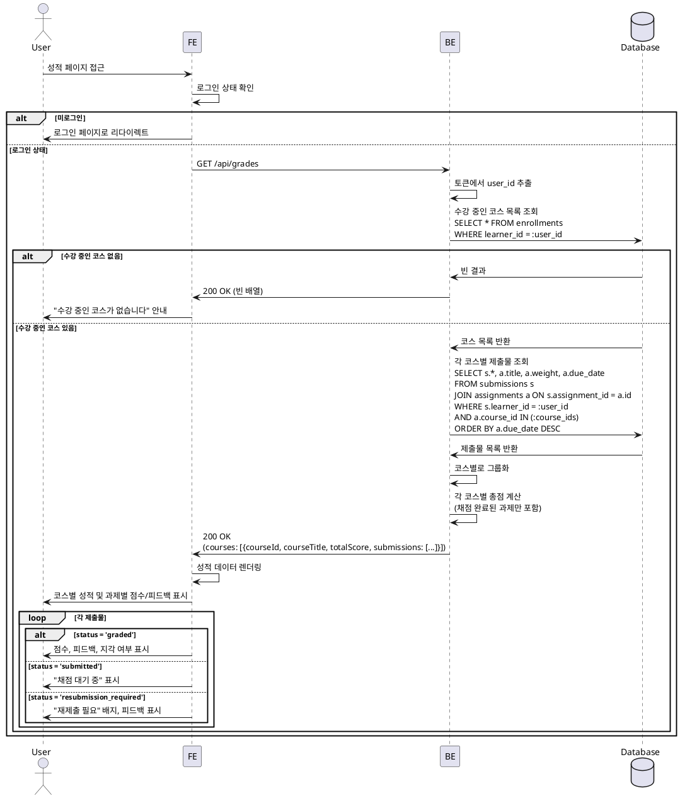

# 유스케이스 006: 성적 & 피드백 열람 (Learner)

## Primary Actor
- 학습자 (Learner)

## Precondition
- 사용자가 Learner 역할로 로그인되어 있음
- 하나 이상의 코스에 수강 신청되어 있음
- 제출한 과제가 존재함

## Trigger
- 학습자가 성적 페이지에 접근

## Main Scenario

1. 학습자가 성적 페이지에 접근
2. 시스템이 학습자의 모든 수강 코스 목록 조회
3. 각 코스별로 제출한 과제 목록 조회
4. 각 제출물의 채점 상태 확인:
   - 채점 완료: 점수, 피드백, 지각 여부, 재제출 여부 표시
   - 채점 대기: "채점 대기 중" 표시
   - 재제출 요청: "재제출 필요" 표시
5. 코스별 총점 계산:
   - 공식: Σ(과제 점수 × 과제 비중 / 100)
   - 채점되지 않은 과제는 총점 계산에서 제외
6. 시스템이 성적 정보를 학습자에게 표시:
   - 코스별 총점
   - 과제별 점수, 상태, 피드백

## Edge Cases

### 제출물 없음
- 수강 중이지만 제출한 과제가 없는 경우: 빈 목록 표시 및 안내 메시지

### 채점 대기 중
- 제출했지만 아직 채점되지 않은 과제: 점수 대신 "채점 대기 중" 표시

### 재제출 요청 상태
- 재제출이 요청된 과제: "재제출 필요" 배지 표시, 피드백 확인 가능

### 권한 없음
- 다른 학습자의 성적 조회 시도: 403 에러 반환

### 데이터베이스 오류
- 조회 중 오류 발생: "성적을 불러오는 중 오류가 발생했습니다" 메시지 표시

## Business Rules

### BR-006-001: 본인 성적만 조회 가능
- 학습자는 본인이 제출한 제출물의 성적만 조회할 수 있음
- 다른 학습자의 성적은 조회 불가

### BR-006-002: 코스별 총점 계산
- 총점 = Σ(채점 완료된 과제 점수 × 해당 과제 비중 / 100)
- 채점되지 않은 과제(status='submitted')는 총점 계산에서 제외
- 재제출 요청 상태(status='resubmission_required')의 과제도 총점 계산에서 제외

### BR-006-003: 피드백 표시
- 채점 완료된 과제만 피드백 표시
- 피드백이 없는 경우 "피드백 없음" 표시

### BR-006-004: 지각 여부 표시
- is_late=true인 제출물은 "지각" 배지 표시

### BR-006-005: 재제출 여부 표시
- status='resubmission_required'인 제출물은 "재제출 필요" 배지 표시

### BR-006-006: 성적 정렬
- 코스별로 그룹화하여 표시
- 각 코스 내에서는 과제 마감일 역순(최신순) 정렬

---

## Sequence Diagram

