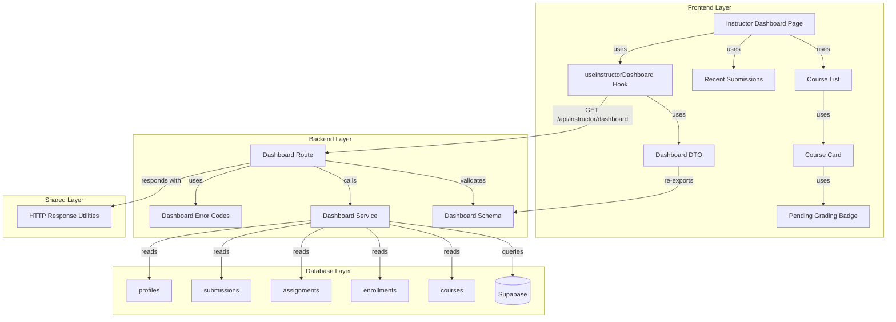

# 구현 계획: Instructor 대시보드

## 개요

### Backend Modules

| 모듈 | 위치 | 설명 |
|------|------|------|
| **Dashboard Schema** | `src/features/dashboard/backend/schema.ts` | 대시보드 응답 zod 스키마 정의 |
| **Dashboard Service** | `src/features/dashboard/backend/service.ts` | 대시보드 데이터 조회 비즈니스 로직 |
| **Dashboard Route** | `src/features/dashboard/backend/route.ts` | Hono 라우터 정의 (GET /api/instructor/dashboard) |
| **Dashboard Error Codes** | `src/features/dashboard/backend/error.ts` | 대시보드 관련 에러 코드 정의 |

### Frontend Modules

| 모듈 | 위치 | 설명 |
|------|------|------|
| **Instructor Dashboard Page** | `src/app/(protected)/instructor/dashboard/page.tsx` | Instructor 대시보드 페이지 |
| **Course List Component** | `src/features/dashboard/components/course-list.tsx` | 코스 목록 컴포넌트 |
| **Course Card Component** | `src/features/dashboard/components/course-card.tsx` | 코스 카드 컴포넌트 |
| **Recent Submissions Component** | `src/features/dashboard/components/recent-submissions.tsx` | 최근 제출물 컴포넌트 |
| **Pending Grading Badge** | `src/features/dashboard/components/pending-grading-badge.tsx` | 채점 대기 배지 컴포넌트 |
| **Dashboard Hook** | `src/features/dashboard/hooks/useInstructorDashboard.ts` | 대시보드 조회 query 훅 |
| **Dashboard DTO** | `src/features/dashboard/lib/dto.ts` | Frontend에서 사용할 DTO 재노출 |

---

## Diagram



---

## Implementation Plan

### 1. Backend: Dashboard Schema

**파일**: `src/features/dashboard/backend/schema.ts`

**목적**: 대시보드 응답 스키마 정의

**구현 내용**:
```typescript
import { z } from 'zod';

/**
 * Course Dashboard Info Schema
 */
export const CourseDashboardInfoSchema = z.object({
  id: z.string().uuid(),
  title: z.string(),
  status: z.enum(['draft', 'published', 'archived']),
  enrollmentCount: z.number(),
  assignmentCount: z.number(),
  pendingGradingCount: z.number(),
  createdAt: z.string().datetime(),
});

export type CourseDashboardInfo = z.infer<typeof CourseDashboardInfoSchema>;

/**
 * Recent Submission Schema
 */
export const RecentSubmissionSchema = z.object({
  id: z.string().uuid(),
  assignmentTitle: z.string(),
  learnerName: z.string(),
  submittedAt: z.string().datetime(),
  status: z.enum(['submitted', 'graded', 'resubmission_required']),
});

export type RecentSubmission = z.infer<typeof RecentSubmissionSchema>;

/**
 * Instructor Dashboard Response Schema
 */
export const InstructorDashboardResponseSchema = z.object({
  courses: z.array(CourseDashboardInfoSchema),
  recentSubmissions: z.array(RecentSubmissionSchema),
  totalPendingGrading: z.number(),
});

export type InstructorDashboardResponse = z.infer<typeof InstructorDashboardResponseSchema>;
```

**Unit Tests**:
- ✅ InstructorDashboardResponseSchema: 유효한 응답 파싱 성공
- ✅ InstructorDashboardResponseSchema: 빈 배열 파싱 성공
- ✅ CourseDashboardInfoSchema: 유효한 코스 정보 파싱 성공
- ✅ RecentSubmissionSchema: 유효한 제출물 정보 파싱 성공

---

### 2. Backend: Dashboard Error Codes

**파일**: `src/features/dashboard/backend/error.ts`

**목적**: 대시보드 관련 에러 코드 정의

**구현 내용**:
```typescript
export const dashboardErrorCodes = {
  unauthorized: 'DASHBOARD_UNAUTHORIZED',
  databaseError: 'DASHBOARD_DATABASE_ERROR',
} as const;

type DashboardErrorValue = (typeof dashboardErrorCodes)[keyof typeof dashboardErrorCodes];

export type DashboardServiceError = DashboardErrorValue;
```

---

### 3. Backend: Dashboard Service

**파일**: `src/features/dashboard/backend/service.ts`

**목적**: 대시보드 데이터 조회 비즈니스 로직

**구현 내용**:
```typescript
import type { SupabaseClient } from '@supabase/supabase-js';
import type { Result } from '@/backend/http/result';
import { failure, success } from '@/backend/http/result';
import { dashboardErrorCodes } from './error';
import type {
  InstructorDashboardResponse,
  CourseDashboardInfo,
  RecentSubmission,
} from './schema';

/**
 * Get Instructor Dashboard
 *
 * @param client - Supabase client
 * @param userId - User ID (Instructor)
 * @returns Dashboard data or error
 */
export async function getInstructorDashboard(
  client: SupabaseClient,
  userId: string,
): Promise<Result<InstructorDashboardResponse, string>> {
  // 1. 내 코스 목록 조회 (통계 포함)
  const { data: courses, error: courseError } = await client
    .from('courses')
    .select(
      `
      id,
      title,
      status,
      created_at,
      enrollments(count),
      assignments(
        id,
        submissions(id, status)
      )
    `,
    )
    .eq('instructor_id', userId)
    .order('created_at', { ascending: false });

  if (courseError) {
    return failure(
      dashboardErrorCodes.databaseError,
      '대시보드를 불러오는 중 오류가 발생했습니다',
    );
  }

  // 2. 코스별 통계 계산
  const courseDashboardInfos: CourseDashboardInfo[] = (courses ?? []).map(
    (course: any) => {
      const enrollmentCount = course.enrollments?.[0]?.count ?? 0;
      const assignmentCount = course.assignments?.length ?? 0;
      const pendingGradingCount =
        course.assignments?.reduce((acc: number, assignment: any) => {
          const submittedCount =
            assignment.submissions?.filter(
              (s: any) => s.status === 'submitted',
            ).length ?? 0;
          return acc + submittedCount;
        }, 0) ?? 0;

      return {
        id: course.id,
        title: course.title,
        status: course.status,
        enrollmentCount,
        assignmentCount,
        pendingGradingCount,
        createdAt: course.created_at,
      };
    },
  );

  // 3. 채점 대기 총 개수 계산
  const totalPendingGrading = courseDashboardInfos.reduce(
    (acc, course) => acc + course.pendingGradingCount,
    0,
  );

  // 4. 최근 제출물 조회 (최근 10개)
  const { data: submissions, error: submissionError } = await client
    .from('submissions')
    .select(
      `
      id,
      submitted_at,
      status,
      assignments!inner(
        title,
        courses!inner(
          instructor_id
        )
      ),
      profiles!inner(
        name
      )
    `,
    )
    .eq('assignments.courses.instructor_id', userId)
    .order('submitted_at', { ascending: false })
    .limit(10);

  if (submissionError) {
    return failure(
      dashboardErrorCodes.databaseError,
      '대시보드를 불러오는 중 오류가 발생했습니다',
    );
  }

  // 5. 최근 제출물 포맷팅
  const recentSubmissions: RecentSubmission[] = (submissions ?? []).map(
    (submission: any) => ({
      id: submission.id,
      assignmentTitle: submission.assignments.title,
      learnerName: submission.profiles.name,
      submittedAt: submission.submitted_at,
      status: submission.status,
    }),
  );

  // 6. 응답 조립
  return success({
    courses: courseDashboardInfos,
    recentSubmissions,
    totalPendingGrading,
  });
}
```

**Unit Tests**:
- ✅ 정상 대시보드 조회 (여러 코스, 여러 제출물)
- ✅ 코스 없는 강사 (빈 배열 반환)
- ✅ 채점 대기 없는 경우 (totalPendingGrading=0)
- ✅ 최근 제출물 없는 경우 (빈 배열 반환)
- ✅ 통계 계산 정확성 (enrollment, assignment, pending grading count)
- ✅ 데이터베이스 오류 시 500 에러 반환

---

### 4. Backend: Dashboard Route

**파일**: `src/features/dashboard/backend/route.ts`

**목적**: Hono 라우터 정의

**구현 내용**:
```typescript
import type { Hono } from 'hono';
import { respond } from '@/backend/http/response';
import { getLogger, getSupabase, type AppEnv } from '@/backend/hono/context';
import { getInstructorDashboard } from './service';

export const registerDashboardRoutes = (app: Hono<AppEnv>) => {
  app.get('/instructor/dashboard', async (c) => {
    const supabase = getSupabase(c);
    const logger = getLogger(c);

    // TODO: 인증 미들웨어에서 userId 추출
    // 임시로 하드코딩 (인증 구현 시 수정 필요)
    const userId = c.req.header('x-user-id') ?? '';

    if (!userId) {
      logger.error('User ID not found in request');
      return c.json({ error: 'Unauthorized' }, 401);
    }

    const result = await getInstructorDashboard(supabase, userId);

    return respond(c, result);
  });
};
```

**Integration Tests**:
- ✅ GET /instructor/dashboard: 인증된 강사의 대시보드 조회 200 응답
- ✅ GET /instructor/dashboard: 미인증 사용자 401 에러 반환
- ✅ GET /instructor/dashboard: 코스 없는 강사 빈 배열 반환

---

### 5. Backend: Hono App Integration

**파일**: `src/backend/hono/app.ts` (기존 수정)

**수정 내용**:
```typescript
import { registerDashboardRoutes } from '@/features/dashboard/backend/route';

// ...existing code...

export const createHonoApp = () => {
  // ...existing middleware...

  registerExampleRoutes(app);
  registerAuthRoutes(app);
  registerGradeRoutes(app);
  registerDashboardRoutes(app); // 추가

  // ...existing code...
};
```

---

### 6. Frontend: Dashboard DTO

**파일**: `src/features/dashboard/lib/dto.ts`

**목적**: Backend 스키마 재노출

**구현 내용**:
```typescript
export {
  InstructorDashboardResponseSchema,
  CourseDashboardInfoSchema,
  RecentSubmissionSchema,
  type InstructorDashboardResponse,
  type CourseDashboardInfo,
  type RecentSubmission,
} from '@/features/dashboard/backend/schema';
```

---

### 7. Frontend: useInstructorDashboard Hook

**파일**: `src/features/dashboard/hooks/useInstructorDashboard.ts`

**목적**: 대시보드 조회 query 훅

**구현 내용**:
```typescript
import { useQuery } from '@tanstack/react-query';
import { apiClient } from '@/lib/remote/api-client';
import type { InstructorDashboardResponse } from '@/features/dashboard/lib/dto';

export const useInstructorDashboard = () => {
  return useQuery({
    queryKey: ['instructor', 'dashboard'],
    queryFn: async (): Promise<InstructorDashboardResponse> => {
      const response = await apiClient.get<InstructorDashboardResponse>('/instructor/dashboard');
      return response.data;
    },
    retry: 1,
    staleTime: 1000 * 60 * 5, // 5분
  });
};
```

---

### 8. Frontend: Pending Grading Badge Component

**파일**: `src/features/dashboard/components/pending-grading-badge.tsx`

**목적**: 채점 대기 배지 컴포넌트

**구현 내용**:
```typescript
"use client";

import { Badge } from "@/components/ui/badge";

type PendingGradingBadgeProps = {
  count: number;
};

export const PendingGradingBadge = ({ count }: PendingGradingBadgeProps) => {
  if (count === 0) {
    return null;
  }

  return (
    <Badge variant="destructive" className="ml-2">
      {count}
    </Badge>
  );
};
```

---

### 9. Frontend: Course Card Component

**파일**: `src/features/dashboard/components/course-card.tsx`

**목적**: 코스 카드 컴포넌트

**구현 내용**:
```typescript
"use client";

import Link from "next/link";
import { Card, CardContent, CardHeader, CardTitle } from "@/components/ui/card";
import { Badge } from "@/components/ui/badge";
import { Button } from "@/components/ui/button";
import type { CourseDashboardInfo } from "@/features/dashboard/lib/dto";
import { PendingGradingBadge } from "./pending-grading-badge";

type CourseCardProps = {
  course: CourseDashboardInfo;
};

const STATUS_LABELS = {
  draft: '작성 중',
  published: '공개',
  archived: '보관',
} as const;

const STATUS_VARIANTS = {
  draft: 'secondary',
  published: 'default',
  archived: 'outline',
} as const;

export const CourseCard = ({ course }: CourseCardProps) => {
  return (
    <Card>
      <CardHeader>
        <div className="flex items-start justify-between">
          <CardTitle className="flex items-center">
            {course.title}
            <PendingGradingBadge count={course.pendingGradingCount} />
          </CardTitle>
          <Badge variant={STATUS_VARIANTS[course.status]}>
            {STATUS_LABELS[course.status]}
          </Badge>
        </div>
      </CardHeader>
      <CardContent>
        <div className="grid grid-cols-3 gap-4 text-center">
          <div>
            <p className="text-2xl font-bold">{course.enrollmentCount}</p>
            <p className="text-sm text-slate-500">수강생</p>
          </div>
          <div>
            <p className="text-2xl font-bold">{course.assignmentCount}</p>
            <p className="text-sm text-slate-500">과제</p>
          </div>
          <div>
            <p className="text-2xl font-bold text-red-500">
              {course.pendingGradingCount}
            </p>
            <p className="text-sm text-slate-500">채점 대기</p>
          </div>
        </div>
        <div className="mt-4 flex gap-2">
          <Button asChild className="flex-1">
            <Link href={`/instructor/courses/${course.id}`}>코스 관리</Link>
          </Button>
          <Button asChild variant="outline" className="flex-1">
            <Link href={`/instructor/courses/${course.id}/grading`}>채점하기</Link>
          </Button>
        </div>
      </CardContent>
    </Card>
  );
};
```

**QA Sheet**:

| 테스트 케이스 | 입력 | 예상 결과 | 실제 결과 | 상태 |
|--------------|------|----------|----------|------|
| 정상 코스 카드 표시 | 모든 통계 포함 | 코스 정보 및 통계 표시 | | ⬜ |
| 채점 대기 배지 표시 | pendingGradingCount=5 | 빨간 배지 "5" 표시 | | ⬜ |
| 채점 대기 없음 | pendingGradingCount=0 | 배지 표시 안 함 | | ⬜ |
| 상태 배지 표시 (draft) | status='draft' | "작성 중" 배지 표시 | | ⬜ |
| 상태 배지 표시 (published) | status='published' | "공개" 배지 표시 | | ⬜ |
| 상태 배지 표시 (archived) | status='archived' | "보관" 배지 표시 | | ⬜ |
| 코스 관리 링크 | 버튼 클릭 | /instructor/courses/{id}로 이동 | | ⬜ |
| 채점하기 링크 | 버튼 클릭 | /instructor/courses/{id}/grading으로 이동 | | ⬜ |

---

### 10. Frontend: Recent Submissions Component

**파일**: `src/features/dashboard/components/recent-submissions.tsx`

**목적**: 최근 제출물 컴포넌트

**구현 내용**:
```typescript
"use client";

import { Card, CardContent, CardHeader, CardTitle } from "@/components/ui/card";
import { Badge } from "@/components/ui/badge";
import type { RecentSubmission } from "@/features/dashboard/lib/dto";
import { formatDistanceToNow } from "date-fns";
import { ko } from "date-fns/locale";

type RecentSubmissionsProps = {
  submissions: RecentSubmission[];
};

const STATUS_LABELS = {
  submitted: '채점 대기',
  graded: '채점 완료',
  resubmission_required: '재제출 필요',
} as const;

const STATUS_VARIANTS = {
  submitted: 'secondary',
  graded: 'default',
  resubmission_required: 'destructive',
} as const;

export const RecentSubmissions = ({ submissions }: RecentSubmissionsProps) => {
  if (submissions.length === 0) {
    return (
      <Card>
        <CardHeader>
          <CardTitle>최근 제출물</CardTitle>
        </CardHeader>
        <CardContent>
          <p className="text-center text-slate-400">최근 제출물이 없습니다</p>
        </CardContent>
      </Card>
    );
  }

  return (
    <Card>
      <CardHeader>
        <CardTitle>최근 제출물</CardTitle>
      </CardHeader>
      <CardContent>
        <div className="space-y-3">
          {submissions.map((submission) => (
            <div
              key={submission.id}
              className="flex items-center justify-between rounded-lg border p-3"
            >
              <div className="flex-1">
                <p className="font-medium">{submission.assignmentTitle}</p>
                <p className="text-sm text-slate-500">{submission.learnerName}</p>
              </div>
              <div className="flex items-center gap-3">
                <p className="text-sm text-slate-500">
                  {formatDistanceToNow(new Date(submission.submittedAt), {
                    addSuffix: true,
                    locale: ko,
                  })}
                </p>
                <Badge variant={STATUS_VARIANTS[submission.status]}>
                  {STATUS_LABELS[submission.status]}
                </Badge>
              </div>
            </div>
          ))}
        </div>
      </CardContent>
    </Card>
  );
};
```

**QA Sheet**:

| 테스트 케이스 | 입력 | 예상 결과 | 실제 결과 | 상태 |
|--------------|------|----------|----------|------|
| 정상 제출물 목록 표시 | 여러 제출물 포함 | 모든 제출물 표시 | | ⬜ |
| 빈 제출물 | submissions=[] | "최근 제출물이 없습니다" 안내 | | ⬜ |
| 상태 배지 표시 (submitted) | status='submitted' | "채점 대기" 배지 표시 | | ⬜ |
| 상태 배지 표시 (graded) | status='graded' | "채점 완료" 배지 표시 | | ⬜ |
| 상태 배지 표시 (resubmission_required) | status='resubmission_required' | "재제출 필요" 배지 표시 | | ⬜ |
| 제출 시간 표시 | submittedAt="2024-01-01" | 상대 시간 표시 (예: "3일 전") | | ⬜ |

---

### 11. Frontend: Course List Component

**파일**: `src/features/dashboard/components/course-list.tsx`

**목적**: 코스 목록 컴포넌트 (상태별 그룹화)

**구현 내용**:
```typescript
"use client";

import type { CourseDashboardInfo } from "@/features/dashboard/lib/dto";
import { CourseCard } from "./course-card";

type CourseListProps = {
  courses: CourseDashboardInfo[];
};

export const CourseList = ({ courses }: CourseListProps) => {
  const draftCourses = courses.filter((c) => c.status === 'draft');
  const publishedCourses = courses.filter((c) => c.status === 'published');
  const archivedCourses = courses.filter((c) => c.status === 'archived');

  return (
    <div className="space-y-6">
      {publishedCourses.length > 0 && (
        <section>
          <h2 className="mb-3 text-xl font-semibold">공개 중인 코스</h2>
          <div className="grid gap-4 md:grid-cols-2">
            {publishedCourses.map((course) => (
              <CourseCard key={course.id} course={course} />
            ))}
          </div>
        </section>
      )}

      {draftCourses.length > 0 && (
        <section>
          <h2 className="mb-3 text-xl font-semibold">작성 중인 코스</h2>
          <div className="grid gap-4 md:grid-cols-2">
            {draftCourses.map((course) => (
              <CourseCard key={course.id} course={course} />
            ))}
          </div>
        </section>
      )}

      {archivedCourses.length > 0 && (
        <section>
          <h2 className="mb-3 text-xl font-semibold">보관된 코스</h2>
          <div className="grid gap-4 md:grid-cols-2">
            {archivedCourses.map((course) => (
              <CourseCard key={course.id} course={course} />
            ))}
          </div>
        </section>
      )}
    </div>
  );
};
```

---

### 12. Frontend: Instructor Dashboard Page

**파일**: `src/app/(protected)/instructor/dashboard/page.tsx`

**목적**: Instructor 대시보드 페이지

**구현 내용**:
```typescript
"use client";

import Link from "next/link";
import { useInstructorDashboard } from "@/features/dashboard/hooks/useInstructorDashboard";
import { CourseList } from "@/features/dashboard/components/course-list";
import { RecentSubmissions } from "@/features/dashboard/components/recent-submissions";
import { Skeleton } from "@/components/ui/skeleton";
import { Alert, AlertDescription } from "@/components/ui/alert";
import { Button } from "@/components/ui/button";
import { Card, CardContent } from "@/components/ui/card";

type InstructorDashboardPageProps = {
  params: Promise<Record<string, never>>;
};

export default function InstructorDashboardPage({ params }: InstructorDashboardPageProps) {
  void params;
  const { data, isLoading, error } = useInstructorDashboard();

  if (isLoading) {
    return (
      <div className="container mx-auto space-y-6 px-4 py-8">
        <h1 className="text-3xl font-bold">Instructor 대시보드</h1>
        <Skeleton className="h-32 w-full" />
        <Skeleton className="h-64 w-full" />
      </div>
    );
  }

  if (error) {
    return (
      <div className="container mx-auto px-4 py-8">
        <h1 className="text-3xl font-bold">Instructor 대시보드</h1>
        <Alert variant="destructive" className="mt-6">
          <AlertDescription>
            대시보드를 불러오는 중 오류가 발생했습니다. 잠시 후 다시 시도하세요.
          </AlertDescription>
        </Alert>
      </div>
    );
  }

  return (
    <div className="container mx-auto space-y-6 px-4 py-8">
      <header>
        <h1 className="text-3xl font-bold">Instructor 대시보드</h1>
        <p className="mt-2 text-slate-500">
          내 코스를 관리하고 학습자의 제출물을 채점하세요
        </p>
      </header>

      {/* 채점 대기 통계 */}
      <Card className="bg-gradient-to-r from-red-50 to-pink-50">
        <CardContent className="flex items-center justify-between p-6">
          <div>
            <p className="text-sm text-slate-500">채점 대기 중</p>
            <p className="text-4xl font-bold text-red-500">
              {data?.totalPendingGrading}
            </p>
          </div>
          <Button asChild>
            <Link href="/instructor/grading">모두 채점하기</Link>
          </Button>
        </CardContent>
      </Card>

      {/* 코스 목록 */}
      {data?.courses.length === 0 ? (
        <Alert>
          <AlertDescription className="flex items-center justify-between">
            <span>아직 코스가 없습니다. 첫 코스를 만들어보세요!</span>
            <Button asChild>
              <Link href="/instructor/courses/new">코스 생성</Link>
            </Button>
          </AlertDescription>
        </Alert>
      ) : (
        <CourseList courses={data?.courses ?? []} />
      )}

      {/* 최근 제출물 */}
      <RecentSubmissions submissions={data?.recentSubmissions ?? []} />
    </div>
  );
}
```

**QA Sheet**:

| 테스트 케이스 | 입력 | 예상 결과 | 실제 결과 | 상태 |
|--------------|------|----------|----------|------|
| 페이지 로딩 중 | isLoading=true | 스켈레톤 표시 | | ⬜ |
| 데이터 로딩 완료 | 여러 코스 포함 | 모든 섹션 표시 | | ⬜ |
| 코스 없음 | courses=[] | "아직 코스가 없습니다" 안내 및 생성 버튼 | | ⬜ |
| 채점 대기 통계 표시 | totalPendingGrading=10 | "10" 표시 | | ⬜ |
| 최근 제출물 표시 | 여러 제출물 포함 | 최근 제출물 목록 표시 | | ⬜ |
| 에러 발생 | error 존재 | 에러 메시지 표시 | | ⬜ |

---

## 구현 순서

1. **Backend Layer** (2.5시간)
   - `src/features/dashboard/backend/schema.ts` 작성
   - `src/features/dashboard/backend/error.ts` 작성
   - `src/features/dashboard/backend/service.ts` 작성 및 Unit Test
   - `src/features/dashboard/backend/route.ts` 작성 및 Integration Test
   - `src/backend/hono/app.ts` 수정

2. **Frontend Layer** (3시간)
   - `src/features/dashboard/lib/dto.ts` 작성
   - `src/features/dashboard/hooks/useInstructorDashboard.ts` 작성
   - `src/features/dashboard/components/pending-grading-badge.tsx` 작성
   - `src/features/dashboard/components/course-card.tsx` 작성 및 QA Sheet 검증
   - `src/features/dashboard/components/recent-submissions.tsx` 작성 및 QA Sheet 검증
   - `src/features/dashboard/components/course-list.tsx` 작성
   - `src/app/(protected)/instructor/dashboard/page.tsx` 작성 및 QA Sheet 검증

3. **Integration Testing** (30분)
   - 전체 플로우 E2E 테스트
   - 통계 계산 정확성 검증
   - 에러 케이스 검증

**예상 총 소요 시간**: 6시간
