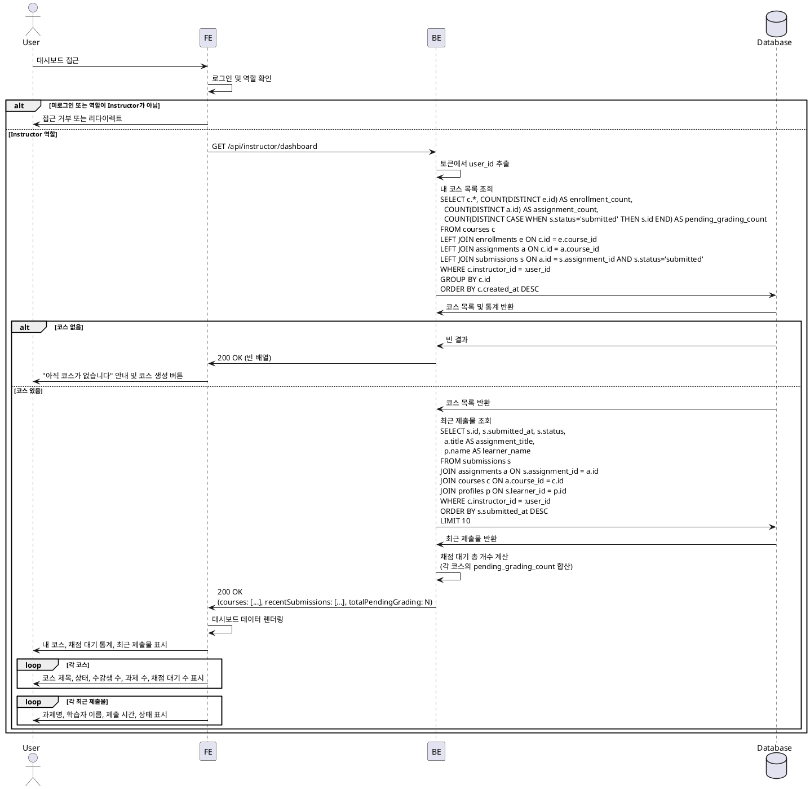

# 유스케이스 007: Instructor 대시보드

## Primary Actor
- 강사 (Instructor)

## Precondition
- 사용자가 Instructor 역할로 로그인되어 있음

## Trigger
- 강사가 대시보드 페이지에 접근

## Main Scenario

1. 강사가 대시보드 페이지에 접근
2. 시스템이 강사의 모든 코스 목록 조회 (draft/published/archived 상태 포함)
3. 각 코스별로 다음 정보 조회:
   - 코스 제목, 상태, 생성일
   - 수강생 수
   - 전체 과제 수
   - 채점 대기 중인 제출물 수
4. 시스템이 최근 제출물 목록 조회 (최근 10개):
   - 제출물 ID
   - 과제명
   - 학습자 이름
   - 제출 시간
   - 채점 상태
5. 시스템이 채점 대기 총 개수 계산 (모든 코스 합산)
6. 시스템이 대시보드 정보를 강사에게 표시:
   - 내 코스 목록 (상태별 그룹화)
   - 채점 대기 통계
   - 최근 제출물

## Edge Cases

### 코스 없음
- 강사가 아직 코스를 생성하지 않은 경우: "아직 코스가 없습니다" 안내 메시지 및 코스 생성 버튼 표시

### 채점 대기 없음
- 모든 제출물이 채점 완료된 경우: "채점 대기 중인 과제가 없습니다" 표시

### 최근 제출물 없음
- 아직 제출물이 없는 경우: "최근 제출물이 없습니다" 안내 메시지

### 권한 없음
- 다른 강사의 대시보드 데이터 조회 시도: 403 에러 반환

### 데이터베이스 오류
- 조회 중 오류 발생: "대시보드를 불러오는 중 오류가 발생했습니다" 메시지 표시

## Business Rules

### BR-007-001: 본인 코스만 조회 가능
- 강사는 본인이 생성한 코스만 조회할 수 있음
- 다른 강사의 코스는 조회 불가

### BR-007-002: 코스 상태별 표시
- draft: 작성 중인 코스 (아직 공개되지 않음)
- published: 공개된 코스 (수강 신청 가능)
- archived: 보관된 코스 (신규 수강 신청 불가)

### BR-007-003: 채점 대기 정의
- status='submitted'인 제출물만 채점 대기로 간주
- status='graded' 또는 'resubmission_required'는 채점 완료로 간주

### BR-007-004: 최근 제출물 정렬
- submitted_at 기준 내림차순 정렬 (최신순)
- 최대 10개까지 표시

### BR-007-005: 수강생 수 계산
- enrollments 테이블에서 해당 코스의 레코드 수를 집계

---

## Sequence Diagram

