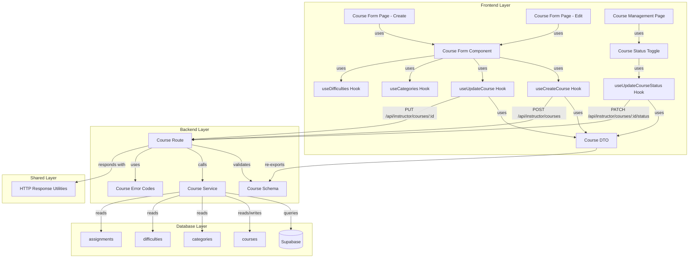

# 구현 계획: 코스 관리 (Instructor)

## 개요

### Backend Modules

| 모듈 | 위치 | 설명 |
|------|------|------|
| **Course Management Schema** | `src/features/course/backend/schema.ts` (확장) | 코스 생성/수정/상태 전환 요청/응답 스키마 추가 |
| **Course Management Service** | `src/features/course/backend/service.ts` (확장) | 코스 생성/수정/상태 전환 비즈니스 로직 추가 |
| **Course Management Route** | `src/features/course/backend/route.ts` (확장) | POST/PUT/PATCH 라우터 추가 |
| **Course Error Codes** | `src/features/course/backend/error.ts` (확장) | 코스 관리 관련 에러 코드 추가 |

### Frontend Modules

| 모듈 | 위치 | 설명 |
|------|------|------|
| **Course Form Page (Create)** | `src/app/(protected)/instructor/courses/new/page.tsx` | 코스 생성 페이지 |
| **Course Form Page (Edit)** | `src/app/(protected)/instructor/courses/[id]/edit/page.tsx` | 코스 수정 페이지 |
| **Course Management Page** | `src/app/(protected)/instructor/courses/[id]/page.tsx` | 코스 관리 페이지 (상태 전환 포함) |
| **Course Form Component** | `src/features/course/components/course-form.tsx` | 코스 생성/수정 폼 컴포넌트 |
| **Course Status Toggle** | `src/features/course/components/course-status-toggle.tsx` | 코스 상태 전환 컴포넌트 |
| **useCreateCourse Hook** | `src/features/course/hooks/useCreateCourse.ts` | 코스 생성 mutation 훅 |
| **useUpdateCourse Hook** | `src/features/course/hooks/useUpdateCourse.ts` | 코스 수정 mutation 훅 |
| **useUpdateCourseStatus Hook** | `src/features/course/hooks/useUpdateCourseStatus.ts` | 코스 상태 전환 mutation 훅 |
| **useCategories Hook** | `src/features/course/hooks/useCategories.ts` | 카테고리 목록 조회 query 훅 |
| **useDifficulties Hook** | `src/features/course/hooks/useDifficulties.ts` | 난이도 목록 조회 query 훅 |
| **Course DTO** | `src/features/course/lib/dto.ts` (확장) | 코스 관리 DTO 재노출 |

---

## Diagram



---

## Implementation Plan

### 1. Backend: Course Management Schema (확장)

**파일**: `src/features/course/backend/schema.ts`

**목적**: 코스 생성/수정/상태 전환 스키마 추가

**구현 내용**:
```typescript
// 기존 스키마 유지 + 아래 스키마 추가

/**
 * Create Course Request Schema
 */
export const CreateCourseRequestSchema = z.object({
  title: z.string().min(1, '제목을 입력하세요').max(200, '제목은 최대 200자까지 입력 가능합니다'),
  description: z.string().min(1, '소개를 입력하세요'),
  categoryId: z.string().uuid('유효한 카테고리를 선택하세요'),
  difficultyId: z.string().uuid('유효한 난이도를 선택하세요'),
  curriculum: z.string().optional().nullable(),
});

export type CreateCourseRequest = z.infer<typeof CreateCourseRequestSchema>;

/**
 * Update Course Request Schema
 */
export const UpdateCourseRequestSchema = CreateCourseRequestSchema;

export type UpdateCourseRequest = z.infer<typeof UpdateCourseRequestSchema>;

/**
 * Update Course Status Request Schema
 */
export const UpdateCourseStatusRequestSchema = z.object({
  status: z.enum(['draft', 'published', 'archived']),
});

export type UpdateCourseStatusRequest = z.infer<typeof UpdateCourseStatusRequestSchema>;

/**
 * Create Course Response Schema
 */
export const CreateCourseResponseSchema = z.object({
  id: z.string().uuid(),
  title: z.string(),
  status: z.enum(['draft', 'published', 'archived']),
  createdAt: z.string().datetime(),
});

export type CreateCourseResponse = z.infer<typeof CreateCourseResponseSchema>;

/**
 * Update Course Response Schema
 */
export const UpdateCourseResponseSchema = CreateCourseResponseSchema;

export type UpdateCourseResponse = z.infer<typeof UpdateCourseResponseSchema>;

/**
 * Category List Response Schema
 */
export const CategoryListResponseSchema = z.object({
  categories: z.array(z.object({
    id: z.string().uuid(),
    name: z.string(),
  })),
});

export type CategoryListResponse = z.infer<typeof CategoryListResponseSchema>;

/**
 * Difficulty List Response Schema
 */
export const DifficultyListResponseSchema = z.object({
  difficulties: z.array(z.object({
    id: z.string().uuid(),
    name: z.string(),
    level: z.number().int(),
  })),
});

export type DifficultyListResponse = z.infer<typeof DifficultyListResponseSchema>;
```

**Unit Tests**:
- ✅ CreateCourseRequestSchema: 유효한 요청 파싱 성공
- ✅ CreateCourseRequestSchema: 제목 누락 시 에러
- ✅ CreateCourseRequestSchema: 제목 길이 초과 시 에러
- ✅ UpdateCourseStatusRequestSchema: 유효한 상태 파싱 성공
- ✅ UpdateCourseStatusRequestSchema: 잘못된 상태 값 에러

---

### 2. Backend: Course Error Codes (확장)

**파일**: `src/features/course/backend/error.ts`

**목적**: 코스 관리 관련 에러 코드 추가

**구현 내용**:
```typescript
// 기존 에러 코드 유지 + 아래 에러 코드 추가

export const courseErrorCodes = {
  // ...existing codes...
  unauthorized: 'COURSE_UNAUTHORIZED',
  notOwner: 'COURSE_NOT_OWNER',
  invalidStatus: 'COURSE_INVALID_STATUS',
  cannotPublishWithoutAssignments: 'COURSE_CANNOT_PUBLISH_WITHOUT_ASSIGNMENTS',
  categoryNotFound: 'COURSE_CATEGORY_NOT_FOUND',
  difficultyNotFound: 'COURSE_DIFFICULTY_NOT_FOUND',
  createFailed: 'COURSE_CREATE_FAILED',
  updateFailed: 'COURSE_UPDATE_FAILED',
} as const;
```

---

### 3. Backend: Course Management Service (확장)

**파일**: `src/features/course/backend/service.ts`

**목적**: 코스 생성/수정/상태 전환 비즈니스 로직 추가

**구현 내용**:
```typescript
// 기존 서비스 유지 + 아래 서비스 추가

/**
 * Create Course
 *
 * @param client - Supabase client
 * @param userId - Instructor User ID
 * @param request - Create course request
 * @returns Created course or error
 */
export async function createCourse(
  client: SupabaseClient,
  userId: string,
  request: CreateCourseRequest,
): Promise<Result<CreateCourseResponse, string>> {
  // 1. 카테고리 유효성 확인
  const { data: category, error: categoryError } = await client
    .from('categories')
    .select('id')
    .eq('id', request.categoryId)
    .eq('is_active', true)
    .single();

  if (categoryError || !category) {
    return failure(
      courseErrorCodes.categoryNotFound,
      '유효한 카테고리를 선택하세요',
    );
  }

  // 2. 난이도 유효성 확인
  const { data: difficulty, error: difficultyError } = await client
    .from('difficulties')
    .select('id')
    .eq('id', request.difficultyId)
    .eq('is_active', true)
    .single();

  if (difficultyError || !difficulty) {
    return failure(
      courseErrorCodes.difficultyNotFound,
      '유효한 난이도를 선택하세요',
    );
  }

  // 3. 코스 생성
  const { data: course, error: insertError } = await client
    .from('courses')
    .insert({
      instructor_id: userId,
      title: request.title,
      description: request.description,
      category_id: request.categoryId,
      difficulty_id: request.difficultyId,
      curriculum: request.curriculum ?? null,
      status: 'draft',
    })
    .select()
    .single();

  if (insertError || !course) {
    return failure(
      courseErrorCodes.createFailed,
      '코스 생성에 실패했습니다',
    );
  }

  const courseRow = course as CourseRow;

  return success({
    id: courseRow.id,
    title: courseRow.title,
    status: courseRow.status,
    createdAt: courseRow.created_at,
  }, 201);
}

/**
 * Update Course
 *
 * @param client - Supabase client
 * @param userId - Instructor User ID
 * @param courseId - Course ID
 * @param request - Update course request
 * @returns Updated course or error
 */
export async function updateCourse(
  client: SupabaseClient,
  userId: string,
  courseId: string,
  request: UpdateCourseRequest,
): Promise<Result<UpdateCourseResponse, string>> {
  // 1. 코스 조회 및 소유권 확인
  const { data: existingCourse, error: fetchError } = await client
    .from('courses')
    .select('id, instructor_id')
    .eq('id', courseId)
    .single();

  if (fetchError || !existingCourse) {
    return failure(
      courseErrorCodes.notFound,
      '코스를 찾을 수 없습니다',
    );
  }

  if (existingCourse.instructor_id !== userId) {
    return failure(
      courseErrorCodes.notOwner,
      '권한이 없습니다',
    );
  }

  // 2. 카테고리 유효성 확인
  const { data: category, error: categoryError } = await client
    .from('categories')
    .select('id')
    .eq('id', request.categoryId)
    .eq('is_active', true)
    .single();

  if (categoryError || !category) {
    return failure(
      courseErrorCodes.categoryNotFound,
      '유효한 카테고리를 선택하세요',
    );
  }

  // 3. 난이도 유효성 확인
  const { data: difficulty, error: difficultyError } = await client
    .from('difficulties')
    .select('id')
    .eq('id', request.difficultyId)
    .eq('is_active', true)
    .single();

  if (difficultyError || !difficulty) {
    return failure(
      courseErrorCodes.difficultyNotFound,
      '유효한 난이도를 선택하세요',
    );
  }

  // 4. 코스 업데이트
  const { data: course, error: updateError } = await client
    .from('courses')
    .update({
      title: request.title,
      description: request.description,
      category_id: request.categoryId,
      difficulty_id: request.difficultyId,
      curriculum: request.curriculum ?? null,
    })
    .eq('id', courseId)
    .eq('instructor_id', userId)
    .select()
    .single();

  if (updateError || !course) {
    return failure(
      courseErrorCodes.updateFailed,
      '코스 수정에 실패했습니다',
    );
  }

  const courseRow = course as CourseRow;

  return success({
    id: courseRow.id,
    title: courseRow.title,
    status: courseRow.status,
    createdAt: courseRow.created_at,
  });
}

/**
 * Update Course Status
 *
 * @param client - Supabase client
 * @param userId - Instructor User ID
 * @param courseId - Course ID
 * @param request - Update course status request
 * @returns Updated course or error
 */
export async function updateCourseStatus(
  client: SupabaseClient,
  userId: string,
  courseId: string,
  request: UpdateCourseStatusRequest,
): Promise<Result<UpdateCourseResponse, string>> {
  // 1. 코스 조회 및 소유권 확인
  const { data: existingCourse, error: fetchError } = await client
    .from('courses')
    .select('id, instructor_id, status')
    .eq('id', courseId)
    .single();

  if (fetchError || !existingCourse) {
    return failure(
      courseErrorCodes.notFound,
      '코스를 찾을 수 없습니다',
    );
  }

  if (existingCourse.instructor_id !== userId) {
    return failure(
      courseErrorCodes.notOwner,
      '권한이 없습니다',
    );
  }

  // 2. draft → published 전환 시 과제 확인 (선택적 정책)
  if (
    existingCourse.status === 'draft' &&
    request.status === 'published'
  ) {
    const { data: assignments, error: assignmentError } = await client
      .from('assignments')
      .select('id')
      .eq('course_id', courseId);

    if (assignmentError) {
      return failure(
        courseErrorCodes.databaseError,
        '상태 전환 중 오류가 발생했습니다',
      );
    }

    // 과제가 최소 1개 이상 있어야 공개 가능 (선택적 정책)
    // 이 정책을 제거하려면 아래 블록을 주석 처리
    if (!assignments || assignments.length === 0) {
      return failure(
        courseErrorCodes.cannotPublishWithoutAssignments,
        '최소 1개의 과제를 추가한 후 공개하세요',
      );
    }
  }

  // 3. 상태 업데이트
  const { data: course, error: updateError } = await client
    .from('courses')
    .update({ status: request.status })
    .eq('id', courseId)
    .eq('instructor_id', userId)
    .select()
    .single();

  if (updateError || !course) {
    return failure(
      courseErrorCodes.updateFailed,
      '상태 전환에 실패했습니다',
    );
  }

  const courseRow = course as CourseRow;

  return success({
    id: courseRow.id,
    title: courseRow.title,
    status: courseRow.status,
    createdAt: courseRow.created_at,
  });
}

/**
 * Get Categories
 *
 * @param client - Supabase client
 * @returns Active categories or error
 */
export async function getCategories(
  client: SupabaseClient,
): Promise<Result<CategoryListResponse, string>> {
  const { data: categories, error } = await client
    .from('categories')
    .select('id, name')
    .eq('is_active', true)
    .order('name', { ascending: true });

  if (error) {
    return failure(
      courseErrorCodes.databaseError,
      '카테고리를 불러오는 중 오류가 발생했습니다',
    );
  }

  return success({
    categories: categories ?? [],
  });
}

/**
 * Get Difficulties
 *
 * @param client - Supabase client
 * @returns Active difficulties or error
 */
export async function getDifficulties(
  client: SupabaseClient,
): Promise<Result<DifficultyListResponse, string>> {
  const { data: difficulties, error } = await client
    .from('difficulties')
    .select('id, name, level')
    .eq('is_active', true)
    .order('level', { ascending: true });

  if (error) {
    return failure(
      courseErrorCodes.databaseError,
      '난이도를 불러오는 중 오류가 발생했습니다',
    );
  }

  return success({
    difficulties: difficulties ?? [],
  });
}
```

**Unit Tests**:
- ✅ createCourse: 정상 코스 생성
- ✅ createCourse: 카테고리 없음 시 에러
- ✅ createCourse: 난이도 없음 시 에러
- ✅ updateCourse: 정상 코스 수정
- ✅ updateCourse: 소유권 없음 시 403 에러
- ✅ updateCourseStatus: draft → published 전환 성공
- ✅ updateCourseStatus: draft → published 시 과제 없으면 에러 (선택적)
- ✅ updateCourseStatus: published → archived 전환 성공
- ✅ getCategories: 활성화된 카테고리 목록 조회
- ✅ getDifficulties: 활성화된 난이도 목록 조회

---

### 4. Backend: Course Management Route (확장)

**파일**: `src/features/course/backend/route.ts`

**목적**: POST/PUT/PATCH 라우터 추가

**구현 내용**:
```typescript
// 기존 라우터 유지 + 아래 라우터 추가

export const registerCourseRoutes = (app: Hono<AppEnv>) => {
  // ...existing GET routes...

  // 카테고리 목록 조회
  app.get('/categories', async (c) => {
    const supabase = getSupabase(c);
    const result = await getCategories(supabase);
    return respond(c, result);
  });

  // 난이도 목록 조회
  app.get('/difficulties', async (c) => {
    const supabase = getSupabase(c);
    const result = await getDifficulties(supabase);
    return respond(c, result);
  });

  // 코스 생성
  app.post('/instructor/courses', async (c) => {
    const supabase = getSupabase(c);
    const logger = getLogger(c);

    const userId = c.req.header('x-user-id') ?? '';
    if (!userId) {
      return c.json({ error: 'Unauthorized' }, 401);
    }

    const body = await c.req.json();
    const parsedBody = CreateCourseRequestSchema.safeParse(body);

    if (!parsedBody.success) {
      return respond(
        c,
        failure(
          400,
          courseErrorCodes.invalidRequest,
          '입력값이 유효하지 않습니다',
          parsedBody.error.format(),
        ),
      );
    }

    const result = await createCourse(supabase, userId, parsedBody.data);
    return respond(c, result);
  });

  // 코스 수정
  app.put('/instructor/courses/:id', async (c) => {
    const supabase = getSupabase(c);
    const logger = getLogger(c);

    const userId = c.req.header('x-user-id') ?? '';
    if (!userId) {
      return c.json({ error: 'Unauthorized' }, 401);
    }

    const courseId = c.req.param('id');
    const body = await c.req.json();
    const parsedBody = UpdateCourseRequestSchema.safeParse(body);

    if (!parsedBody.success) {
      return respond(
        c,
        failure(
          400,
          courseErrorCodes.invalidRequest,
          '입력값이 유효하지 않습니다',
          parsedBody.error.format(),
        ),
      );
    }

    const result = await updateCourse(supabase, userId, courseId, parsedBody.data);
    return respond(c, result);
  });

  // 코스 상태 전환
  app.patch('/instructor/courses/:id/status', async (c) => {
    const supabase = getSupabase(c);
    const logger = getLogger(c);

    const userId = c.req.header('x-user-id') ?? '';
    if (!userId) {
      return c.json({ error: 'Unauthorized' }, 401);
    }

    const courseId = c.req.param('id');
    const body = await c.req.json();
    const parsedBody = UpdateCourseStatusRequestSchema.safeParse(body);

    if (!parsedBody.success) {
      return respond(
        c,
        failure(
          400,
          courseErrorCodes.invalidRequest,
          '입력값이 유효하지 않습니다',
          parsedBody.error.format(),
        ),
      );
    }

    const result = await updateCourseStatus(supabase, userId, courseId, parsedBody.data);
    return respond(c, result);
  });
};
```

**Integration Tests**:
- ✅ POST /instructor/courses: 정상 코스 생성 201 응답
- ✅ POST /instructor/courses: 입력값 검증 실패 시 400 에러
- ✅ PUT /instructor/courses/:id: 정상 코스 수정 200 응답
- ✅ PUT /instructor/courses/:id: 소유권 없음 시 403 에러
- ✅ PATCH /instructor/courses/:id/status: 정상 상태 전환 200 응답
- ✅ GET /categories: 활성화된 카테고리 목록 200 응답
- ✅ GET /difficulties: 활성화된 난이도 목록 200 응답

---

### 5. Frontend: Course DTO (확장)

**파일**: `src/features/course/lib/dto.ts`

**목적**: 코스 관리 DTO 재노출

**구현 내용**:
```typescript
// 기존 DTO 유지 + 아래 DTO 추가

export {
  // ...existing exports...
  CreateCourseRequestSchema,
  UpdateCourseRequestSchema,
  UpdateCourseStatusRequestSchema,
  CreateCourseResponseSchema,
  UpdateCourseResponseSchema,
  CategoryListResponseSchema,
  DifficultyListResponseSchema,
  type CreateCourseRequest,
  type UpdateCourseRequest,
  type UpdateCourseStatusRequest,
  type CreateCourseResponse,
  type UpdateCourseResponse,
  type CategoryListResponse,
  type DifficultyListResponse,
} from '@/features/course/backend/schema';
```

---

### 6. Frontend: Hooks

**파일**: `src/features/course/hooks/useCreateCourse.ts`

**구현 내용**:
```typescript
import { useMutation, useQueryClient } from '@tanstack/react-query';
import { apiClient } from '@/lib/remote/api-client';
import type { CreateCourseRequest, CreateCourseResponse } from '@/features/course/lib/dto';

export const useCreateCourse = () => {
  const queryClient = useQueryClient();

  return useMutation({
    mutationFn: async (request: CreateCourseRequest): Promise<CreateCourseResponse> => {
      const response = await apiClient.post<CreateCourseResponse>('/instructor/courses', request);
      return response.data;
    },
    onSuccess: () => {
      queryClient.invalidateQueries({ queryKey: ['instructor', 'courses'] });
      queryClient.invalidateQueries({ queryKey: ['instructor', 'dashboard'] });
    },
  });
};
```

**파일**: `src/features/course/hooks/useUpdateCourse.ts`

**구현 내용**:
```typescript
import { useMutation, useQueryClient } from '@tanstack/react-query';
import { apiClient } from '@/lib/remote/api-client';
import type { UpdateCourseRequest, UpdateCourseResponse } from '@/features/course/lib/dto';

export const useUpdateCourse = (courseId: string) => {
  const queryClient = useQueryClient();

  return useMutation({
    mutationFn: async (request: UpdateCourseRequest): Promise<UpdateCourseResponse> => {
      const response = await apiClient.put<UpdateCourseResponse>(`/instructor/courses/${courseId}`, request);
      return response.data;
    },
    onSuccess: () => {
      queryClient.invalidateQueries({ queryKey: ['course', courseId] });
      queryClient.invalidateQueries({ queryKey: ['instructor', 'courses'] });
      queryClient.invalidateQueries({ queryKey: ['instructor', 'dashboard'] });
    },
  });
};
```

**파일**: `src/features/course/hooks/useUpdateCourseStatus.ts`

**구현 내용**:
```typescript
import { useMutation, useQueryClient } from '@tanstack/react-query';
import { apiClient } from '@/lib/remote/api-client';
import type { UpdateCourseStatusRequest, UpdateCourseResponse } from '@/features/course/lib/dto';

export const useUpdateCourseStatus = (courseId: string) => {
  const queryClient = useQueryClient();

  return useMutation({
    mutationFn: async (request: UpdateCourseStatusRequest): Promise<UpdateCourseResponse> => {
      const response = await apiClient.patch<UpdateCourseResponse>(`/instructor/courses/${courseId}/status`, request);
      return response.data;
    },
    onSuccess: () => {
      queryClient.invalidateQueries({ queryKey: ['course', courseId] });
      queryClient.invalidateQueries({ queryKey: ['instructor', 'courses'] });
      queryClient.invalidateQueries({ queryKey: ['instructor', 'dashboard'] });
    },
  });
};
```

**파일**: `src/features/course/hooks/useCategories.ts`

**구현 내용**:
```typescript
import { useQuery } from '@tanstack/react-query';
import { apiClient } from '@/lib/remote/api-client';
import type { CategoryListResponse } from '@/features/course/lib/dto';

export const useCategories = () => {
  return useQuery({
    queryKey: ['categories'],
    queryFn: async (): Promise<CategoryListResponse> => {
      const response = await apiClient.get<CategoryListResponse>('/categories');
      return response.data;
    },
    staleTime: 1000 * 60 * 10, // 10분
  });
};
```

**파일**: `src/features/course/hooks/useDifficulties.ts`

**구현 내용**:
```typescript
import { useQuery } from '@tanstack/react-query';
import { apiClient } from '@/lib/remote/api-client';
import type { DifficultyListResponse } from '@/features/course/lib/dto';

export const useDifficulties = () => {
  return useQuery({
    queryKey: ['difficulties'],
    queryFn: async (): Promise<DifficultyListResponse> => {
      const response = await apiClient.get<DifficultyListResponse>('/difficulties');
      return response.data;
    },
    staleTime: 1000 * 60 * 10, // 10분
  });
};
```

---

### 7. Frontend: Course Form Component

**파일**: `src/features/course/components/course-form.tsx`

**목적**: 코스 생성/수정 폼 컴포넌트 (재사용)

**구현 내용**:
```typescript
"use client";

import { useForm } from "react-hook-form";
import { zodResolver } from "@hookform/resolvers/zod";
import { Button } from "@/components/ui/button";
import { Input } from "@/components/ui/input";
import { Label } from "@/components/ui/label";
import { Textarea } from "@/components/ui/textarea";
import { Select, SelectContent, SelectItem, SelectTrigger, SelectValue } from "@/components/ui/select";
import { CreateCourseRequestSchema, type CreateCourseRequest } from "@/features/course/lib/dto";
import { useCategories } from "@/features/course/hooks/useCategories";
import { useDifficulties } from "@/features/course/hooks/useDifficulties";

type CourseFormProps = {
  defaultValues?: Partial<CreateCourseRequest>;
  onSubmit: (data: CreateCourseRequest) => void;
  isLoading?: boolean;
  submitLabel?: string;
};

export const CourseForm = ({
  defaultValues,
  onSubmit,
  isLoading = false,
  submitLabel = "저장",
}: CourseFormProps) => {
  const { data: categoriesData } = useCategories();
  const { data: difficultiesData } = useDifficulties();

  const {
    register,
    handleSubmit,
    formState: { errors },
    setValue,
    watch,
  } = useForm<CreateCourseRequest>({
    resolver: zodResolver(CreateCourseRequestSchema),
    defaultValues: defaultValues ?? {
      title: "",
      description: "",
      categoryId: "",
      difficultyId: "",
      curriculum: "",
    },
  });

  const selectedCategoryId = watch("categoryId");
  const selectedDifficultyId = watch("difficultyId");

  return (
    <form onSubmit={handleSubmit(onSubmit)} className="space-y-6">
      {/* 제목 */}
      <div className="space-y-2">
        <Label htmlFor="title">제목 *</Label>
        <Input
          id="title"
          type="text"
          {...register("title")}
          disabled={isLoading}
        />
        {errors.title && (
          <p className="text-sm text-red-500">{errors.title.message}</p>
        )}
      </div>

      {/* 소개 */}
      <div className="space-y-2">
        <Label htmlFor="description">소개 *</Label>
        <Textarea
          id="description"
          rows={5}
          {...register("description")}
          disabled={isLoading}
        />
        {errors.description && (
          <p className="text-sm text-red-500">{errors.description.message}</p>
        )}
      </div>

      {/* 카테고리 */}
      <div className="space-y-2">
        <Label htmlFor="categoryId">카테고리 *</Label>
        <Select
          value={selectedCategoryId}
          onValueChange={(value) => setValue("categoryId", value)}
          disabled={isLoading}
        >
          <SelectTrigger>
            <SelectValue placeholder="카테고리 선택" />
          </SelectTrigger>
          <SelectContent>
            {categoriesData?.categories.map((category) => (
              <SelectItem key={category.id} value={category.id}>
                {category.name}
              </SelectItem>
            ))}
          </SelectContent>
        </Select>
        {errors.categoryId && (
          <p className="text-sm text-red-500">{errors.categoryId.message}</p>
        )}
      </div>

      {/* 난이도 */}
      <div className="space-y-2">
        <Label htmlFor="difficultyId">난이도 *</Label>
        <Select
          value={selectedDifficultyId}
          onValueChange={(value) => setValue("difficultyId", value)}
          disabled={isLoading}
        >
          <SelectTrigger>
            <SelectValue placeholder="난이도 선택" />
          </SelectTrigger>
          <SelectContent>
            {difficultiesData?.difficulties.map((difficulty) => (
              <SelectItem key={difficulty.id} value={difficulty.id}>
                {difficulty.name}
              </SelectItem>
            ))}
          </SelectContent>
        </Select>
        {errors.difficultyId && (
          <p className="text-sm text-red-500">{errors.difficultyId.message}</p>
        )}
      </div>

      {/* 커리큘럼 */}
      <div className="space-y-2">
        <Label htmlFor="curriculum">커리큘럼 (선택)</Label>
        <Textarea
          id="curriculum"
          rows={10}
          placeholder="강좌 커리큘럼을 입력하세요"
          {...register("curriculum")}
          disabled={isLoading}
        />
        {errors.curriculum && (
          <p className="text-sm text-red-500">{errors.curriculum.message}</p>
        )}
      </div>

      {/* 제출 버튼 */}
      <Button type="submit" className="w-full" disabled={isLoading}>
        {isLoading ? "저장 중..." : submitLabel}
      </Button>
    </form>
  );
};
```

**QA Sheet**:

| 테스트 케이스 | 입력 | 예상 결과 | 실제 결과 | 상태 |
|--------------|------|----------|----------|------|
| 정상 폼 제출 | 모든 필수 필드 입력 | onSubmit 호출 | | ⬜ |
| 제목 누락 | title="" | "제목을 입력하세요" 에러 | | ⬜ |
| 소개 누락 | description="" | "소개를 입력하세요" 에러 | | ⬜ |
| 카테고리 미선택 | categoryId="" | "유효한 카테고리를 선택하세요" 에러 | | ⬜ |
| 난이도 미선택 | difficultyId="" | "유효한 난이도를 선택하세요" 에러 | | ⬜ |
| 기본값 표시 | defaultValues 제공 | 폼에 기존 데이터 채워짐 | | ⬜ |
| 로딩 중 비활성화 | isLoading=true | 모든 입력 필드 비활성화 | | ⬜ |

---

### 8. Frontend: Course Status Toggle Component

**파일**: `src/features/course/components/course-status-toggle.tsx`

**구현 내용**:
```typescript
"use client";

import { useState } from "react";
import { Button } from "@/components/ui/button";
import {
  Dialog,
  DialogContent,
  DialogDescription,
  DialogFooter,
  DialogHeader,
  DialogTitle,
} from "@/components/ui/dialog";
import { useToast } from "@/hooks/use-toast";
import { useUpdateCourseStatus } from "@/features/course/hooks/useUpdateCourseStatus";

type CourseStatusToggleProps = {
  courseId: string;
  currentStatus: 'draft' | 'published' | 'archived';
};

const STATUS_ACTIONS = {
  draft: { next: 'published' as const, label: '공개하기', confirmMessage: '코스를 공개하시겠습니까?' },
  published: { next: 'archived' as const, label: '보관하기', confirmMessage: '코스를 보관하시겠습니까?' },
  archived: { next: 'published' as const, label: '다시 공개하기', confirmMessage: '코스를 다시 공개하시겠습니까?' },
} as const;

export const CourseStatusToggle = ({ courseId, currentStatus }: CourseStatusToggleProps) => {
  const [isDialogOpen, setIsDialogOpen] = useState(false);
  const { toast } = useToast();
  const { mutate, isPending } = useUpdateCourseStatus(courseId);

  const action = STATUS_ACTIONS[currentStatus];

  const handleConfirm = () => {
    mutate(
      { status: action.next },
      {
        onSuccess: () => {
          toast({
            title: "성공",
            description: "코스 상태가 변경되었습니다",
          });
          setIsDialogOpen(false);
        },
        onError: (error: any) => {
          toast({
            title: "오류",
            description: error.message ?? "상태 전환에 실패했습니다",
            variant: "destructive",
          });
        },
      },
    );
  };

  return (
    <>
      <Button onClick={() => setIsDialogOpen(true)} disabled={isPending}>
        {action.label}
      </Button>

      <Dialog open={isDialogOpen} onOpenChange={setIsDialogOpen}>
        <DialogContent>
          <DialogHeader>
            <DialogTitle>상태 전환 확인</DialogTitle>
            <DialogDescription>{action.confirmMessage}</DialogDescription>
          </DialogHeader>
          <DialogFooter>
            <Button variant="outline" onClick={() => setIsDialogOpen(false)}>
              취소
            </Button>
            <Button onClick={handleConfirm} disabled={isPending}>
              {isPending ? "처리 중..." : "확인"}
            </Button>
          </DialogFooter>
        </DialogContent>
      </Dialog>
    </>
  );
};
```

---

### 9. Frontend: Pages

**파일**: `src/app/(protected)/instructor/courses/new/page.tsx`

**구현 내용**:
```typescript
"use client";

import { useRouter } from "next/navigation";
import { useToast } from "@/hooks/use-toast";
import { CourseForm } from "@/features/course/components/course-form";
import { useCreateCourse } from "@/features/course/hooks/useCreateCourse";
import type { CreateCourseRequest } from "@/features/course/lib/dto";

type CreateCoursePageProps = {
  params: Promise<Record<string, never>>;
};

export default function CreateCoursePage({ params }: CreateCoursePageProps) {
  void params;
  const router = useRouter();
  const { toast } = useToast();
  const { mutate, isPending } = useCreateCourse();

  const handleSubmit = (data: CreateCourseRequest) => {
    mutate(data, {
      onSuccess: (response) => {
        toast({
          title: "코스 생성 완료",
          description: "코스가 성공적으로 생성되었습니다",
        });
        router.push(`/instructor/courses/${response.id}`);
      },
      onError: (error: any) => {
        toast({
          title: "코스 생성 실패",
          description: error.message ?? "코스 생성에 실패했습니다",
          variant: "destructive",
        });
      },
    });
  };

  return (
    <div className="container mx-auto max-w-2xl space-y-6 px-4 py-8">
      <header>
        <h1 className="text-3xl font-bold">새 코스 만들기</h1>
        <p className="mt-2 text-slate-500">
          코스 정보를 입력하고 학습자에게 공유하세요
        </p>
      </header>

      <CourseForm
        onSubmit={handleSubmit}
        isLoading={isPending}
        submitLabel="코스 생성"
      />
    </div>
  );
}
```

**파일**: `src/app/(protected)/instructor/courses/[id]/edit/page.tsx`

**구현 내용**:
```typescript
"use client";

import { use } from "react";
import { useRouter } from "next/navigation";
import { useToast } from "@/hooks/use-toast";
import { CourseForm } from "@/features/course/components/course-form";
import { useCourse } from "@/features/course/hooks/useCourse";
import { useUpdateCourse } from "@/features/course/hooks/useUpdateCourse";
import { Skeleton } from "@/components/ui/skeleton";
import { Alert, AlertDescription } from "@/components/ui/alert";
import type { CreateCourseRequest } from "@/features/course/lib/dto";

type EditCoursePageProps = {
  params: Promise<{ id: string }>;
};

export default function EditCoursePage({ params }: EditCoursePageProps) {
  const { id } = use(params);
  const router = useRouter();
  const { toast } = useToast();
  const { data: course, isLoading, error } = useCourse(id);
  const { mutate, isPending } = useUpdateCourse(id);

  const handleSubmit = (data: CreateCourseRequest) => {
    mutate(data, {
      onSuccess: () => {
        toast({
          title: "코스 수정 완료",
          description: "코스가 성공적으로 수정되었습니다",
        });
        router.push(`/instructor/courses/${id}`);
      },
      onError: (error: any) => {
        toast({
          title: "코스 수정 실패",
          description: error.message ?? "코스 수정에 실패했습니다",
          variant: "destructive",
        });
      },
    });
  };

  if (isLoading) {
    return (
      <div className="container mx-auto max-w-2xl px-4 py-8">
        <Skeleton className="h-64 w-full" />
      </div>
    );
  }

  if (error || !course) {
    return (
      <div className="container mx-auto max-w-2xl px-4 py-8">
        <Alert variant="destructive">
          <AlertDescription>
            코스를 불러오는 중 오류가 발생했습니다
          </AlertDescription>
        </Alert>
      </div>
    );
  }

  return (
    <div className="container mx-auto max-w-2xl space-y-6 px-4 py-8">
      <header>
        <h1 className="text-3xl font-bold">코스 수정</h1>
        <p className="mt-2 text-slate-500">
          코스 정보를 수정하세요
        </p>
      </header>

      <CourseForm
        defaultValues={{
          title: course.title,
          description: course.description,
          categoryId: course.category.id,
          difficultyId: course.difficulty.id,
          curriculum: course.curriculum,
        }}
        onSubmit={handleSubmit}
        isLoading={isPending}
        submitLabel="수정 완료"
      />
    </div>
  );
}
```

**파일**: `src/app/(protected)/instructor/courses/[id]/page.tsx`

**구현 내용**:
```typescript
"use client";

import { use } from "react";
import Link from "next/link";
import { Button } from "@/components/ui/button";
import { Card, CardContent, CardHeader, CardTitle } from "@/components/ui/card";
import { Badge } from "@/components/ui/badge";
import { Skeleton } from "@/components/ui/skeleton";
import { Alert, AlertDescription } from "@/components/ui/alert";
import { useCourse } from "@/features/course/hooks/useCourse";
import { CourseStatusToggle } from "@/features/course/components/course-status-toggle";

type CourseManagePageProps = {
  params: Promise<{ id: string }>;
};

const STATUS_LABELS = {
  draft: '작성 중',
  published: '공개',
  archived: '보관',
} as const;

export default function CourseManagePage({ params }: CourseManagePageProps) {
  const { id } = use(params);
  const { data: course, isLoading, error } = useCourse(id);

  if (isLoading) {
    return (
      <div className="container mx-auto px-4 py-8">
        <Skeleton className="h-64 w-full" />
      </div>
    );
  }

  if (error || !course) {
    return (
      <div className="container mx-auto px-4 py-8">
        <Alert variant="destructive">
          <AlertDescription>
            코스를 불러오는 중 오류가 발생했습니다
          </AlertDescription>
        </Alert>
      </div>
    );
  }

  return (
    <div className="container mx-auto space-y-6 px-4 py-8">
      <header className="flex items-start justify-between">
        <div>
          <h1 className="text-3xl font-bold">{course.title}</h1>
          <Badge className="mt-2">{STATUS_LABELS[course.status]}</Badge>
        </div>
        <div className="flex gap-2">
          <Button asChild variant="outline">
            <Link href={`/instructor/courses/${id}/edit`}>수정</Link>
          </Button>
          <CourseStatusToggle courseId={id} currentStatus={course.status} />
        </div>
      </header>

      <Card>
        <CardHeader>
          <CardTitle>코스 정보</CardTitle>
        </CardHeader>
        <CardContent className="space-y-4">
          <div>
            <p className="text-sm font-medium text-slate-500">소개</p>
            <p className="mt-1">{course.description}</p>
          </div>
          <div>
            <p className="text-sm font-medium text-slate-500">카테고리</p>
            <p className="mt-1">{course.category.name}</p>
          </div>
          <div>
            <p className="text-sm font-medium text-slate-500">난이도</p>
            <p className="mt-1">{course.difficulty.name}</p>
          </div>
          {course.curriculum && (
            <div>
              <p className="text-sm font-medium text-slate-500">커리큘럼</p>
              <pre className="mt-1 whitespace-pre-wrap">{course.curriculum}</pre>
            </div>
          )}
        </CardContent>
      </Card>

      <Card>
        <CardHeader>
          <CardTitle>통계</CardTitle>
        </CardHeader>
        <CardContent>
          <div className="grid grid-cols-2 gap-4 text-center">
            <div>
              <p className="text-2xl font-bold">{course.enrollmentCount}</p>
              <p className="text-sm text-slate-500">수강생</p>
            </div>
            {/* TODO: 과제 수 통계 추가 */}
          </div>
        </CardContent>
      </Card>
    </div>
  );
}
```

**QA Sheet** (종합):

| 테스트 케이스 | 입력 | 예상 결과 | 실제 결과 | 상태 |
|--------------|------|----------|----------|------|
| 코스 생성 페이지 렌더링 | /instructor/courses/new 접근 | 폼 표시 | | ⬜ |
| 정상 코스 생성 | 모든 필수 필드 입력 후 제출 | 201 응답, 코스 관리 페이지로 이동 | | ⬜ |
| 코스 수정 페이지 렌더링 | /instructor/courses/:id/edit 접근 | 기존 데이터 채워진 폼 표시 | | ⬜ |
| 정상 코스 수정 | 필드 수정 후 제출 | 200 응답, 성공 메시지 표시 | | ⬜ |
| 코스 관리 페이지 렌더링 | /instructor/courses/:id 접근 | 코스 정보 및 상태 전환 버튼 표시 | | ⬜ |
| draft → published 전환 | "공개하기" 버튼 클릭 및 확인 | 상태 변경, 성공 메시지 | | ⬜ |
| published → archived 전환 | "보관하기" 버튼 클릭 및 확인 | 상태 변경, 성공 메시지 | | ⬜ |
| 권한 없는 코스 수정 시도 | 다른 강사의 코스 ID로 접근 | 403 에러 | | ⬜ |

---

## 구현 순서

1. **Backend Layer** (3시간)
   - `src/features/course/backend/schema.ts` 확장
   - `src/features/course/backend/error.ts` 확장
   - `src/features/course/backend/service.ts` 확장 및 Unit Test
   - `src/features/course/backend/route.ts` 확장 및 Integration Test

2. **Frontend Layer** (4시간)
   - `src/features/course/lib/dto.ts` 확장
   - Hooks 작성 (useCreateCourse, useUpdateCourse, useUpdateCourseStatus, useCategories, useDifficulties)
   - `src/features/course/components/course-form.tsx` 작성 및 QA Sheet 검증
   - `src/features/course/components/course-status-toggle.tsx` 작성
   - Pages 작성 (new, edit, manage)

3. **Integration Testing** (1시간)
   - 전체 플로우 E2E 테스트
   - 소유권 검증 테스트
   - 상태 전환 테스트

**예상 총 소요 시간**: 8시간
