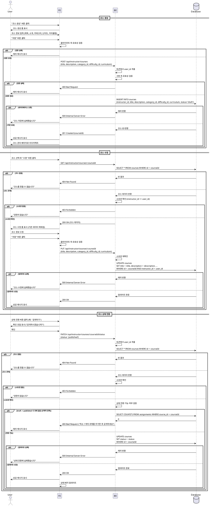

# 유스케이스 008: 코스 관리 (Instructor)

## Primary Actor
- 강사 (Instructor)

## Precondition
- 사용자가 Instructor 역할로 로그인되어 있음

## Trigger
- 강사가 코스 생성/수정/상태 전환을 시도

## Main Scenario

### 8.1 코스 생성

1. 강사가 "코스 생성" 버튼 클릭
2. 시스템이 코스 생성 폼 표시
3. 강사가 코스 정보 입력:
   - 제목 (필수)
   - 소개 (필수)
   - 카테고리 선택 (필수)
   - 난이도 선택 (필수)
   - 커리큘럼 (선택)
4. 강사가 "저장" 버튼 클릭
5. 시스템이 입력값 유효성 검증
6. 시스템이 코스 레코드 생성 (status='draft')
7. 시스템이 강사를 코스 관리 페이지로 리다이렉트
8. 성공 메시지 표시

### 8.2 코스 수정

1. 강사가 내 코스 목록에서 코스 선택
2. 강사가 "수정" 버튼 클릭
3. 시스템이 코스 수정 폼 표시 (기존 데이터 미리 채워짐)
4. 강사가 코스 정보 수정
5. 강사가 "저장" 버튼 클릭
6. 시스템이 입력값 유효성 검증
7. 시스템이 소유권 확인 (instructor_id == 현재 사용자)
8. 시스템이 코스 레코드 업데이트
9. 성공 메시지 표시

### 8.3 코스 상태 전환

1. 강사가 코스 관리 페이지에서 상태 전환 버튼 클릭
2. 시스템이 현재 상태 확인:
   - draft → published: "공개하시겠습니까?" 확인 모달
   - published → archived: "보관하시겠습니까?" 확인 모달
3. 강사가 확인
4. 시스템이 소유권 확인
5. 시스템이 상태 전환 가능 여부 검증:
   - draft → published: 과제가 최소 1개 이상 있어야 함 (선택적)
   - published → archived: 항상 가능
   - archived → published: 다시 공개 가능
6. 시스템이 코스 상태 업데이트
7. 성공 메시지 표시

## Edge Cases

### 입력 검증 실패
- 필수 필드 누락: "필수 항목을 입력하세요" 메시지 표시
- 제목 길이 초과: "제목은 최대 200자까지 입력 가능합니다"

### 소유권 확인 실패
- 다른 강사의 코스 수정 시도: 403 에러 반환, "권한이 없습니다" 메시지

### 카테고리/난이도 없음
- 활성화된 카테고리나 난이도가 없는 경우: "현재 사용 가능한 카테고리가 없습니다" 안내

### 상태 전환 제한
- draft → published 시 과제 없음: "최소 1개의 과제를 추가한 후 공개하세요" (선택적 정책)

### 데이터베이스 오류
- 저장/업데이트 실패: "코스 저장에 실패했습니다. 다시 시도하세요"

## Business Rules

### BR-008-001: 소유권
- 코스는 생성한 강사만 수정/삭제/상태 전환 가능
- instructor_id와 현재 사용자 ID가 일치해야 함

### BR-008-002: 코스 상태 전환
- **draft**: 작성 중, 학습자에게 보이지 않음
- **published**: 공개, 수강 신청 가능
- **archived**: 보관, 기존 수강생은 접근 가능하지만 신규 수강 신청 불가

### BR-008-003: 필수 입력 정보
- 제목, 소개, 카테고리, 난이도는 필수
- 커리큘럼은 선택

### BR-008-004: 제목 길이 제한
- 최소 1자, 최대 200자

### BR-008-005: 카테고리/난이도 활성화 상태
- is_active=true인 카테고리/난이도만 선택 가능

### BR-008-006: 공개 조건 (선택적)
- draft → published 전환 시 과제가 최소 1개 이상 있어야 함 (비즈니스 정책에 따라 선택 가능)

### BR-008-007: 코스 삭제
- 현재 스펙에는 삭제 기능 미포함
- 대신 archived 상태로 전환하여 보관

---

## Sequence Diagram

