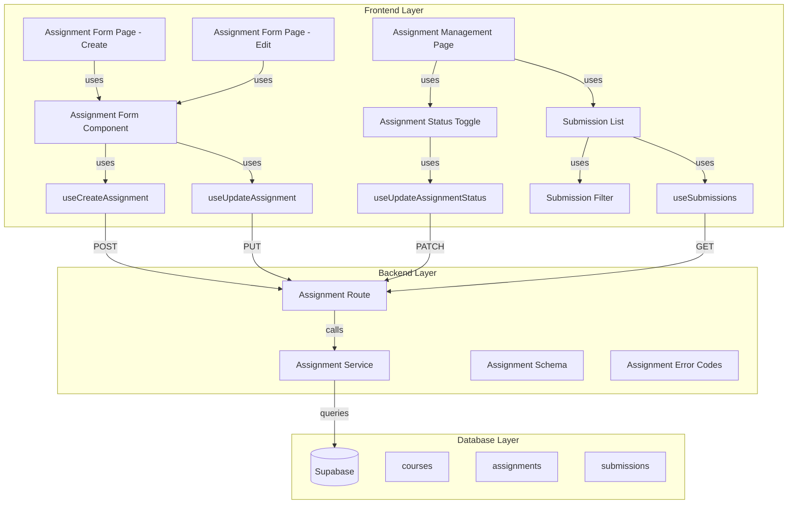

# 구현 계획: 과제 관리 (Instructor)

## 개요

### Backend Modules

| 모듈 | 위치 | 설명 |
|------|------|------|
| **Assignment Management Schema** | `src/features/assignment/backend/schema.ts` (확장) | 과제 생성/수정/상태 전환 스키마 추가 |
| **Assignment Management Service** | `src/features/assignment/backend/service.ts` (확장) | 과제 CRUD 비즈니스 로직 추가 |
| **Assignment Management Route** | `src/features/assignment/backend/route.ts` (확장) | POST/PUT/PATCH 라우터 추가 |
| **Assignment Error Codes** | `src/features/assignment/backend/error.ts` (확장) | 과제 관리 에러 코드 추가 |

### Frontend Modules

| 모듈 | 위치 | 설명 |
|------|------|------|
| **Assignment Form Page (Create)** | `src/app/(protected)/instructor/courses/[courseId]/assignments/new/page.tsx` | 과제 생성 페이지 |
| **Assignment Form Page (Edit)** | `src/app/(protected)/instructor/assignments/[id]/edit/page.tsx` | 과제 수정 페이지 |
| **Assignment Management Page** | `src/app/(protected)/instructor/assignments/[id]/page.tsx` | 과제 관리 및 제출물 목록 페이지 |
| **Assignment Form Component** | `src/features/assignment/components/assignment-form.tsx` | 과제 생성/수정 폼 컴포넌트 |
| **Assignment Status Toggle** | `src/features/assignment/components/assignment-status-toggle.tsx` | 과제 상태 전환 컴포넌트 |
| **Submission List Component** | `src/features/assignment/components/submission-list.tsx` | 제출물 목록 컴포넌트 |
| **Submission Filter Component** | `src/features/assignment/components/submission-filter.tsx` | 제출물 필터 컴포넌트 |
| **useCreateAssignment Hook** | `src/features/assignment/hooks/useCreateAssignment.ts` | 과제 생성 mutation 훅 |
| **useUpdateAssignment Hook** | `src/features/assignment/hooks/useUpdateAssignment.ts` | 과제 수정 mutation 훅 |
| **useUpdateAssignmentStatus Hook** | `src/features/assignment/hooks/useUpdateAssignmentStatus.ts` | 과제 상태 전환 mutation 훅 |
| **useSubmissions Hook** | `src/features/assignment/hooks/useSubmissions.ts` | 제출물 목록 조회 query 훅 |

---

## Diagram



---

## Implementation Plan

### 1. Backend: Assignment Management Schema (확장)

**파일**: `src/features/assignment/backend/schema.ts`

**구현 내용**:
```typescript
// 기존 스키마 유지 + 추가

export const CreateAssignmentRequestSchema = z.object({
  courseId: z.string().uuid(),
  title: z.string().min(1, '제목을 입력하세요'),
  description: z.string().min(1, '설명을 입력하세요'),
  dueDate: z.string().datetime(),
  weight: z.number().min(0).max(100),
  allowLate: z.boolean().default(false),
  allowResubmission: z.boolean().default(false),
});

export const UpdateAssignmentRequestSchema = CreateAssignmentRequestSchema.omit({ courseId: true });

export const UpdateAssignmentStatusRequestSchema = z.object({
  status: z.enum(['draft', 'published', 'closed']),
});

export const SubmissionListQuerySchema = z.object({
  filter: z.enum(['all', 'pending', 'late', 'resubmission']).default('all'),
});
```

---

### 2. Backend: Assignment Management Service (확장)

**파일**: `src/features/assignment/backend/service.ts`

**주요 함수**:
- `createAssignment`: 과제 생성
- `updateAssignment`: 과제 수정
- `updateAssignmentStatus`: 과제 상태 전환
- `getSubmissions`: 제출물 목록 조회 (필터링 포함)

---

### 3. Backend: Assignment Management Route (확장)

**파일**: `src/features/assignment/backend/route.ts`

**추가 라우트**:
- POST `/instructor/courses/:courseId/assignments`
- PUT `/instructor/assignments/:id`
- PATCH `/instructor/assignments/:id/status`
- GET `/instructor/assignments/:id/submissions`

---

### 4. Frontend: Hooks

**파일**:
- `src/features/assignment/hooks/useCreateAssignment.ts`
- `src/features/assignment/hooks/useUpdateAssignment.ts`
- `src/features/assignment/hooks/useUpdateAssignmentStatus.ts`
- `src/features/assignment/hooks/useSubmissions.ts`

---

### 5. Frontend: Components

**파일**: `src/features/assignment/components/assignment-form.tsx`

**목적**: 과제 생성/수정 폼 (제목, 설명, 마감일, 점수 비중, 정책)

**파일**: `src/features/assignment/components/assignment-status-toggle.tsx`

**목적**: 과제 상태 전환 버튼 (draft → published → closed)

**파일**: `src/features/assignment/components/submission-list.tsx`

**목적**: 제출물 목록 표시 (테이블 형식, 학습자 이름, 제출 시간, 상태)

**파일**: `src/features/assignment/components/submission-filter.tsx`

**목적**: 제출물 필터 (전체/미채점/지각/재제출 요청)

---

### 6. Frontend: Pages

**파일**: `src/app/(protected)/instructor/courses/[courseId]/assignments/new/page.tsx`

**목적**: 과제 생성 페이지

**파일**: `src/app/(protected)/instructor/assignments/[id]/edit/page.tsx`

**목적**: 과제 수정 페이지

**파일**: `src/app/(protected)/instructor/assignments/[id]/page.tsx`

**목적**: 과제 관리 페이지 (정보 표시, 상태 전환, 제출물 목록)

---

## QA Sheet (종합)

| 테스트 케이스 | 입력 | 예상 결과 | 실제 결과 | 상태 |
|--------------|------|----------|----------|------|
| 과제 생성 | 모든 필수 필드 입력 | 201 응답, 과제 생성 완료 | | ⬜ |
| 과제 수정 | 기존 과제 수정 | 200 응답, 과제 수정 완료 | | ⬜ |
| 과제 상태 전환 (draft → published) | 상태 전환 버튼 클릭 | 상태 변경 | | ⬜ |
| 과제 상태 전환 (published → closed) | 상태 전환 버튼 클릭 | 상태 변경 | | ⬜ |
| 제출물 목록 조회 | 과제 ID로 조회 | 모든 제출물 표시 | | ⬜ |
| 제출물 필터링 (미채점) | filter='pending' | 미채점 제출물만 표시 | | ⬜ |
| 제출물 필터링 (지각) | filter='late' | 지각 제출물만 표시 | | ⬜ |
| 제출물 필터링 (재제출) | filter='resubmission' | 재제출 요청 제출물만 표시 | | ⬜ |
| 권한 없는 과제 수정 시도 | 다른 강사의 과제 ID로 접근 | 403 에러 | | ⬜ |

---

## 구현 순서

1. **Backend Layer** (3시간)
2. **Frontend Layer** (4시간)
3. **Integration Testing** (1시간)

**예상 총 소요 시간**: 8시간
