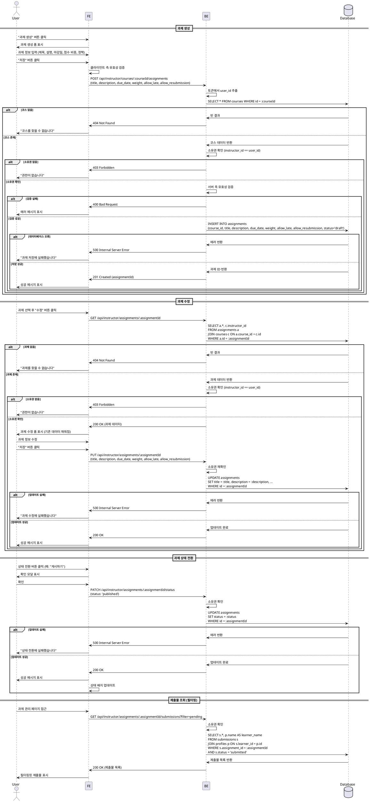

# 유스케이스 009: 과제 관리 (Instructor)

## Primary Actor
- 강사 (Instructor)

## Precondition
- 사용자가 Instructor 역할로 로그인되어 있음
- 관리할 코스가 존재함

## Trigger
- 강사가 과제 생성/수정/상태 전환을 시도

## Main Scenario

### 9.1 과제 생성

1. 강사가 코스 관리 페이지에서 "과제 생성" 버튼 클릭
2. 시스템이 과제 생성 폼 표시
3. 강사가 과제 정보 입력:
   - 제목 (필수)
   - 설명 (필수)
   - 마감일 (필수)
   - 점수 비중 (필수, 0~100)
   - 지각 허용 여부 (선택, 기본값 false)
   - 재제출 허용 여부 (선택, 기본값 false)
4. 강사가 "저장" 버튼 클릭
5. 시스템이 입력값 유효성 검증
6. 시스템이 과제 레코드 생성 (status='draft')
7. 성공 메시지 표시

### 9.2 과제 수정

1. 강사가 과제 목록에서 과제 선택
2. 강사가 "수정" 버튼 클릭
3. 시스템이 과제 수정 폼 표시 (기존 데이터 미리 채워짐)
4. 강사가 과제 정보 수정
5. 강사가 "저장" 버튼 클릭
6. 시스템이 입력값 유효성 검증
7. 시스템이 소유권 확인 (코스 소유자 == 현재 사용자)
8. 시스템이 과제 레코드 업데이트
9. 성공 메시지 표시

### 9.3 과제 상태 전환

1. 강사가 과제 관리 페이지에서 상태 전환 버튼 클릭
2. 시스템이 현재 상태 확인:
   - draft → published: "게시하시겠습니까?" 확인 모달
   - published → closed: "마감하시겠습니까?" 확인 모달
3. 강사가 확인
4. 시스템이 소유권 확인
5. 시스템이 상태 업데이트
6. 학습자 화면에 반영 (published 시 과제 노출, closed 시 제출 버튼 비활성화)
7. 성공 메시지 표시

### 9.4 제출물 필터링

1. 강사가 과제 관리 페이지에서 제출물 목록 조회
2. 시스템이 기본 제출물 목록 표시 (전체)
3. 강사가 필터 선택:
   - 미채점 (status='submitted')
   - 지각 (is_late=true)
   - 재제출 요청 (status='resubmission_required')
4. 시스템이 필터링된 제출물 목록 표시

## Edge Cases

### 입력 검증 실패
- 필수 필드 누락: "필수 항목을 입력하세요"
- 점수 비중 범위 초과: "점수 비중은 0~100 사이여야 합니다"
- 마감일 과거: "마감일은 현재 시간 이후여야 합니다"

### 소유권 확인 실패
- 다른 강사의 과제 수정 시도: 403 에러 반환, "권한이 없습니다"

### 상태 전환 제한
- closed → published 전환 불가: "마감된 과제는 다시 공개할 수 없습니다"

### 자동 마감
- 마감일 이후 시스템이 자동으로 status='closed' 로 전환 (배치 작업 또는 조회 시 체크)

### 데이터베이스 오류
- 저장/업데이트 실패: "과제 저장에 실패했습니다"

## Business Rules

### BR-009-001: 소유권
- 과제는 코스 소유자만 생성/수정/삭제/상태 전환 가능
- 코스의 instructor_id와 현재 사용자 ID가 일치해야 함

### BR-009-002: 과제 상태 전환
- **draft**: 작성 중, 학습자에게 보이지 않음
- **published**: 게시됨, 학습자가 제출 가능
- **closed**: 마감됨, 제출 불가, 채점만 가능

### BR-009-003: 필수 입력 정보
- 제목, 설명, 마감일, 점수 비중은 필수
- 지각 허용, 재제출 허용은 선택 (기본값 false)

### BR-009-004: 점수 비중 제한
- 0 이상 100 이하의 소수점 숫자

### BR-009-005: 마감일 검증
- 과거 시간 불가 (생성 시)
- 마감일 이후 자동으로 closed 상태 전환

### BR-009-006: 제출물 필터링
- 미채점: status='submitted'
- 지각: is_late=true
- 재제출 요청: status='resubmission_required'

---

## Sequence Diagram

