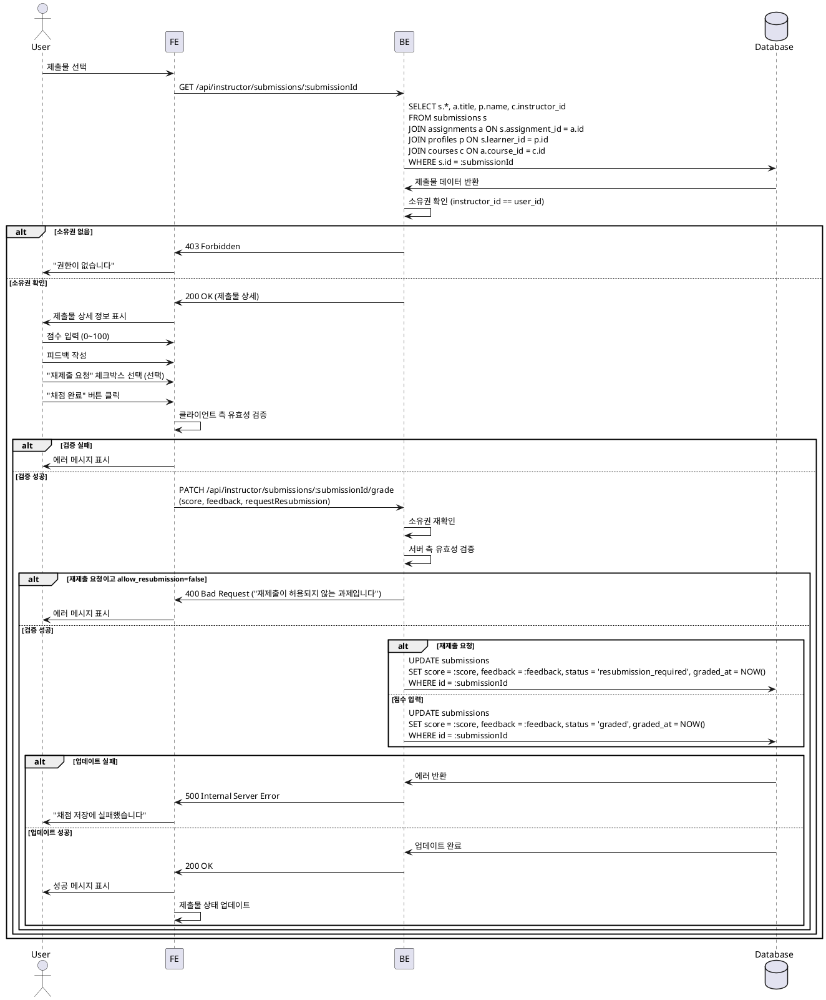

# 유스케이스 010: 제출물 채점 & 피드백 (Instructor)

## Primary Actor
- 강사 (Instructor)

## Precondition
- 사용자가 Instructor 역할로 로그인되어 있음
- 제출물이 존재함 (status='submitted')

## Trigger
- 강사가 제출물 채점 페이지에 접근

## Main Scenario

1. 강사가 제출물 선택
2. 시스템이 제출물 상세 정보 표시:
   - 과제명
   - 학습자 이름
   - 제출 내용 (텍스트, 링크)
   - 제출 시간
   - 지각 여부
3. 강사가 점수 입력 (0~100)
4. 강사가 피드백 작성 (필수)
5. 강사가 "재제출 요청" 체크박스 선택 (선택)
6. 강사가 "채점 완료" 버튼 클릭
7. 시스템이 입력값 유효성 검증
8. 시스템이 소유권 확인 (과제의 코스 소유자 == 현재 사용자)
9. 시스템이 제출물 업데이트:
   - 점수 입력 시: status='graded', graded_at 갱신
   - 재제출 요청 시: status='resubmission_required'
10. 학습자에게 피드백 표시
11. 학습자 대시보드 과제 상태 반영
12. 성공 메시지 표시

## Edge Cases

### 입력 검증 실패
- 점수 범위 초과: "점수는 0~100 사이여야 합니다"
- 피드백 누락: "피드백을 입력하세요"

### 소유권 확인 실패
- 다른 강사의 제출물 채점 시도: 403 에러 반환, "권한이 없습니다"

### 이미 채점된 제출물
- status='graded'인 제출물 재채점 시: 기존 점수/피드백 덮어쓰기, 경고 모달 표시

### 재제출 요청 정책 확인
- 과제의 allow_resubmission=false인 경우: "재제출 요청" 체크박스 비활성화

### 데이터베이스 오류
- 저장 실패: "채점 저장에 실패했습니다"

## Business Rules

### BR-010-001: 소유권
- 제출물은 과제의 코스 소유자만 채점 가능

### BR-010-002: 점수 범위
- 0 이상 100 이하의 소수점 숫자

### BR-010-003: 피드백 필수
- 채점 시 피드백은 필수 입력

### BR-010-004: 재제출 요청
- 재제출 요청 시 status='resubmission_required'
- 과제의 allow_resubmission=true일 때만 가능

### BR-010-005: 채점 상태 전환
- submitted → graded: 점수 입력
- submitted → resubmission_required: 재제출 요청

---

## Sequence Diagram

