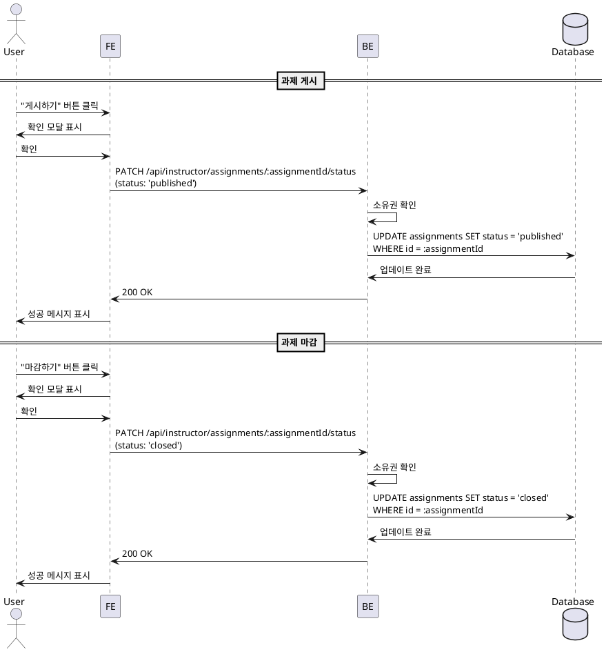

# 유스케이스 011: Assignment 게시/마감 (Instructor)

## Primary Actor
- 강사 (Instructor)

## Precondition
- 사용자가 Instructor 역할로 로그인되어 있음
- 과제가 존재함

## Trigger
- 강사가 과제 게시 또는 마감 버튼 클릭

## Main Scenario

### 11.1 과제 게시 (draft → published)

1. 강사가 과제 관리 페이지에서 "게시하기" 버튼 클릭
2. 시스템이 확인 모달 표시 ("과제를 게시하시겠습니까?")
3. 강사가 확인
4. 시스템이 소유권 확인
5. 시스템이 과제 상태를 'published'로 업데이트
6. 학습자 화면에 과제 노출
7. 성공 메시지 표시

### 11.2 과제 마감 (published → closed)

1. 강사가 과제 관리 페이지에서 "마감하기" 버튼 클릭
2. 시스템이 확인 모달 표시 ("과제를 마감하시겠습니까?")
3. 강사가 확인
4. 시스템이 소유권 확인
5. 시스템이 과제 상태를 'closed'로 업데이트
6. 학습자 화면에서 제출 버튼 비활성화
7. 채점만 가능, 제출 불가
8. 성공 메시지 표시

### 11.3 자동 마감

1. 시스템이 주기적으로 (또는 조회 시) 마감일 확인
2. 마감일 이후인 과제 중 status='published'인 과제 자동으로 'closed'로 전환

## Edge Cases

### 소유권 확인 실패
- 다른 강사의 과제 상태 전환 시도: 403 에러

### 상태 전환 제한
- closed → published 재전환: 정책에 따라 허용 또는 차단 (현재 스펙에서는 허용)

### 데이터베이스 오류
- 상태 전환 실패: "상태 전환에 실패했습니다"

## Business Rules

### BR-011-001: 소유권
- 과제는 코스 소유자만 게시/마감 가능

### BR-011-002: 상태 전환 순서
- draft → published → closed

### BR-011-003: 자동 마감
- 마감일 이후 자동으로 closed 상태 전환 (배치 작업 또는 조회 시 체크)

### BR-011-004: 마감 후 제출 불가
- status='closed'인 과제는 제출 불가, 채점만 가능

---

## Sequence Diagram

