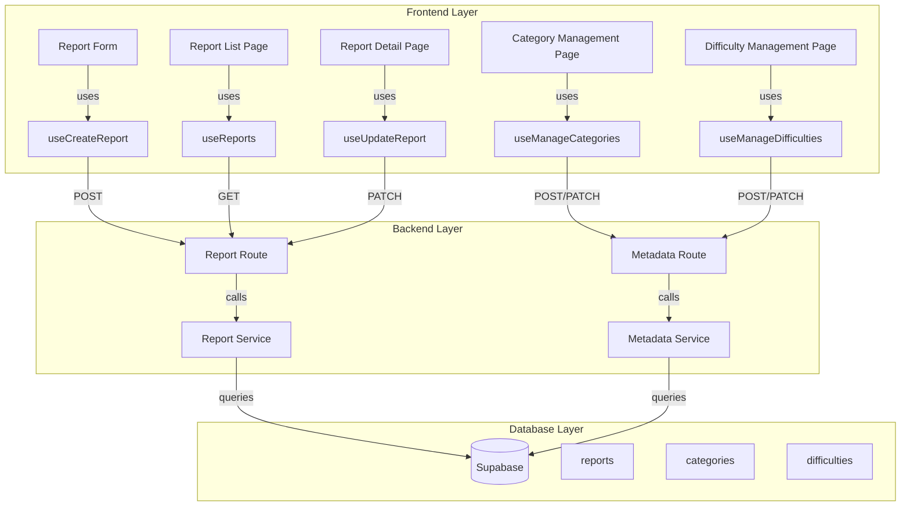

# 구현 계획: 운영 (Operator)

## 개요

### Backend Modules

| 모듈 | 위치 | 설명 |
|------|------|------|
| **Report Schema** | `src/features/report/backend/schema.ts` | 신고 관련 스키마 정의 |
| **Report Service** | `src/features/report/backend/service.ts` | 신고 CRUD 비즈니스 로직 |
| **Report Route** | `src/features/report/backend/route.ts` | 신고 관련 라우터 |
| **Metadata Schema** | `src/features/metadata/backend/schema.ts` | 메타데이터 관련 스키마 정의 |
| **Metadata Service** | `src/features/metadata/backend/service.ts` | 메타데이터 CRUD 비즈니스 로직 |
| **Metadata Route** | `src/features/metadata/backend/route.ts` | 메타데이터 관련 라우터 |
| **Operator Error Codes** | `src/features/operator/backend/error.ts` | 운영 관련 에러 코드 |

### Frontend Modules

| 모듈 | 위치 | 설명 |
|------|------|------|
| **Report Form Component** | `src/features/report/components/report-form.tsx` | 신고 폼 컴포넌트 |
| **Report List Page** | `src/app/(protected)/operator/reports/page.tsx` | 신고 목록 페이지 |
| **Report Detail Page** | `src/app/(protected)/operator/reports/[id]/page.tsx` | 신고 상세 및 처리 페이지 |
| **Category Management Page** | `src/app/(protected)/operator/categories/page.tsx` | 카테고리 관리 페이지 |
| **Difficulty Management Page** | `src/app/(protected)/operator/difficulties/page.tsx` | 난이도 관리 페이지 |
| **useCreateReport Hook** | `src/features/report/hooks/useCreateReport.ts` | 신고 생성 mutation 훅 |
| **useReports Hook** | `src/features/report/hooks/useReports.ts` | 신고 목록 조회 query 훅 |
| **useUpdateReport Hook** | `src/features/report/hooks/useUpdateReport.ts` | 신고 처리 mutation 훅 |
| **useManageCategories Hook** | `src/features/metadata/hooks/useManageCategories.ts` | 카테고리 관리 mutation 훅 |
| **useManageDifficulties Hook** | `src/features/metadata/hooks/useManageDifficulties.ts` | 난이도 관리 mutation 훅 |

---

## Diagram



---

## Implementation Plan

### 1. Backend: Report Schema

**파일**: `src/features/report/backend/schema.ts`

**구현 내용**:
```typescript
export const CreateReportRequestSchema = z.object({
  targetType: z.enum(['course', 'assignment', 'submission', 'user']),
  targetId: z.string().uuid(),
  reason: z.string().min(1),
  content: z.string().min(1),
});

export const UpdateReportRequestSchema = z.object({
  status: z.enum(['received', 'investigating', 'resolved']),
  action: z.string().optional(),
});

export const ReportListQuerySchema = z.object({
  filter: z.enum(['all', 'received', 'investigating', 'resolved']).default('all'),
});
```

### 2. Backend: Metadata Schema

**파일**: `src/features/metadata/backend/schema.ts`

**구현 내용**:
```typescript
export const CreateCategoryRequestSchema = z.object({
  name: z.string().min(1),
});

export const UpdateCategoryRequestSchema = z.object({
  name: z.string().min(1).optional(),
  isActive: z.boolean().optional(),
});

export const CreateDifficultyRequestSchema = z.object({
  name: z.string().min(1),
  level: z.number().int().positive(),
});

export const UpdateDifficultyRequestSchema = z.object({
  name: z.string().min(1).optional(),
  level: z.number().int().positive().optional(),
  isActive: z.boolean().optional(),
});
```

### 3. Backend: Services

주요 함수:
- `createReport`: 신고 생성
- `getReports`: 신고 목록 조회 (필터링)
- `updateReport`: 신고 처리
- `createCategory`: 카테고리 생성
- `updateCategory`: 카테고리 수정
- `createDifficulty`: 난이도 생성
- `updateDifficulty`: 난이도 수정

### 4. Backend: Routes

**라우트**:
- POST `/api/reports`
- GET `/api/operator/reports`
- PATCH `/api/operator/reports/:id`
- GET `/api/operator/categories`
- POST `/api/operator/categories`
- PATCH `/api/operator/categories/:id`
- GET `/api/operator/difficulties`
- POST `/api/operator/difficulties`
- PATCH `/api/operator/difficulties/:id`

### 5. Frontend: Components & Pages

- 신고 폼 컴포넌트
- 신고 목록 페이지 (테이블 형식, 필터링)
- 신고 상세 페이지 (상태 변경, 조치 내용 입력)
- 카테고리 관리 페이지 (추가/수정/비활성화)
- 난이도 관리 페이지 (추가/수정/비활성화)

---

## QA Sheet

| 테스트 케이스 | 입력 | 예상 결과 | 실제 결과 | 상태 |
|--------------|------|----------|----------|------|
| 신고 접수 | 모든 필드 입력 | 201 응답, 신고 생성 완료 | | ⬜ |
| 신고 목록 조회 (운영자) | /operator/reports 접근 | 신고 목록 표시 | | ⬜ |
| 신고 처리 | 상태 변경 및 조치 내용 입력 | 200 응답, 신고 업데이트 완료 | | ⬜ |
| 카테고리 추가 | 카테고리 이름 입력 | 201 응답, 카테고리 생성 완료 | | ⬜ |
| 카테고리 비활성화 | is_active=false | 200 응답, 카테고리 비활성화 완료 | | ⬜ |
| 난이도 추가 | 난이도 이름 및 레벨 입력 | 201 응답, 난이도 생성 완료 | | ⬜ |
| 난이도 비활성화 | is_active=false | 200 응답, 난이도 비활성화 완료 | | ⬜ |
| 권한 없는 접근 | 운영자가 아닌 사용자 | 403 에러 | | ⬜ |

---

## 구현 순서

1. **Backend Layer** (4시간)
2. **Frontend Layer** (5시간)
3. **Integration Testing** (1시간)

**예상 총 소요 시간**: 10시간
