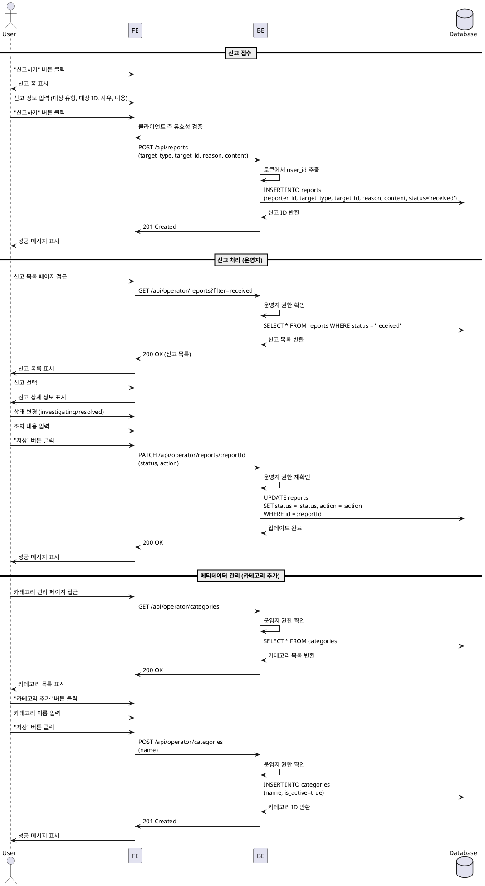

# 유스케이스 012: 운영 (Operator)

## Primary Actor
- 운영자 (Operator)

## Precondition
- 사용자가 Operator 역할로 로그인되어 있음

## Trigger
- 운영자가 신고 접수, 메타데이터 관리 기능에 접근

## Main Scenario

### 12.1 신고 접수

1. 사용자(학습자/강사)가 신고하기 버튼 클릭
2. 시스템이 신고 폼 표시
3. 사용자가 신고 정보 입력:
   - 신고 대상 유형 (코스/과제/제출물/사용자)
   - 대상 ID
   - 사유
   - 내용
4. 사용자가 "신고하기" 버튼 클릭
5. 시스템이 입력값 유효성 검증
6. 시스템이 신고 레코드 생성 (status='received')
7. 성공 메시지 표시

### 12.2 신고 처리

1. 운영자가 신고 목록 페이지 접근
2. 시스템이 모든 신고 목록 표시 (필터: received/investigating/resolved)
3. 운영자가 신고 선택
4. 시스템이 신고 상세 정보 표시:
   - 신고자 정보
   - 신고 대상 정보
   - 사유 및 내용
5. 운영자가 상태 변경 (investigating/resolved)
6. 운영자가 조치 내용 입력 (경고, 제출물 무효화, 계정 제한 등)
7. 운영자가 "저장" 버튼 클릭
8. 시스템이 신고 레코드 업데이트
9. 성공 메시지 표시

### 12.3 메타데이터 관리 (카테고리)

1. 운영자가 카테고리 관리 페이지 접근
2. 시스템이 모든 카테고리 목록 표시 (활성화/비활성화)
3. 운영자가 "카테고리 추가" 버튼 클릭
4. 운영자가 카테고리 이름 입력
5. 운영자가 "저장" 버튼 클릭
6. 시스템이 카테고리 레코드 생성 (is_active=true)
7. 성공 메시지 표시

### 12.4 메타데이터 관리 (난이도)

1. 운영자가 난이도 관리 페이지 접근
2. 시스템이 모든 난이도 목록 표시 (활성화/비활성화)
3. 운영자가 "난이도 추가" 버튼 클릭
4. 운영자가 난이도 이름 및 레벨 입력
5. 운영자가 "저장" 버튼 클릭
6. 시스템이 난이도 레코드 생성 (is_active=true)
7. 성공 메시지 표시

## Edge Cases

### 신고 입력 검증 실패
- 필수 필드 누락: "필수 항목을 입력하세요"

### 권한 없음
- 운영자가 아닌 사용자의 접근: 403 에러

### 메타데이터 비활성화 제한
- 사용 중인 카테고리/난이도 비활성화 시: 경고 모달 표시 또는 비활성화 제한

### 데이터베이스 오류
- 저장/업데이트 실패: "저장에 실패했습니다"

## Business Rules

### BR-012-001: 운영자 권한 가드
- 운영 기능은 role='operator'인 사용자만 접근 가능

### BR-012-002: 신고 상태 전환
- received → investigating → resolved

### BR-012-003: 신고 조치 내용
- 경고, 제출물 무효화, 계정 제한 등 자유 입력

### BR-012-004: 메타데이터 비활성화
- 사용 중인 카테고리/난이도는 비활성화 권장하지 않음 (경고 표시)

---

## Sequence Diagram

